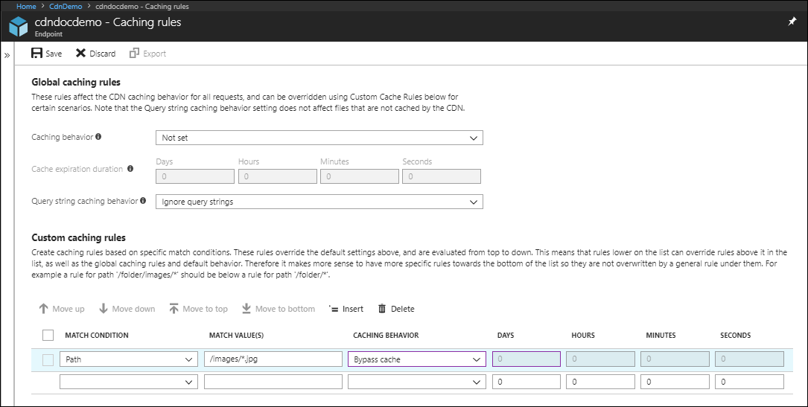
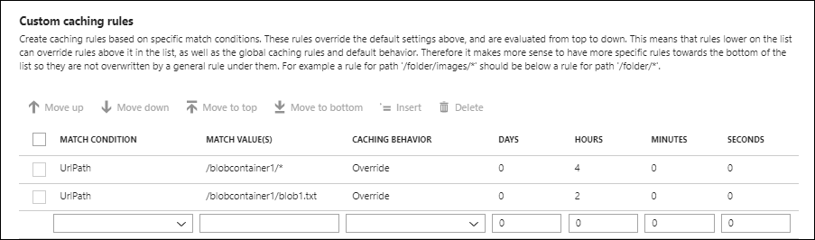
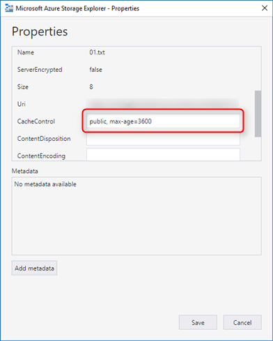

# Manage expiration of Azure Blob storage in Azure Content Delivery Network

> [!div class="op_single_selector"]
> - [Azure web content](cdn-manage-expiration-of-cloud-service-content.md)
> - [Azure Blob storage](cdn-manage-expiration-of-blob-content.md)
>

The [Blob storage service](../storage/common/storage-introduction.md#blob-storage) in Azure Storage is one of several Azure-based origins integrated with Azure Content Delivery Network. Any publicly accessible blob content can be cached in Azure Content Delivery Network until its time to live (TTL) elapses. The TTL gets determined by the `Cache-Control` header in the HTTP response from the origin server. This article describes several ways that you can set the `Cache-Control` header on a blob in Azure Storage.

You can also control cache settings from the Azure portal by setting content delivery network caching rules. If you create a caching rule and set its caching behavior to **Override** or **Bypass cache**, the origin-provided caching settings discussed in this article are ignored. For information about general caching concepts, see [How caching works](cdn-how-caching-works.md).

> [!TIP]
> You can choose to set no TTL on a blob. In this case, Azure Content Delivery Network automatically applies a default TTL of seven days, unless you have set up caching rules in the Azure portal. This default TTL applies only to general web delivery optimizations. For large file optimizations, the default TTL is one day, and for media streaming optimizations, the default TTL is one year.
>
> For more information about how Azure Content Delivery Network works to speed up access to blobs and other files, see [Overview of the Azure Content Delivery Network](cdn-overview.md).
>
> For more information about Azure Blob storage, see [Introduction to Blob storage](../storage/blobs/storage-blobs-introduction.md).

<a name='setting-cache-control-headers-by-using-cdn-caching-rules'></a>

## Setting Cache-Control headers by using content delivery network caching rules

The preferred method for setting a blob's `Cache-Control` header is to use caching rules in the Azure portal. For more information about content delivery network caching rules, see [Control Azure Content Delivery Network caching behavior with caching rules](cdn-caching-rules.md).

> [!NOTE]
> Caching rules are available only for **Azure CDN Standard from Edgio** profiles. For **Azure CDN Premium from Edgio** profiles, you must use the [Azure Content Delivery Network rules engine](./cdn-verizon-premium-rules-engine.md) in the **Manage** portal for similar functionality.

**To navigate to the CDN caching rules page**:

1. In the Azure portal, select a content delivery network profile, then select the endpoint for the blob.

2. In the left pane under Settings, select **Caching rules**.

   

   The **Caching rules** page appears.

   

**To set a Blob storage service's Cache-Control headers by using global caching rules:**

1. Under **Global caching rules**, set **Query string caching behavior** to **Ignore query strings** and set **Caching behavior** to **Override**.

2. For **Cache expiration duration**, enter 3600 in the **Seconds** box or 1 in the **Hours** box.

   

   This global caching rule sets a cache duration of one hour and affects all requests to the endpoint. It overrides any `Cache-Control` or `Expires` HTTP headers that get sent by the origin server specified by the endpoint.

3. Select **Save**.

**To set a blob file's Cache-Control headers by using custom caching rules:**

1. Under **Custom caching rules**, create two match conditions:

     A. For the first match condition, set **Match condition** to **Path** and enter `/blobcontainer1/*` for **Match value**. Set **Caching behavior** to **Override** and enter 4 in the **Hours** box.

    B. For the second match condition, set **Match condition** to **Path** and enter `/blobcontainer1/blob1.txt` for **Match value**. Set **Caching behavior** to **Override** and enter 2 in the **Hours** box.

    

    The first custom caching rule sets a cache duration of four hours for any blob files in the `/blobcontainer1` folder on the origin server specified by your endpoint. The second rule overrides the first rule for the `blob1.txt` blob file only and sets a cache duration of two hours for it.

2. Select **Save**.

## Setting Cache-Control headers by using Azure PowerShell

[!INCLUDE [updated-for-az](../../includes/updated-for-az.md)]

[Azure PowerShell](/powershell/azure/) is one of the quickest and most powerful ways to administer your Azure services. Use the `Get-AzStorageBlob` cmdlet to get a reference to the blob, then set the `.ICloudBlob.Properties.CacheControl` property.

For example:

```powershell
# Create a storage context
$context = New-AzStorageContext -StorageAccountName "<storage account name>" -StorageAccountKey "<storage account key>"

# Get a reference to the blob
$blob = Get-AzStorageBlob -Context $context -Container "<container name>" -Blob "<blob name>"

# Set the CacheControl property to expire in 1 hour (3600 seconds)
$blob.ICloudBlob.Properties.CacheControl = "max-age=3600"

# Send the update to the cloud
$blob.ICloudBlob.SetProperties()
```

> [!TIP]
> You can also use PowerShell to [manage your content delivery network profiles and endpoints](cdn-manage-powershell.md).
>
>

## Setting Cache-Control headers by using .NET

To specify a blob's `Cache-Control` header by using .NET code, use the [Azure Storage Client Library for .NET](../storage/blobs/storage-quickstart-blobs-dotnet.md) to set the [BlobHttpHeaders.CacheControl](/dotnet/api/azure.storage.blobs.models.blobhttpheaders.cachecontrol?view=azure-dotnet&preserve-view=true) property.

For example:

```csharp
    class Program
    {
        const string containerName = "<container name>";
        const string blobName = "<blob name>";
        const string connectionString = "<storage connection string>";
        static void Main()
        {
            // Retrieve storage account information from connection string
            BlobContainerClient container = new BlobContainerClient(connectionString, containerName);

            // Create a blob client for interacting with the blob service.
            BlobClient blob = container.GetBlobClient(blobName);

            // Set the CacheControl property to expire in 1 hour (3600 seconds)
            blob.SetHttpHeaders(new BlobHttpHeaders {CacheControl = "max-age=3600" });
        }
    }
```

> [!TIP]
> There are more .NET code samples available in [Azure Blob Storage Samples for .NET](https://azure.microsoft.com/documentation/samples/storage-blob-dotnet-getting-started/).
>

## Setting Cache-Control headers by using other methods

### Azure Storage Explorer

With [Azure Storage Explorer](https://azure.microsoft.com/features/storage-explorer/), you can view and edit your blob storage resources, including properties such as the *CacheControl* property.

To update the *CacheControl* property of a blob with Azure Storage Explorer:
   1. Select a blob, then select **Properties** from the context menu.
   2. Scroll down to the *CacheControl* property.
   3. Enter a value, then select **Save**.



<a name='azure-cli'></a>

### The Azure CLI

You can manage Azure blob resources from the command line via the [Azure CLI](/cli/azure). To set the cache-control header when you upload a blob with the Azure CLI, set the *cacheControl* property by using the `-p` switch. The following example shows how to set the TTL to one hour (3600 seconds):

```azurecli
azure storage blob upload -c <connectionstring> -p cacheControl="max-age=3600" .\<blob name> <container name> <blob name>
```

### Azure Storage services REST API

You can use the [Azure Storage services REST API](/rest/api/storageservices/) to explicitly set the *x-ms-blob-cache-control* property by using the following operations on a request:

   - [Put Blob](/rest/api/storageservices/Put-Blob)
   - [Put Block List](/rest/api/storageservices/Put-Block-List)
   - [Set Blob Properties](/rest/api/storageservices/Set-Blob-Properties)

## Testing the Cache-Control header

You can easily verify the TTL settings of your blobs. With your browser's developer tools, test that your blob includes the `Cache-Control` response header. You can also use a tool such as [Wget](https://www.gnu.org/software/wget/), [Postman](https://www.getpostman.com/), or [Fiddler](https://www.telerik.com/fiddler) to examine the response headers.

## Next Steps

- [Learn how to manage expiration of Cloud Service content in Azure Content Delivery Network](cdn-manage-expiration-of-cloud-service-content.md)
- learn about [caching concepts](cdn-how-caching-works.md)
