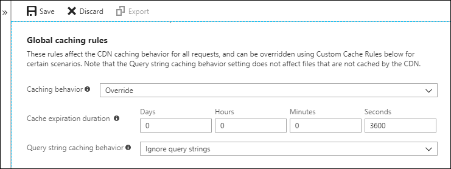
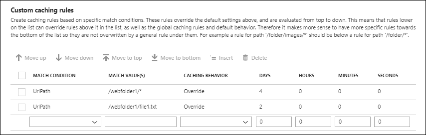

# Manage expiration of web content in Azure Content Delivery Network

> [!div class="op_single_selector"]
> - [Azure web content](cdn-manage-expiration-of-cloud-service-content.md)
> - [Azure Blob storage](cdn-manage-expiration-of-blob-content.md)
>

Files from publicly accessible origin web servers can be cached in Azure Content Delivery Network until their time to live (TTL) elapses. The TTL gets determined by the `Cache-Control` header in the HTTP response from the origin server. This article describes how to set `Cache-Control` headers for the Web Apps feature of Microsoft Azure App Service, Azure Cloud Services, ASP.NET applications, and Internet Information Services (IIS) sites, all of which are configured similarly. You can set the `Cache-Control` header either by using configuration files or programmatically.

You can also control cache settings from the Azure portal by setting [content delivery network caching rules](cdn-caching-rules.md). If you create one or more caching rules and set their caching behavior to **Override** or **Bypass cache**, the origin-provided caching settings discussed in this article are ignored. For information about general caching concepts, see [How caching works](cdn-how-caching-works.md).

> [!TIP]
> You can choose to set no TTL on a file. In this case, Azure Content Delivery Network automatically applies a default TTL of seven days, unless you've set up caching rules in the Azure portal. This default TTL applies only to general web delivery optimizations. For large file optimizations, the default TTL is one day, and for media streaming optimizations, the default TTL is one year.
>
> For more information about how Azure Content Delivery Network works to speed up access to files and other resources, see [Overview of the Azure Content Delivery Network](cdn-overview.md).
>

<a name='setting-cache-control-headers-by-using-cdn-caching-rules'></a>

## Setting Cache-Control headers by using content delivery network caching rules

The preferred method for setting a web server's `Cache-Control` header is to use caching rules in the Azure portal. For more information about content delivery network caching rules, see [Control Azure Content Delivery Network caching behavior with caching rules](cdn-caching-rules.md).

> [!NOTE]
> Caching rules are available only for **Azure CDN Standard from Edgio** profiles. For **Azure CDN Premium from Edgio** profiles, you must use the [Azure Content Delivery Network rules engine](./cdn-verizon-premium-rules-engine.md) in the **Manage** portal for similar functionality.

**To navigate to the CDN caching rules page**:

1. In the Azure portal, select a content delivery network profile, then select the endpoint for the web server.

1. In the left pane under Settings, select **Caching rules**.

   

   The **Caching rules** page appears.

   

**To set a web server's Cache-Control headers by using global caching rules:**

1. Under **Global caching rules**, set **Query string caching behavior** to **Ignore query strings** and set **Caching behavior** to **Override**.

1. For **Cache expiration duration**, enter 3600 in the **Seconds** box or 1 in the **Hours** box.

   

   This global caching rule sets a cache duration of one hour and affects all requests to the endpoint. It overrides any `Cache-Control` or `Expires` HTTP headers that get sent by the origin server specified by the endpoint.

1. Select **Save**.

**To set a web server file's Cache-Control headers by using custom caching rules:**

1. Under **Custom caching rules**, create two match conditions:

     1. For the first match condition, set **Match condition** to **Path** and enter `/webfolder1/*` for **Match value**. Set **Caching behavior** to **Override** and enter 4 in the **Days** box.

     1. For the second match condition, set **Match condition** to **Path** and enter `/webfolder1/file1.txt` for **Match value**. Set **Caching behavior** to **Override** and enter 2 in the **Days** box.

    

    The first custom caching rule sets a cache duration of four days for any files in the `/webfolder1` folder on the origin server specified by your endpoint. The second rule overrides the first rule for the `file1.txt` file only and sets a cache duration of two days for it.

1. Select **Save**.

## Setting Cache-Control headers by using configuration files

For static content, such as images and style sheets, you can control the update frequency by modifying the **applicationHost.config** or **Web.config** configuration files for your web application. To set the `Cache-Control` header for your content, use the `<system.webServer>/<staticContent>/<clientCache>` element in either file.

### Using ApplicationHost.config files

The **ApplicationHost.config** file is the root file of the IIS configuration system. The configuration settings in an **ApplicationHost.config** file affect all applications on the site, but are overridden by the settings of any **Web.config** files that exist for a web application.

### Using Web.config files

With a **Web.config** file, you can customize the way your entire web application or a specific directory on your web application behaves. Typically, you have at least one **Web.config** file in the root folder of your web application. For each **Web.config** file in a specific folder, the configuration settings affect everything in that folder and its subfolders, unless they're overridden at the subfolder level by another **Web.config** file.

For example, you can set a `<clientCache>` element in a **Web.config** file in the root folder of your web application to cache all static content on your web application for three days. You can also add a **Web.config** file in a subfolder with more variable content (for example, `\frequent`) and set its `<clientCache>` element to cache the subfolder's content for six hours. The net result is that content on the entire web site is cached for three days, except for any content in the `\frequent` directory, which is cached for only six hours.

The following XML configuration file example shows how to set the `<clientCache>` element to specify a maximum age of three days:

```xml
<configuration>
    <system.webServer>
        <staticContent>
            <clientCache cacheControlMode="UseMaxAge" cacheControlMaxAge="3.00:00:00" />
        </staticContent>
    </system.webServer>
</configuration>
```

To use the **cacheControlMaxAge** attribute, you must set the value of the **cacheControlMode** attribute to `UseMaxAge`. This setting caused the HTTP header and directive, `Cache-Control: max-age=<nnn>`, to be added to the response. The format of the timespan value for the **cacheControlMaxAge** attribute is `<days>.<hours>:<min>:<sec>`. Its value is converted to seconds and is used as the value of the `Cache-Control` `max-age` directive. For more information about the `<clientCache>` element, see [Client Cache \<clientCache>](/iis/configuration/system.webServer/staticContent/clientCache).

## Setting Cache-Control headers programmatically

For ASP.NET applications, you control the content delivery network caching behavior programmatically by setting the **HttpResponse.Cache** property of the .NET API. For information about the **HttpResponse.Cache** property, see [HttpResponse.Cache Property](/dotnet/api/system.web.httpresponse.cache#System_Web_HttpResponse_Cache) and [HttpCachePolicy Class](/dotnet/api/system.web.httpcachepolicy).

To programmatically cache application content in ASP.NET, follow these steps:
   1. Verify that the content is marked as cacheable by setting `HttpCacheability` to `Public`.
   1. Set a cache validator by calling one of the following `HttpCachePolicy` methods:
      - Call `SetLastModified` to set a timestamp value for the `Last-Modified` header.
      - Call `SetETag` to set a value for the `ETag` header.
   1. Optionally, specify a cache expiration time by calling `SetExpires` to set a value for the `Expires` header. Otherwise, the default cache heuristics described previously in this document apply.

For example, to cache content for one hour, add the following C# code:

```csharp
// Set the caching parameters.
Response.Cache.SetExpires(DateTime.Now.AddHours(1));
Response.Cache.SetCacheability(HttpCacheability.Public);
Response.Cache.SetLastModified(DateTime.Now);
```

## Testing the Cache-Control header

You can easily verify the TTL settings of your web content. With your browser's developer tools, test that your web content includes the `Cache-Control` response header. You can also use a tool such as **wget**, [Postman](https://www.getpostman.com/), or [Fiddler](https://www.telerik.com/fiddler) to examine the response headers.

## Next Steps

- [Read details about the **clientCache** element](/iis/configuration/system.webServer/staticContent/clientCache)
- [Read the documentation for the **HttpResponse.Cache** Property](/dotnet/api/system.web.httpresponse.cache#System_Web_HttpResponse_Cache)
- [Read the documentation for the **HttpCachePolicy Class**](/dotnet/api/system.web.httpcachepolicy)
- learn about [caching concepts](cdn-how-caching-works.md)
