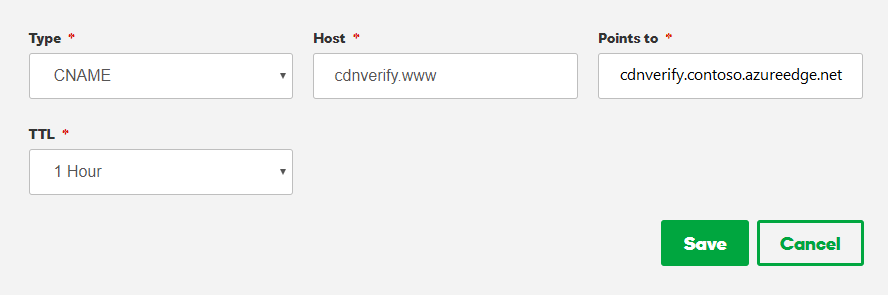
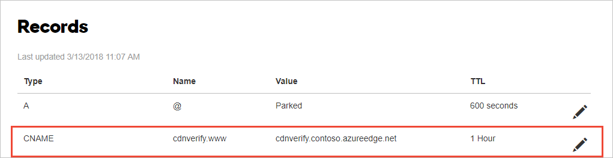
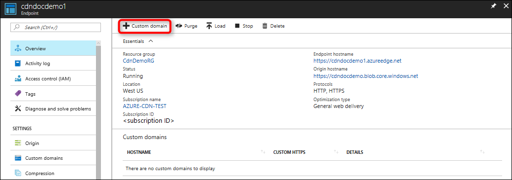
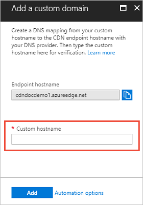
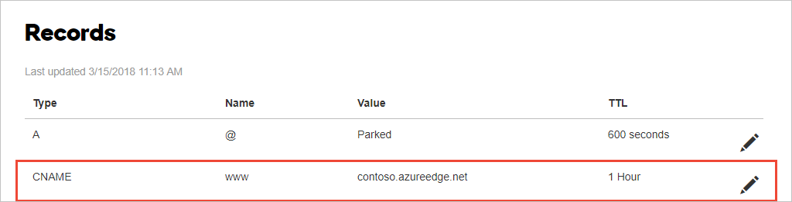

# Tutorial: Add a custom domain to your Azure CDN endpoint
This tutorial shows how to add a custom domain to an Azure Content Delivery Network (CDN) endpoint. When you use a CDN endpoint to deliver content, a custom domain is necessary if you would like your own domain name to be visible in your CDN URL. Having a visible domain name can be convenient for your customers and useful for branding purposes. 

After you create a CDN endpoint in your profile, the endpoint name, which is a subdomain of azureedge.net, is included in the URL for delivering CDN content by default (for example, https:\//contoso.azureedge.net/photo.png). For your convenience, Azure CDN provides the option of associating a custom domain with a CDN endpoint. With this option, you deliver your content with a custom domain in your URL instead of an endpoint name (for example, https:\//www.contoso.com/photo.png). 

In this tutorial, you learn how to:
> [!div class="checklist"]
> - Create a CNAME DNS record.
> - Associate the custom domain with your CDN endpoint.
> - Verify the custom domain.

[!INCLUDE [quickstarts-free-trial-note](../../includes/quickstarts-free-trial-note.md)]

## Prerequisites

Before you can complete the steps in this tutorial, you must first create a CDN profile and at least one CDN endpoint. For more information, see [Quickstart: Create an Azure CDN profile and endpoint](cdn-create-new-endpoint.md).

If you do not already have a custom domain, you must first purchase one with a domain provider. For example, see [Buy a custom domain name](https://docs.microsoft.com/azure/app-service/manage-custom-dns-buy-domain).

If you are using Azure to host your [DNS domains](https://docs.microsoft.com/azure/dns/dns-overview), you must delegate the domain provider's domain name system (DNS) to an Azure DNS. For more information, see [Delegate a domain to Azure DNS](https://docs.microsoft.com/azure/dns/dns-delegate-domain-azure-dns). Otherwise, if you are using a domain provider to handle your DNS domain, proceed to [Create a CNAME DNS record](#create-a-cname-dns-record).

## Create a CNAME DNS record

Before you can use a custom domain with an Azure CDN endpoint, you must first create a canonical name (CNAME) record with your domain provider to point to your CDN endpoint. A CNAME record is a type of DNS record that maps a source domain name to a destination domain name. For Azure CDN, the source domain name is your custom domain name and the destination domain name is your CDN endpoint hostname. After Azure CDN verifies the CNAME record that you create, traffic addressed to the source custom domain (such as www\.contoso.com) is routed to the specified destination CDN endpoint hostname (such as contoso.azureedge.net). 

A custom domain and its subdomain can be associated with only a single endpoint at a time. However, you can use different subdomains from the same custom domain for different Azure service endpoints by using multiple CNAME records. You can also map a custom domain with different subdomains to the same CDN endpoint.

> [!NOTE]
> Any alias record type can be used for Custom domains if you're using Azure DNS as your domain provider. This walkthrough uses the CNAME record type. If you're using A or AAAA record types, follow the same steps below and replace CNAME with the record type of your choice. If you're using an alias record to add a root domain as a custom domain and you want to enable SSL, you must use manual validation as described in [this article](https://docs.microsoft.com/azure/cdn/cdn-custom-ssl?tabs=option-1-default-enable-https-with-a-cdn-managed-certificate#custom-domain-is-not-mapped-to-your-cdn-endpoint). For more information, see [Point zone apex to Azure CDN endpoints](https://docs.microsoft.com/azure/dns/dns-alias#point-zone-apex-to-azure-cdn-endpoints).

## Map the temporary cdnverify subdomain

When you map an existing domain that is in production, there are special considerations. While you are registering your custom domain in the Azure portal, a brief period of downtime for the domain can occur. To avoid interruption of web traffic, first map your custom domain to your CDN endpoint hostname with the Azure cdnverify subdomain to create a temporary CNAME mapping. With this method, users can access your domain without interruption while the DNS mapping occurs. 

Otherwise, if you are using your custom domain for the first time and no production traffic is running on it, you can directly map your custom domain to your CDN endpoint. Proceed to [Map the permanent custom domain](#map-the-permanent-custom-domain).

To create a CNAME record with the cdnverify subdomain:

1. Sign in to the web site of the domain provider for your custom domain.

2. Find the page for managing DNS records by consulting the provider's documentation or searching for areas of the web site labeled **Domain Name**, **DNS**, or **Name server management**. 

3. Create a CNAME record entry for your custom domain and complete the fields as shown in the following table (field names may vary):

    | Source                    | Type  | Destination                     |
    |---------------------------|-------|---------------------------------|
    | cdnverify.www.contoso.com | CNAME | cdnverify.contoso.azureedge.net |

    - Source: Enter your custom domain name, including the cdnverify subdomain, in the following format: cdnverify.&lt;custom domain name&gt;. For example, cdnverify.www.contoso.com.

    - Type: Enter *CNAME*.

    - Destination: Enter your CDN endpoint hostname, including the cdnverify subdomain, in the following format: cdnverify._&lt;endpoint name&gt;_.azureedge.net. For example, cdnverify.contoso.azureedge.net.

4. Save your changes.

For example, the procedure for the GoDaddy domain registrar is as follows:

1. Sign in and select the custom domain you want to use.

2. In the Domains section, select **Manage All**, then select **DNS** | **Manage Zones**.

3. For **Domain Name**, enter your custom domain, then select **Search**.

4. From the **DNS Management** page, select **Add**, then select **CNAME** in the **Type** list.

5. Complete the following fields of the CNAME entry:

    

    - Type: Leave *CNAME* selected.

    - Host: Enter the subdomain of your custom domain to use, including the cdnverify subdomain name. For example, cdnverify.www.

    - Points to: Enter the host name of your CDN endpoint, including the cdnverify subdomain name. For example, cdnverify.contoso.azureedge.net. 

    - TTL: Leave *1 Hour* selected.

6. Select **Save**.
 
    The CNAME entry is added to the DNS records table.

    

## Associate the custom domain with your CDN endpoint

After you've registered your custom domain, you can then add it to your CDN endpoint. 

1. Sign in to the [Azure portal](https://portal.azure.com/) and browse to the CDN profile containing the endpoint that you want to map to a custom domain.
    
2. On the **CDN profile** page, select the CDN endpoint to associate with the custom domain.

   The **Endpoint** page opens.
    
3. Select **Custom domain**. 

   

   The **Add a custom domain** page opens.

4. For **Endpoint hostname**, the endpoint host name to use as the destination domain of your CNAME record is prefilled and is derived from your CDN endpoint URL: *&lt;endpoint hostname&gt;*.azureedge.net. It cannot be changed.

5. For **Custom hostname**, enter your custom domain, including the subdomain, to use as the source domain of your CNAME record. For example, www\.contoso.com or cdn.contoso.com. Do not use the cdnverify subdomain name.

   

6. Select **Add**.

   Azure verifies that the CNAME record exists for the custom domain name you entered. If the CNAME is correct, your custom domain will be validated. 

   It can take some time for the new custom domain settings to propagate to all CDN edge nodes: 
    - For **Azure CDN Standard from Microsoft** profiles, propagation usually completes in 10 minutes. 
    - For **Azure CDN Standard from Akamai** profiles, propagation usually completes within one minute. 
    - For **Azure CDN Standard from Verizon** and **Azure CDN Premium from Verizon** profiles, propagation usually completes in 10 minutes.   

## Verify the custom domain

After you have completed the registration of your custom domain, verify that the custom domain references your CDN endpoint.
 
1. Ensure that you have public content that is cached at the endpoint. For example, if your CDN endpoint is associated with a storage account, Azure CDN will cache the content in a public container. To test the custom domain, verify that your container is set to allow public access and contains at least one file.

2. In your browser, navigate to the address of the file by using the custom domain. For example, if your custom domain is www.contoso.com, the URL to the cached file should be similar to the following URL: http:\//www.contoso.com/my-public-container/my-file.jpg. Verify that the result is that same as when you access the CDN endpoint directly at *&lt;endpoint hostname&gt;*.azureedge.net.

## Map the permanent custom domain

If you have verified that the cdnverify subdomain has been successfully mapped to your endpoint (or if you are using a new custom domain  that is not in production), you can then map the custom domain directly to your CDN endpoint hostname.

To create a CNAME record for your custom domain:

1. Sign in to the web site of the domain provider for your custom domain.

2. Find the page for managing DNS records by consulting the provider's documentation or searching for areas of the web site labeled **Domain Name**, **DNS**, or **Name Server Management**. 

3. Create a CNAME record entry for your custom domain and complete the fields as shown in the following table (field names may vary):

    | Source          | Type  | Destination           |
    |-----------------|-------|-----------------------|
    | <www.contoso.com> | CNAME | contoso.azureedge.net |

   - Source: Enter your custom domain name (for example, www\.contoso.com).

   - Type: Enter *CNAME*.

   - Destination: Enter your CDN endpoint hostname. It must be in the following format:_&lt;endpoint name&gt;_.azureedge.net. For example, contoso.azureedge.net.

4. Save your changes.

5. If you're previously created a temporary cdnverify subdomain CNAME record, delete it. 

6. If you are using this custom domain in production for the first time, follow the steps for [Associate the custom domain with your CDN endpoint](#associate-the-custom-domain-with-your-cdn-endpoint) and [Verify the custom domain](#verify-the-custom-domain).

For example, the procedure for the GoDaddy domain registrar is as follows:

1. Sign in and select the custom domain you want to use.

2. In the Domains section, select **Manage All**, then select **DNS** | **Manage Zones**.

3. For **Domain Name**, enter your custom domain, then select **Search**.

4. From the **DNS Management** page, select **Add**, then select **CNAME** in the **Type** list.

5. Complete the fields of the CNAME entry:

    

    - Type: Leave *CNAME* selected.

    - Host: Enter the subdomain of your custom domain to use. For example, www or cdn.

    - Points to: Enter the host name of your CDN endpoint. For example, contoso.azureedge.net. 

    - TTL: Leave *1 Hour* selected.

6. Select **Save**.
 
    The CNAME entry is added to the DNS records table.

    

7. If you have a cdnverify CNAME record, select the pencil icon next to it, then select the trash can icon.

8. Select **Delete** to delete the CNAME record.

## Clean up resources

In the preceding steps, you added a custom domain to a CDN endpoint. If you no longer want to associate your endpoint with a custom domain, you can remove the custom domain by performing these steps:
 
1. In your CDN profile, select the endpoint with the custom domain that you want to remove.

2. From the **Endpoint** page, under Custom domains, right-click the custom domain that you want to remove, then select **Delete** from the context menu.  

   The custom domain is disassociated from your endpoint.

## Next steps

In this tutorial, you learned how to:

> [!div class="checklist"]
> - Create a CNAME DNS record.
> - Associate the custom domain with your CDN endpoint.
> - Verify the custom domain.

Advance to the next tutorial to learn how to configure HTTPS on an Azure CDN custom domain.

> [!div class="nextstepaction"]
> [Tutorial: Configure HTTPS on an Azure CDN custom domain](cdn-custom-ssl.md)

