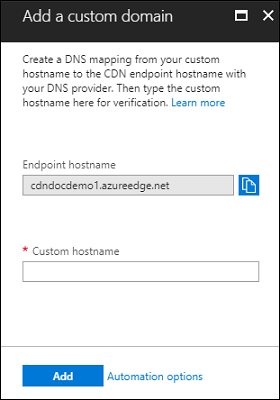

# Add a custom domain to your CDN endpoint
After you create a profile, you typically also create one or more CDN [endpoints](cdn-create-new-endpoint.md#create-a-new-cdn-endpoint) (a subdomain of `azureedge.net`) to deliver your content using HTTP and HTTPS. By default, this endpoint is included in all your URLs (for example, `https://contoso.azureedge.net/photo.png`). For your convenience, Azure CDN allows you to associate a custom domain (for example, `www.contoso.com`) with your endpoint. With this option, you use a custom domain to deliver your content instead of your endpoint. This option is useful if, for example, you would like your own domain name to be visible to your customers for branding purposes.

If you do not already have a custom domain, you must first purchase one with a domain provider. After you have obtained a custom domain, follow these steps:
1. [Access the DNS records of your domain provider](#step-1-access-dns-records-by-using-your-domain-provider)
2. [Create the CNAME DNS record(s)](#step-2-create-the-cname-dns-records)
	- Option 1: Direct mapping of your custom domain to the CDN endpoint
	- Option 2: Mapping of your custom domain to the CDN endpoint by using cdnverify 
3. [Enable the CNAME record mapping in Azure](#step-3-enable-the-cname-record-mapping-in-azure)
4. [Verify that the custom subdomain references your CDN endpoint](#step-4-verify-that-the-custom-subdomain-references-your-cdn-endpoint)
5. [(Dependent step) Map the permanent custom domain to the CDN endpoint](#step-5-dependent-step-map-the-permanent-custom-domain-to-the-cdn-endpoint)

## Step 1: Access DNS records by using your domain provider

If you are using Azure to host your [DNS domains](https://docs.microsoft.com/en-us/azure/dns/dns-overview), you must delegate the domain provider's DNS to an Azure DNS. For more information, see [Delegate a domain to Azure DNS](https://docs.microsoft.com/azure/dns/dns-delegate-domain-azure-dns)

Otherwise, if you are using your domain provider to handle your DNS domain, sign in to the website of your domain provider. Find the page for managing DNS records by consulting the provider's documentation or searching for areas of the web site labeled **Domain Name**, **DNS**, or **Name Server Management**. Often, you can find the DNS records page by viewing your account information and looking for a link such as **My domains**. Some providers have different links to add different types of records.

> [!NOTE]
> For certain providers, such as GoDaddy, changes to DNS records don't become effective until you select a separate **Save Changes** link. 

## Step 2: Create the CNAME DNS record(s)

Before you can use a custom domain with an Azure CDN endpoint, you must first create a Canonical Name (CNAME) record with your domain provider. A CNAME record is a type of record in the Domain Name System (DNS) that maps a source domain to a destination domain by specifying an alias domain name for the "canonical" or true domain name. For Azure CDN, the source domain is your custom domain (and subdomain) and the destination domain is your CDN endpoint. Azure CDN verifies the CNAME DNS record when you add the custom domain to the endpoint from the portal or API. 

A CNAME record maps a specific domain and subdomain, such as `www.contoso.com` or `cdn.contoso.com`; it is not possible to map a CNAME record to a root domain, such as `contoso.com`. A subdomain can be associated with only one CDN endpoint and the CNAME record that you create will route all traffic addressed to the subdomain to the specified endpoint. For example, if you associate `www.contoso.com` with your CDN endpoint, you cannot associate it with another Azure endpoint, such as a storage account endpoint or a cloud service endpoint. However, you can use different subdomains from the same domain for different service endpoints. You can also map different subdomains to the same CDN endpoint.

Use one of the following options to map your custom domain to a CDN endpoint:

- Option 1: Direct mapping. If no production traffic is running on the custom domain, you can map a custom domain to a CDN endpoint directly. The process of mapping your custom domain to your CDN endpoint might result in a brief period of downtime for the domain while you are registering the domain in the Azure portal. Your CNAME mapping entry should be in this format: 
 
  | NAME             | TYPE  | VALUE                  |
  |------------------|-------|------------------------|
  | www\.consoto.com | CNAME | consoto\.azureedge.net |

- Option 2: Mapping with the **cdnverify** subdomain. If production traffic that cannot be interrupted is running on the custom domain, you can create a temporary CNAME mapping to your CDN endpoint. With this option, you use the Azure **cdnverify** subdomain to provide an intermediate registration step so that users can access your domain without interruption while the DNS mapping takes place.

   1. Create a new CNAME record and provide a subdomain alias that includes the **cdnverify** subdomain. For example, **cdnverify.www** or **cdnverify.cdn**. 
   2. Provide the host name, which is your CDN endpoint, in the following format: `cdnverify.<EndpointName>.azureedge.net`. Your CNAME mapping entry should be in this format: 

   | NAME                       | TYPE  | VALUE                            |
   |----------------------------|-------|----------------------------------|
   | cdnverify.www\.consoto.com | CNAME | cdnverify.consoto\.azureedge.net | 

## Step 3: Enable the CNAME record mapping in Azure

After you have registered your custom domain by using one of the previous procedures, you can then enable the custom domain feature in Azure CDN. 

1. Log in to the [Azure portal](https://portal.azure.com/) and browse to the CDN profile with the endpoint you want to map to a custom domain.  
2. In the **CDN Profile** blade, select the CDN endpoint with which you want to associate the subdomain.
3. In the upper left of the endpoint blade, click **Custom domain**. 

   

4. In the **Custom hostname** text box, enter your custom domain, including the subdomain. For example, `www.contoso.com` or `cdn.contoso.com`.

   

5. Click **Add**.

   Azure verifies that the CNAME record exists for the domain name you have entered. If the CNAME is correct, your custom domain is validated. It can take some time for the CNAME record to propagate to the name servers. If your domain is not validated immediately, verify that the CNAME record is correct, then wait a few minutes and try again. For **Azure CDN from Verizon** (Standard and Premium) endpoints, it can take up to 90 minutes for custom domain settings to propagate to all CDN edge nodes.  

## Step 4: Verify that the custom subdomain references your CDN endpoint

After you have completed the registration of your custom domain, verify that the custom subdomain references your CDN endpoint.
 
1. Ensure that you have public content that is cached at the endpoint. For example, if your CDN endpoint is associated with a storage account, the CDN caches content in public blob containers. To test the custom domain, verify that your container is set to allow public access and contains at least one blob.

2. In your browser, navigate to the address of the blob by using the custom domain. For example, if your custom domain is `cdn.contoso.com`, the URL to the cached blob should be similar to the following URL: `http://cdn.contoso.com/mypubliccontainer/acachedblob.jpg`.

## Step 5 (Dependent step): Map the permanent custom domain to the CDN endpoint

This step is dependent on step 2, option 2 (Mapping with the **cdnverify** subdomain). If you are using the temporary **cdnverify** subdomain and have verified that it works, you can then map your permanent custom domain to the CDN endpoint.

1. On your domain provider's web site, create a CNAME DNS record to map your permanent custom domain to the CDN endpoint. Your CNAME mapping entry should be in this format: 
 
   | NAME             | TYPE  | VALUE                  |
   |------------------|-------|------------------------|
   | www\.consoto.com | CNAME | consoto\.azureedge.net |
2. Delete the CNAME record with the **cdnverify** subdomain that you previously created.

## See Also
[How to Enable the Content Delivery Network (CDN) for Azure](cdn-create-new-endpoint.md)  
[Delegating your domain to Azure DNS](../dns/dns-domain-delegation.md)