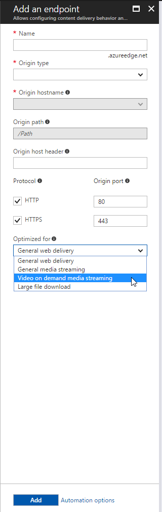

# Media streaming optimization with Azure CDN 
 
Use of high-definition video is increasing on the internet, which creates difficulties for efficient delivery of large files. Customers expect smooth playback of video on demand or live video assets on a variety of networks and clients all over the world. A fast and efficient delivery mechanism for media streaming files is critical to ensure a smooth and enjoyable consumer experience.  

Live streaming media is especially difficult to deliver because of the large sizes and number of concurrent viewers. Long delays cause users to leave. Because live streams can't be cached ahead of time and large latencies aren't acceptable to viewers, video fragments must be delivered in a timely manner. 

The request patterns of streaming also provide some new challenges. When a popular live stream or a new series is released for video on demand, thousands to millions of viewers might request the stream at the same time. In this case, smart request consolidation is vital to not overwhelm the origin servers when the assets aren't cached yet.
 

## Media streaming optimizations for Azure CDN from Microsoft

**Azure CDN Standard from Microsoft** endpoints deliver streaming media assets directly by using the general web delivery optimization type. 

Media streaming optimization for **Azure CDN Standard from Microsoft** is effective for live or video-on-demand streaming media that uses individual media fragments for delivery. This process is different from a single large asset transferred via progressive download or by using byte-range requests. For information on that style of media delivery, see [Large file download optimization with Azure CDN](cdn-large-file-optimization.md).

The general media delivery or video-on-demand media delivery optimization types use Azure Content Delivery Network (CDN) with back-end optimizations to deliver media assets faster. They also use configurations for media assets based on best practices learned over time.

### Partial cache sharing
Partial cache sharing allows the CDN to serve partially cached content to new requests. For example, if the first request to the CDN results in a cache miss, the request is sent to the origin. Although this incomplete content is loaded into the CDN cache, other requests to the CDN can start getting this data. 

## Media streaming optimizations for Azure CDN from Verizon

**Azure CDN Standard from Verizon** and **Azure CDN Premium from Verizon** endpoints deliver streaming media assets directly by using the general web delivery optimization type. A few features on the CDN directly assist in delivering media assets by default.

### Partial cache sharing

Partial cache sharing allows the CDN to serve partially cached content to new requests. For example, if the first request to the CDN results in a cache miss, the request is sent to the origin. Although this incomplete content is loaded into the CDN cache, other requests to the CDN can start getting this data. 

### Cache fill wait time

 The cache fill wait time feature forces the edge server to hold any subsequent requests for the same resource until HTTP response headers arrive from the origin server. If HTTP response headers from the origin  arrive before the timer expires, all requests that were put on hold are served out of the growing cache. At the same time, the cache is filled by data from the origin. By default, the cache fill wait time is set to 3,000 milliseconds. 

 
## Media streaming optimizations for Azure CDN from Akamai
 
**Azure CDN Standard from Akamai** offers a feature that delivers streaming media assets efficiently to users across the globe at scale. The feature reduces latencies because it reduces the load on the origin servers. This feature is available with the standard Akamai pricing tier. 

Media streaming optimization for **Azure CDN Standard from Akamai** is effective for live or video-on-demand streaming media that uses individual media fragments for delivery. This process is different from a single large asset transferred via progressive download or by using byte-range requests. For information on that style of media delivery, see [Large file optimization](cdn-large-file-optimization.md).

The general media delivery or video-on-demand media delivery optimization types use a CDN with back-end optimizations to deliver media assets faster. They also use configurations for media assets based on best practices learned over time.

### Configure an Akamai CDN endpoint to optimize media streaming
 
You can configure your content delivery network (CDN) endpoint to optimize delivery for large files via the Azure portal. You can also use the REST APIs or any of the client SDKs to do this. The following steps show the process via the Azure portal for an **Azure CDN Standard from Akamai** profile:

1. To add a new endpoint, on an Akamai **CDN profile** page, select **Endpoint**.
  
    

2. In the **Optimized for** drop-down list, select **Video on demand media streaming** for video-on-demand assets. If you do a combination of live and video-on-demand streaming, select **General media streaming**.

     
 
After you create the endpoint, it applies the optimization for all files that match certain criteria. The following section describes this process. 

### Caching

If **Azure CDN Standard from Akamai** detects that the asset is a streaming manifest or fragment, it uses different caching expiration times from general web delivery. (See the full list in the following table.) As always, cache-control or Expires headers sent from the origin are honored. If the asset is not a media asset, it caches by using the expiration times for general web delivery.

The short negative caching time is useful for origin offload when many users request a fragment that doesn’t exist yet. An example is a live stream where the packets aren't available from the origin that second. The longer caching interval also helps offload requests from the origin because video content isn't typically modified.
 

|   | General web delivery | General media streaming | Video-on-demand media streaming  
--- | --- | --- | ---
Caching: Positive   HTTP 200, 203, 300,   301, 302, and 410 | 7 days |365 days | 365 days   
Caching: Negative   HTTP 204, 305, 404,   and 405 | None | 1 second | 1 second
 
### Deal with origin failure  

General media delivery and video-on-demand media delivery also have origin timeouts and a retry log based on best practices for typical request patterns. For example, because general media delivery is for live and video-on-demand media delivery, it uses a shorter connection timeout due to the time-sensitive nature of live streaming.

When a connection times out, the CDN retries a number of times before it sends a "504 - Gateway Timeout" error to the client. 

When a file matches the file type and size conditions list, the CDN uses the behavior for media streaming. Otherwise, it uses general web delivery.
   
### Conditions for media streaming optimization 

The following table lists the set of criteria to be satisfied for media streaming optimization: 
 
Supported streaming types | File extensions  
--- | ---  
Apple HLS | m3u8, m3u, m3ub, key, ts, aac
Adobe HDS | f4m, f4x, drmmeta, bootstrap, f4f, Seg-Frag URL structure   (matching regex: ^(/.*)Seq(\d+)-Frag(\d+)
DASH | mpd, dash, divx, ismv, m4s, m4v, mp4, mp4v,   sidx, webm, mp4a, m4a, isma
Smooth streaming | /manifest/, /QualityLevels/Fragments/
  
 
