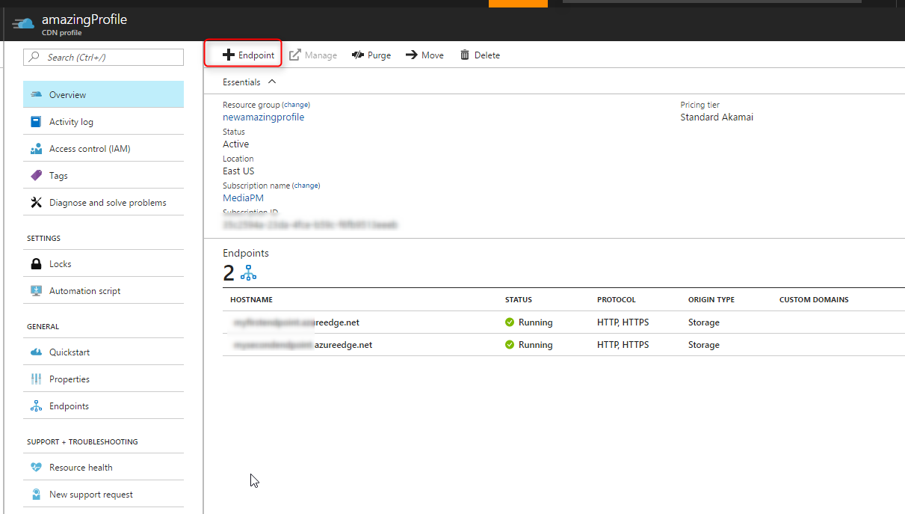
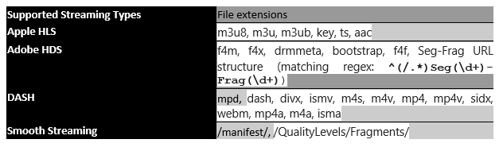

# Media Streaming Optimization via Azure CDN 
 
High definition video is becoming an ever-larger part of the internet, which creates various difficulties in efficiently delivering such large files across the internet. Customers expect smooth playback of VOD or live video assets on a variety of networks and clients all over the world. Providing a faster and efficient delivery mechanism for media streaming files is critical to ensure smooth and enjoyable consumer experience.  

Live streaming media is especially difficult to deliver, not only because of the large sizes and number of concurrent viewers, but also because delays are a deal breaker for users. Live streams cannot be cached ahead of time, and large latencies are not acceptable to viewers, so video fragments must be delivered in a timely manner. 

The request patterns of streaming also provide some new challenges. Either for a popular live stream, or when a new series are released for Video on Demand (VOD), there may be thousands to millions of viewers attempting to request the stream at the same time. In this case, smart request consolidation is vital to not overwhelm the origin servers when the assets are not cached yet.
 
Azure CDN from Akamai now offers a feature catered to delivering streaming media assets efficiently to end users across the globe at scale and reduced latencies while reducing the load on the origin servers. This feature is available through the “Optimized For” feature on Azure CDN Endpoint created under an Azure CDN Profile with “Standard Akamai” pricing tier. You should use “Video on demand media streaming” optimization for VOD assets, and “General media streaming” optimization type if you do a combination of live and VOD streaming.

Azure CDN from Verizon can deliver streaming media directly in the “general web delivery” optimization type.
 
## Configuring CDN Endpoint to optimize delivery of media streaming in Azure CDN from Akamai
 
You can configure your CDN endpoint to optimize delivery for large files via Azure Portal by simply selecting the “General media streaming” or “Video on demand media streaming” option under the “Optimized For” property selection during the endpoint creation. You can also use our REST APIs or any of the client SDKs to do this. The screenshots below illustrate the process via Azure Portal. 
  

*Figure 1: Adding a new CDN endpoint from the CDN Profile*

 
  
*Figure 2: Creating a CDN Endpoint with Video on demand media streaming selected* 
 
Once the CDN endpoint is created, it will apply the optimization for all files that match certain criteria. The following section describes this in detail. 
 
## Media streaming optimizations for Azure CDN from Akamai
 
Media streaming optimization from Akamai is effective for live or VOD streaming media that uses individual media fragments for delivery, as opposed to a single large asset transferred via progressive download or using byte range requests. For that style of media delivery, check out [large file optimization](cdn-large-file-optimization.md).

Using either the general media delivery or VOD media delivery optimization type will use a CDN network with backend optimizations to deliver media assets faster, as well as configurations for media assets based on best practices learned over time.

### Caching

If Azure CDN from Akamai detects the asset is a streaming manifest or fragment (see full list below), the CDN will use different caching expiration times from general delivery. As always, cache-control or expires headers sent from the origin will be honored, and if the asset is not a media asset it will cache using the expiration times for general web delivery.

The short negative caching time is useful for origin offload when many users request a fragment that doesn’t exist yet, such as in a live stream where the packets are not available from the origin that second. The longer caching interval also helps offload requests from the origin as video content is not typically modified.
 
 
 
### Dealing with Origin Failure  

General media delivery and VOD media delivery also have origin timeout and retry log based on best practices for typical request patterns. For example, since general media delivery is targeted for both live and VOD media delivery, it uses a much shorter connection timeout due to the time sensitive nature of live streaming.

When a connection times out, the CDN will retry a certain number of times before sending a 504 Gateway Time-out error to the client. 

When a file matches the file type and size conditions list, the CDN uses the behavior for media streaming, and general web delivery otherwise. 
   
### Conditions for media streaming optimization 

The following table lists the set of criteria to be satisfied for this optimization 
 
 
 
## Media streaming optimizations for Azure CDN from Verizon

Azure CDN from Verizon is capable of delivery streaming media assets directly using the ‘general web delivery’ optimization type. There are also a few features on the CDN by default that directly assist in delivery media assets.

### Partial cache sharing

This allows partially cached content to be served from the CDN to new requests. This means that for example, the first request to the CDN results in a cache miss, and the request is sent to the origin. While this content is still loaded into the CDN cache (but is still incomplete), other requests to the CDN can start getting this data. 

### Cache Fill Wait Time

Useful in conjunction with partial cache sharing, the cache fill wait time feature forces the edge server to hold any subsequent requests for the same resource until HTTP response headers arrive from the Origin server. If HTTP response headers from the Origin server arrive before the timer expires, all requests that were put on hold will get served out of the growing cache (at the same time it is filled by data from the origin). By default, Cache Fill Wait Time is set to 3000 milliseconds. 

