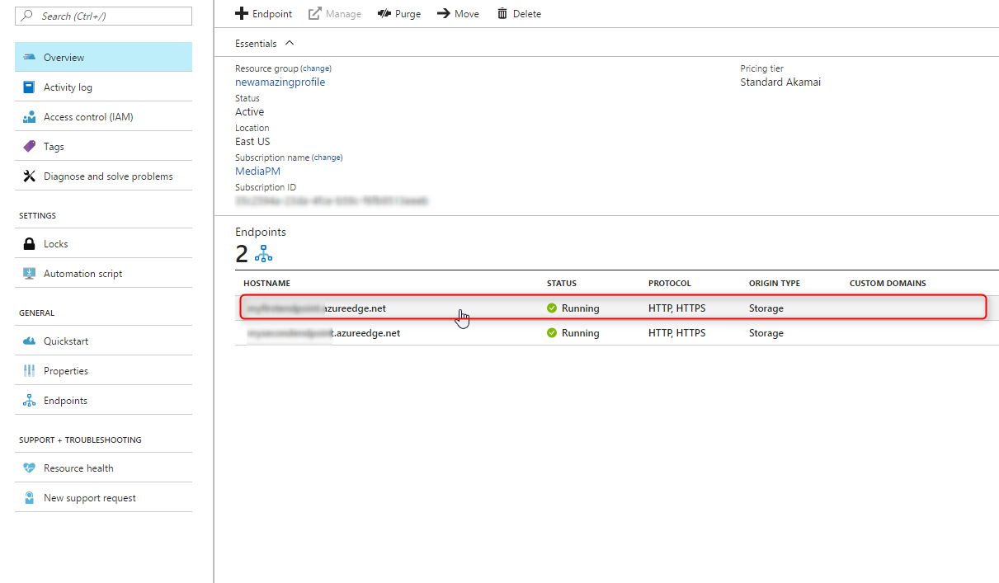
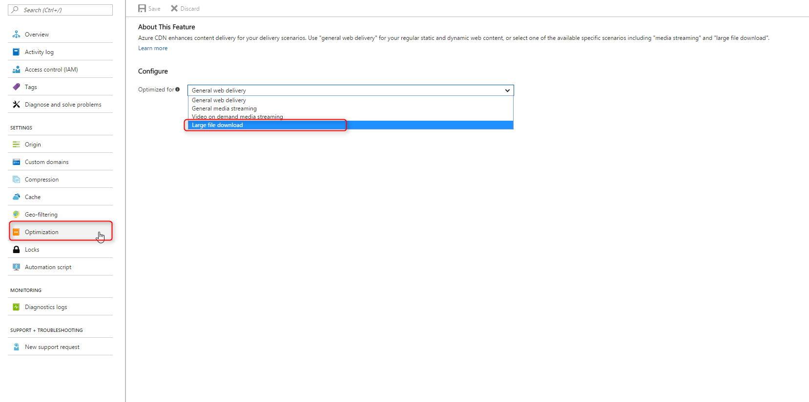

# Optimize Azure CDN for the type of content delivery

When you deliver content to a large global audience, it's critical to ensure the optimized delivery of your content. [Azure Content Delivery Network (CDN)](cdn-overview.md) can optimize the delivery experience based on the type of content you have. The content can be a website, a live stream, a video, or a large file for download. When you create a CDN endpoint, you specify a scenario in the **Optimized for** option. Your choice determines which optimization is applied to the content delivered from the CDN endpoint.

Optimization choices are designed to use best-practice behaviors to improve content delivery performance and better origin offload. Your scenario choices affect performance by modifying configurations for partial caching, object chunking, and the origin failure retry policy. 

This article provides an overview of various optimization features and when you should use them. For more information on features and limitations, see the respective articles on each individual optimization type.

> [!NOTE]
> When you create a CDN endpoint, the **Optimized for** options can vary based on the type of profile the endpoint is created in. Azure CDN providers apply enhancement in different ways, depending on the scenario. 

## Provider options

**Azure CDN Standard from Microsoft** profiles supports the following optimizations:

* [General web delivery](#general-web-delivery). This optimization is also used for media streaming and large file download.

> [!NOTE]
> Dynamic site acceleration from Microsoft is offered via [Azure Front Door Service](../frontdoor/front-door-overview.md).

**Azure CDN Standard from Edgio** and **Azure CDN Premium from Edgio** profiles support the following optimizations:

* [General web delivery](#general-web-delivery). This optimization is also used for media streaming and large file download.

* [Dynamic site acceleration](#dynamic-site-acceleration) 

**Azure CDN Standard from Akamai** profiles support the following optimizations:

> [!IMPORTANT]
> Azure CDN from Akamai is scheduled to be retired on October 31, 2023. For more information, see [**Migrate CDN provider**](cdn-change-provider.md) for guidance on migrating to another Azure CDN provider.

* [General web delivery](#general-web-delivery) 

* [General media streaming](#general-media-streaming)

* [Video-on-demand media streaming](#video-on-demand-media-streaming)

* [Large file download](#large-file-download)

* [Dynamic site acceleration](#dynamic-site-acceleration) 

Microsoft recommends that you test performance variations between different providers to select the optimal provider for your delivery.

## Select and configure optimization types

When you create a CDN endpoint, select an optimization type that best matches the scenario and type of content that you want the endpoint to deliver. 

**General web delivery** is the default selection. You can only update **Azure CDN Standard from Akamai** endpoints optimization at any time. 

For **Azure CDN Standard from Microsoft**, **Azure CDN Standard from Edgio** and **Azure CDN Premium from Edgio**, you can't.

1. In an **Azure CDN Standard from Akamai** profile, select an endpoint.

    

2. Under SETTINGS, select **Optimization**. Then, select a type from the **Optimized for** drop-down list.

    

## Optimization for specific scenarios

You can optimize the CDN endpoint for one of these scenarios. 

### General web delivery

General web delivery is the most common optimization option. It's designed for general web content optimization, such as webpages and web applications. This optimization also can be used for file and video downloads.

A typical website contains static and dynamic content. Static content includes images, JavaScript libraries, and style sheets that can be cached and delivered to different users. Dynamic content is personalized for an individual user, such as news items that are tailored to a user profile. Dynamic content, such as shopping cart contents, isn't cached because it's unique to each user. General web delivery can optimize your entire website. 

> [!NOTE]
> If you are using an **Azure CDN Standard from Akamai** profile, select this optimization type if your average file size is smaller than 10 MB. Otherwise, if your average file size is larger than 10 MB, select **Large file download** from the **Optimized for** drop-down list.

### General media streaming

If you need to use the endpoint for live streaming and video-on-demand streaming, select the general media streaming optimization type.

Media streaming is time-sensitive, because packets that arrive late on the client, such as frequent buffering of video content, can cause a degraded viewing experience. Media streaming optimization reduces the latency of media content delivery and provides a smooth streaming experience for users. 

This scenario is common for Azure media service customers. When you use Azure media services, you get a single streaming endpoint that can be used for both live and on-demand streaming. With this scenario, customers don't need to switch to another endpoint when they change from live to on-demand streaming. General media streaming optimization supports this type of scenario.

For **Azure CDN Standard from Microsoft**, **Azure CDN Standard from Edgio**, and **Azure CDN Premium from Edgio**, use the general web delivery optimization type to deliver general streaming media content.

For more information about media streaming optimization, see [Media streaming optimization](cdn-media-streaming-optimization.md).

### Video-on-demand media streaming

Video-on-demand media streaming optimization improves video-on-demand streaming content. If you use an endpoint for video-on-demand streaming, use this option.

For **Azure CDN Standard from Microsoft**, **Azure CDN Standard from Edgio**, and **Azure CDN Premium from Edgio** profiles, use the general web delivery optimization type to deliver video-on-demand streaming media content.

For more information about media streaming optimization, see [Media streaming optimization](cdn-media-streaming-optimization.md).

> [!NOTE]
> If the CDN endpoint primarily serves video-on-demand content, use this optimization type. The major difference between this optimization type and the general media streaming optimization type is the connection retry time-out. The time-out is much shorter to work with live streaming scenarios.
>

### Large file download

For **Azure CDN Standard from Akamai** profiles, large file downloads are optimized for content larger than 10 MB. If your average file size is smaller than 10 MB, use general web delivery. If your average files sizes are consistently larger than 10 MB, it might be more efficient to create a separate endpoint for large files. For example, firmware or software updates typically are large files. To deliver files larger than 1.8 GB, the large file download optimization is required.

For **Azure CDN Standard from Microsoft**, **Azure CDN Standard from Edgio**, and **Azure CDN Premium from Edgio** profiles, use the general web delivery optimization type to deliver large file download content. There's no limitation on file download size.

For more information about large file optimization, see [Large file optimization](cdn-large-file-optimization.md).

### Dynamic site acceleration

 Dynamic site acceleration (DSA) is available for **Azure CDN Standard from Akamai**, **Azure CDN Standard from Edgio**, and **Azure CDN Premium from Edgio** profiles. This optimization involves an extra fee to use; for more information, see [Content Delivery Network pricing](https://azure.microsoft.com/pricing/details/cdn/).

> [!NOTE]
> Dynamic site acceleration from Microsoft is offered via [Azure Front Door Service](../frontdoor/front-door-overview.md) which is a global [anycast](https://en.wikipedia.org/wiki/Anycast) service leveraging Microsoft's private global network to deliver your app workloads.

DSA includes various techniques that benefit the latency and performance of dynamic content. Techniques include route and network optimization, TCP optimization, and more. 

You can use this optimization to accelerate a web app that includes numerous responses that aren't cacheable. Examples are search results, checkout transactions, or real-time data. You can continue to use core Azure CDN caching capabilities for static data. 

For more information about dynamic site acceleration, see [Dynamic site acceleration](cdn-dynamic-site-acceleration.md).
