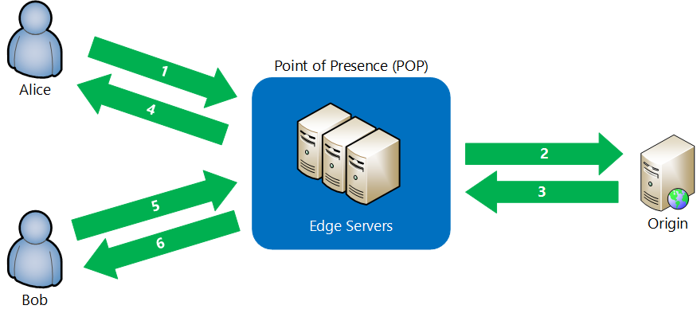

# What is a content delivery network on Azure?
A content delivery network (CDN) is a distributed network of servers that can efficiently deliver web content to users. CDNs store cached content on edge servers in point-of-presence (POP) locations that are close to end users, to minimize latency. 

Azure Content Delivery Network (CDN) offers developers a global solution for rapidly delivering high-bandwidth content to users by caching their content at strategically placed physical nodes across the world. Azure CDN can also accelerate dynamic content, which cannot be cached, by leveraging various network optimizations using CDN POPs. For example, route optimization to bypass Border Gateway Protocol (BGP).

The benefits of using Azure CDN to deliver web site assets include:

* Better performance and improved user experience for end users, especially when using applications in which multiple round-trips are required to load content.
* Large scaling to better handle instantaneous high loads, such as the start of a product launch event.
* Distribution of user requests and serving of content directly from edge servers so that less traffic is sent to the origin server.

For a list of current CDN node locations, see [Azure CDN POP locations](cdn-pop-locations.md).

## How it works

1. A user (Alice) requests a file (also called an asset) by using a URL with a special domain name, such as _&lt;endpoint name&gt;_.azureedge.net. This name can be an endpoint hostname or a custom domain. The DNS routes the request to the best performing POP location, which is usually the POP that is geographically closest to the user.
    
2. If no edge servers in the POP have the file in their cache, the POP requests the file from the origin server. The origin server can be an Azure Web App, Azure Cloud Service, Azure Storage account, or any publicly accessible web server.
   
3. The origin server returns the file to an edge server in the POP.
    
4. An edge server in the POP caches the file and returns the file to the original requestor (Alice). The file remains cached on the edge server in the POP until the time-to-live (TTL) specified by its HTTP headers expires. If the origin server didn't specify a TTL, the default TTL is seven days.
    
5. Additional users can then request the same file by using the same URL that Alice used, and can also be directed to the same POP.
    
6. If the TTL for the file hasn't expired, the POP edge server returns the file directly from the cache. This process results in a faster, more responsive user experience.

## Requirements
To use Azure CDN, you must own at least one Azure subscription. You also need to create at least one CDN profile, which is a collection of CDN endpoints. Every CDN endpoint represents a specific configuration of content deliver behavior and access. To organize your CDN endpoints by internet domain, web application, or some other criteria, you can use multiple profiles. Because [Azure CDN pricing](https://azure.microsoft.com/pricing/details/cdn/) is applied at the CDN profile level, you must create multiple CDN profiles if you want to use a mix of pricing tiers. For information about the Azure CDN billing structure, see [Understanding Azure CDN billing](cdn-billing.md).

### Limitations
Each Azure subscription has default limits for the following resources:
 - The number of CDN profiles that can be created.
 - The number of endpoints that can be created in a CDN profile. 
 - The number of custom domains that can be mapped to an endpoint.

For more information about CDN subscription limits, see [CDN limits](https://docs.microsoft.com/azure/azure-subscription-service-limits).
    
## Azure CDN features
Azure CDN offers the following key features:

- [Dynamic site acceleration](cdn-dynamic-site-acceleration.md)
- [CDN caching rules](cdn-caching-rules.md)
- [HTTPS custom domain support](cdn-custom-ssl.md)
- [Azure diagnostics logs](cdn-azure-diagnostic-logs.md)
- [File compression](cdn-improve-performance.md)
- [Geo-filtering](cdn-restrict-access-by-country.md)

For a complete list of features that each Azure CDN product supports, see [Compare Azure CDN product features](cdn-features.md).

## Next steps
- To get started with CDN, see [Create an Azure CDN profile and endpoint](cdn-create-new-endpoint.md).
- Manage your CDN endpoints through the [Microsoft Azure portal](https://portal.azure.com) or with [PowerShell](cdn-manage-powershell.md).
- Learn how to automate Azure CDN with [.NET](cdn-app-dev-net.md) or [Node.js](cdn-app-dev-node.md).
- To see Azure CDN in action, watch the [Azure CDN videos](https://azure.microsoft.com/resources/videos/index/?services=cdn&sort=newest).
- For information about the latest Azure CDN features, see [Azure CDN blog](https://azure.microsoft.com/blog/tag/azure-cdn/).
