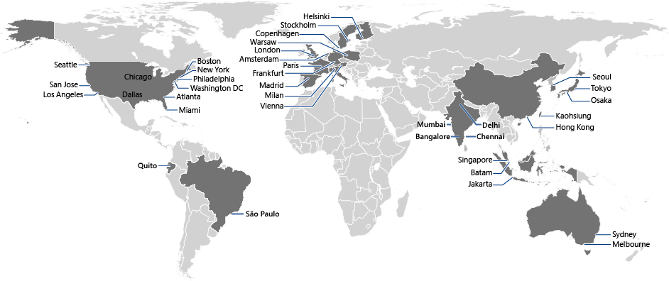

<properties
	pageTitle="Azure CDN POP Locations"
	description="This topic lists Azure CDN POP Locations."
	services="cdn"
	documentationCenter=""
	authors="camsoper"
	manager="erikre"
	editor=""/>

<tags
	ms.service="cdn"
	ms.workload="media"
	ms.tgt_pltfrm="na"
	ms.devlang="na"
	ms.topic="article"
	ms.date="05/11/2016"
	ms.author="casoper"/>

# Azure CDN POP Locations

This topic lists current POP locations for **Azure CDN from Verizon** and **Azure CDN from Akamai**.

>[AZURE.NOTE] **Azure CDN from Akamai** POP locations are not individually disclosed by Akamai, only countries.  
 

| Region | Verizon | Akamai |
|--------|---------|--------|
| North America | Atlanta, GA Philadelphia, PA New York, NY Miami, FL Washington DC Boston, MA Chicago, IL Dallas, TX Los Angeles, CA San Jose, CA Seattle, WA | Canada Mexico United States |
| South America | São Paulo, Brazil Rio de Janeiro, Brazil Quito, Ecuador Medellin, Colombia Buenos Aires, Argentina| Argentina Brazil Chile Colombia Ecuador Peru Uruguay | 
| North and East Europe| Copenhagen, Denmark Helsinki, Finland London, UK Stockholm, Sweden Warsaw, Poland | Bulgaria Denmark Finland Ireland Norway Poland Sweden United Kingdom  |
| West Europe | Amsterdam, Netherlands Frankfurt, Germany Paris, France Vienna, Austria | Austria Belgium France Germany Netherlands Switzerland|
| South Europe | Madrid, Spain Milan, Italy | Greece Italy Portugal Spain |
| East Asia | Tokyo, Japan Osaka, Japan Batam, Indonesia Jakarta, Indonesia Hong Kong Kaohsiung, Taiwan Seoul, South Korea Singapore| Hong Kong Indonesia Japan Macau Malaysia Philippines Singapore South Korea Taiwan, Province of China Thailand |
| South and Central Asia | Bangalore, India Chennai, India Delhi, India Mumbai, India | India Sri Lanka |
| Middle East/West Asia | Muscat, Oman | Israel Kuwait Qatar Turkey United Arab Emirates
| Africa | | Egypt South Africa
| Australia and New Zealand | Melbourne, Australia Sydney, Australia | Australia New Zealand |
