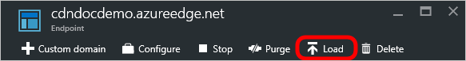
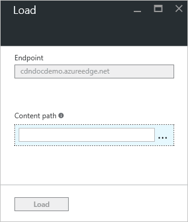
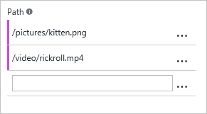

# Pre-load assets on an Azure CDN endpoint
[!INCLUDE [cdn-verizon-only](../../includes/cdn-verizon-only.md)]

By default, assets are cached only when they're requested. Because the edge servers have not yet cached the content and need to forward the request to the origin server, the first request from each region can take longer than subsequent requests. To avoid this first-hit latency, pre-load your assets. In addition to providing a better customer experience, pre-loading your cached assets can reduce network traffic on the origin server.

> [!NOTE]
> Pre-loading assets is useful for large events or content that becomes simultaneously available to many users, such as a new movie release or a software update.
> 
> 

This tutorial walks you through pre-loading cached content on all Azure CDN edge nodes.

## To pre-load assets
1. In the [Azure portal](https://portal.azure.com), browse to the CDN profile containing the endpoint you wish to pre-load. The profile pane opens.
    
2. Click the endpoint in the list. The endpoint pane opens.
3. From the CDN endpoint pane, select **Load**.
   
    
   
    The **Load** pane opens.
   
    
4. For **Content path**, enter the full path of each asset you wish to load (for example, `/pictures/kitten.png`).
   
   > [!TIP]
   > After you start entering text, more **Content path** text boxes will appear to allow you to build a list of multiple assets. To delete assets from the list, select the ellipsis (...) button, then select **Delete**.
   > 
   > Each content path must be a relative URL that fits the following [regular expressions](/dotnet/standard/base-types/regular-expression-language-quick-reference):  
   > - Load a single file path: `^(?:\/[a-zA-Z0-9-_.%=\u0020]+)+$`  
   > - Load a single file with query string: `^(?:\?[-_a-zA-Z0-9\/%:;=!,.\+'&\u0020]*)?$` 
   > 
   > Because each asset must have its own path, there's no wildcard functionality for pre-loading assets.
   > 
   > 
   
    
5. When you are finished entering content paths, select **Load**.
   

> [!NOTE]
> There's a limit of 10 load requests per minute per CDN profile and 50 concurrent paths can be processed at one time. Each path has a path-length limit of 1024 characters.
> 
> 

## See also
* [Purge an Azure CDN endpoint](cdn-purge-endpoint.md)
* [Azure CDN REST API reference: Pre-load content on an endpoint](https://docs.microsoft.com/rest/api/cdn/endpoints/loadcontent)
* [Azure CDN REST API reference: Purge content from an endpoint](https://docs.microsoft.com/rest/api/cdn/endpoints/purgecontent)

