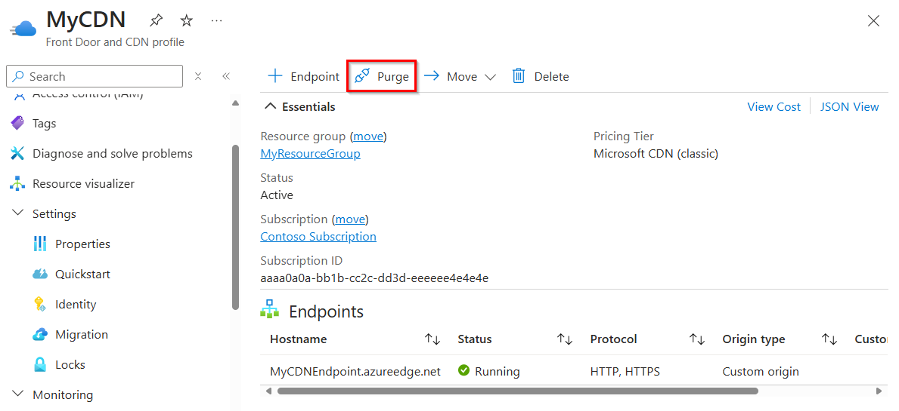
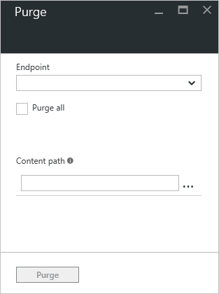
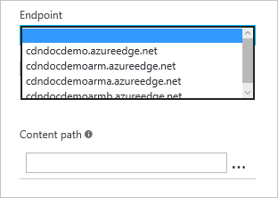
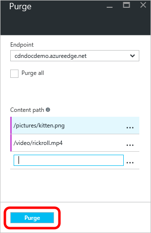

# Purge an Azure CDN endpoint
## Overview
Azure CDN edge nodes will cache assets until the asset's time-to-live (TTL) expires.  After the asset's TTL expires, when a client requests the asset from the edge node, the edge node will retrieve a new updated copy of the asset to serve the client request and store refresh the cache.

The best practice to make sure your users always obtain the latest copy of your assets is to version your assets for each update and publish them as new URLs.  CDN will immediately retrieve the new assets for the next client requests.  Sometimes you may wish to purge cached content from all edge nodes and force them all to retrieve new updated assets.  This might be due to updates to your web application, or to quickly update assets that contain incorrect information.

> [!TIP]
> Note that purging only clears the cached content on the CDN edge servers.  Any downstream caches, such as proxy servers and local browser caches, may still hold a cached copy of the file.  It's important to remember this when you set a file's time-to-live.  You can force a downstream client to request the latest version of your file by giving it a unique name every time you update it, or by taking advantage of [query string caching](cdn-query-string.md).  
> 
> 

This tutorial walks you through purging assets from all edge nodes of an endpoint.

## Walkthrough
1. In the [Azure Portal](https://portal.azure.com), browse to the CDN profile containing the endpoint you wish to purge.
2. From the CDN profile blade, click the purge button.
   
    
   
    The Purge blade opens.
   
    
3. On the Purge blade, select the service address you wish to purge from the URL dropdown.
   
    
   
   > [!NOTE]
   > You can also get to the Purge blade by clicking the **Purge** button on the CDN endpoint blade.  In that case, the **URL** field will be pre-populated with the service address of that specific endpoint.
   > 
   > 
4. Select what assets you wish to purge from the edge nodes.  If you wish to clear all assets, click the **Purge all** checkbox.  Otherwise, type the path of each asset you wish to purge in the **Path** textbox. Below formats are supported in the path.
	1. **Single URL purge**: Purge individual asset by specifying the full URL, with or without the file extension, e.g.,`/pictures/strasbourg.png`; `/pictures/strasbourg`
	2. **Wildcard purge**: Asterisk (\*) may be used as a wildcard. Purge all folders, sub-folders and files under an endpoint with `/*` in the path or purge all sub-folders and files under a specific folder by specifying the folder followed by `/*`, e.g.,`/pictures/*`.  Note that wildcard purge is not supported by Azure CDN from Akamai currently. 
	3. **Root domain purge**: Purge the root of the endpoint with "/" in the path.
   
   > [!TIP]
   > Paths must be specified for purge and must be a relative URL that fit the following [regular expression](/dotnet/standard/base-types/regular-expression-language-quick-reference). **Purge all** and **Wildcard purge** not supported by **Azure CDN from Akamai** currently.
   > > Single URL purge `@"^\/(?>(?:[a-zA-Z0-9-_.%=\(\)\u0020]+\/?)*)$";`  
   > > Query string `@"^(?:\?[-\@_a-zA-Z0-9\/%:;=!,.\+'&\(\)\u0020]*)?$";`  
   > > Wildcard purge `@"^\/(?:[a-zA-Z0-9-_.%=\(\)\u0020]+\/)*\*$";`. 
   > 
   > More **Path** textboxes will appear after you enter text to allow you to build a list of multiple assets.  You can delete assets from the list by clicking the ellipsis (...) button.
   > 
5. Click the **Purge** button.
   
    

> [!IMPORTANT]
> Purge requests take approximately 10 minutes to process with **Azure CDN from Microsoft**, approximately 2 minutes with **Azure CDN from Verizon** (standard and premium), and approximately 10 seconds with **Azure CDN from Akamai**.  Azure CDN has a limit of 50 concurrent purge requests at any given time at the profile level. 
> 
> 

## See also
* [Pre-load assets on an Azure CDN endpoint](cdn-preload-endpoint.md)
* [Azure CDN REST API reference - Purge or Pre-Load an Endpoint](/rest/api/cdn/endpoints)

