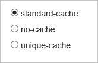

<properties
	pageTitle="CDN - Controlling caching behavior of requests with query strings - Premium"
	description="CDN query string caching controls how files are to be cached when they contain query strings."
	services="cdn"
	documentationCenter=".NET"
	authors="camsoper"
	manager="erikre"
	editor=""/>

<tags
	ms.service="cdn"
	ms.workload="tbd"
	ms.tgt_pltfrm="na"
	ms.devlang="na"
	ms.topic="article"
	ms.date="04/26/2016" 
	ms.author="casoper"/>

#Controlling caching behavior of CDN requests with query strings - Premium

> [AZURE.SELECTOR]
- [Standard](cdn-query-string.md)
- [Premium](cdn-query-string-premium.md)

##Overview

Query string caching controls how files are to be cached when they contain query strings.

> [AZURE.IMPORTANT] The Standard and Premium CDN tiers provide the same query string caching functionality, but the user interface differs.  This document describes the **Premium** tier user interface.  For the Standard tier, see [Controlling caching behavior of CDN requests with query strings](cdn-query-string.md).

Three modes are available:

- **standard-cache**:  This is the default mode.  The CDN edge node will pass the query string from the requestor to the origin on the first request and cache the asset.  All subsequent requests for that asset that are served from the edge node will ignore the query string until the cached asset expires.
- **no-cache**:  In this mode, requests with query strings are not cached at the CDN edge node.  The edge node retrieves the asset directly from the origin and passes it to the requestor with each request.
- **unique-cache**:  This mode treats each request with a query string as a unique asset with its own cache.  For example, the response from the origin for a request for *foo.ashx?q=bar* would be cached at the edge node and returned for subsequent caches with that same query string.  A request for *foo.ashx?q=somethingelse* would be cached as a separate asset with its own time to live.

	>[AZURE.WARNING] This mode should not be used when the query string contains parameters that will change with every request, such as a session ID or a user name, since this would result in a very low cache hit ratio.

##Changing query string caching settings for premium CDN profiles

1. From the CDN profile blade, click the **Manage** button.

	

	The CDN management portal opens.

2. Hover over the **HTTP Large** tab, then hover over the **Cache Settings** flyout.  Click on **Query-String Caching**.

	Query string caching options are displayed.

	

3. After making your selection, click the **Update** button.
