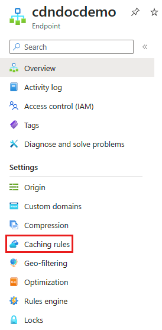
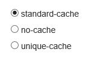

# Control Azure Content Delivery Network caching behavior with query strings - standard tier

> [!div class="op_single_selector"]
> - [Standard tier](cdn-query-string.md)
> - [Premium tier](cdn-query-string-premium.md)
>

## Overview

With Azure Content Delivery Network, you can control how files are cached for a web request that contains a query string. In a web request with a query string, the query string is that portion of the request that occurs after a question mark (?). A query string can contain one or more key-value pairs, in which the field name and its value are separated by an equals sign (=). Each key-value pair is separated by an ampersand (&). For example, HTTP:\//www.contoso.com/content.mov?field1=value1&field2=value2. If there's more than one key-value pair in a query string of a request, their order doesn't matter.

> [!IMPORTANT]
> The Azure Content Delivery Network standard and premium products provide the same query string caching functionality, but the user interface is different. This article describes the interface for **Azure CDN Standard from Microsoft** and **Azure CDN Standard from Edgio**. For query string caching with **Azure CDN Premium from Edgio**, see [Control Azure Content Delivery Network caching behavior with query strings - premium tier](cdn-query-string-premium.md).

Three query string modes are available:

- **Ignore query strings:** Default mode. In this mode, the content delivery network point of presence (POP) node passes the query strings from the requestor to the origin server on the first request and caches the asset. All subsequent requests for the asset that are served from the POP ignore the query strings until the cached asset expires.

- **Bypass caching for query strings:** In this mode, requests with query strings aren't cached at the content delivery network POP node. The POP node retrieves the asset directly from the origin server and passes it to the requestor with each request.

- **Cache every unique URL:** In this mode, each request with a unique URL, including the query string, is treated as a unique asset with its own cache. For example, the response from the origin server for a request for example.ashx?q=test1 is cached at the POP node and returned for subsequent caches with the same query string. A request for example.ashx?q=test2 is cached as a separate asset with its own time to live setting.

    >[!IMPORTANT]
    > Do not use this mode when the query string contains parameters that will change with every request, such as a session ID or a user name, because it will result in a low cache-hit ratio.

## Changing query string caching settings for standard content delivery network profiles

1. Open a content delivery network profile, then select the content delivery network endpoint you want to manage.

   

2. In the left pane under Settings, select **Caching rules**.

    

3. In the **Query string caching behavior** list, select a query string mode, then select **Save**.

   

> [!IMPORTANT]
> Because it takes time for the registration to propagate through Azure Content Delivery Network, cache string settings changes might not be immediately visible:
> - For **Azure CDN Standard from Microsoft** profiles, propagation usually completes in 10 minutes.
> - For **Azure CDN Standard from Edgio** and **Azure CDN Premium from Edgio** profiles, propagation usually completes in 10 minutes.

## Next step

- Learn how to [purge cached content](cdn-purge-endpoint.md) from Azure Content Delivery Network endpoint.
