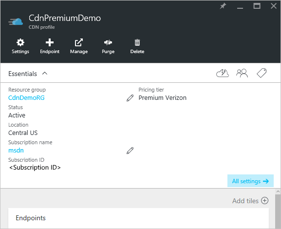
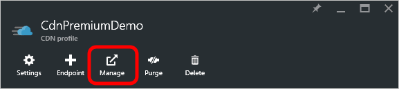
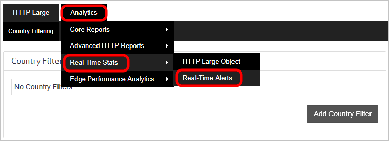
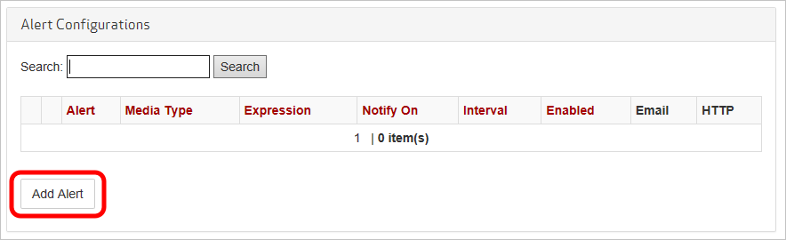
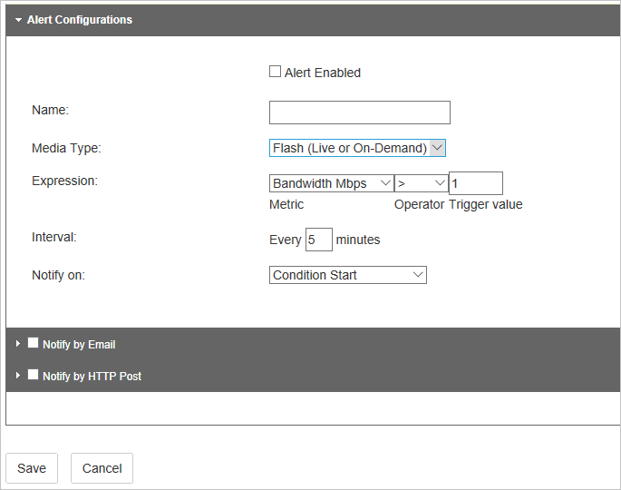
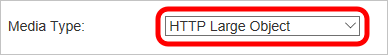
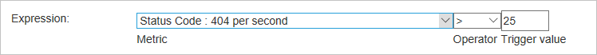
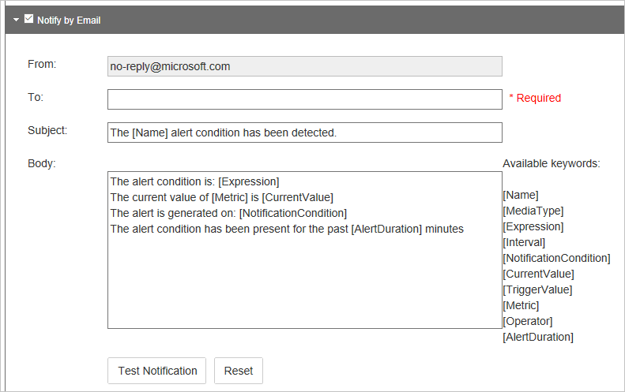
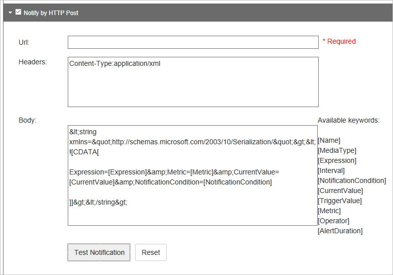

# Real-time alerts in Microsoft Azure CDN
[!INCLUDE [cdn-premium-feature](../../includes/cdn-premium-feature.md)]

## Overview
This document explains real-time alerts in Microsoft Azure CDN. This functionality provides real-time notifications about the performance of the endpoints in your CDN profile.  You can set up email or HTTP alerts based on:

* Bandwidth
* Status Codes
* Cache Statuses
* Connections

## Creating a real-time alert
1. In the [Azure portal](https://portal.azure.com), browse to your CDN profile.
   
    
1. From the CDN profile blade, click the **Manage** button.
   
    
   
    The CDN management portal opens.
3. Hover over the **Analytics** tab, then hover over the **Real-Time Stats** flyout.  Click on **Real-Time Alerts**.
   
    
   
    The list of existing alert configurations (if any) is displayed.
4. Click the **Add Alert** button.
   
    
   
    A form for creating a new alert is displayed.
   
    
5. If you want this alert to be active when you click **Save**, check the **Alert Enabled** checkbox.
6. Enter a descriptive name for your alert in the **Name** field.
7. In the **Media Type** dropdown, select **HTTP Large Object**.
   
    
   
   > [!IMPORTANT]
   > You must select **HTTP Large Object** as the **Media Type**.  The other choices are not used by **Azure CDN from Edgio**.  Failure to select **HTTP Large Object** causes your alert to never be triggered.
   > 
   > 
8. Create an **Expression** to monitor by selecting a **Metric**, **Operator**, and **Trigger value**.
   
   * For **Metric**, select the type of condition you want monitored.  **Bandwidth Mbps** is the amount of bandwidth usage in megabits per second.  **Total Connections** is the number of concurrent HTTP connections to our edge servers.  For definitions of the various cache statuses and status codes, see [Azure CDN Cache Status Codes](/previous-versions/azure/mt759237(v=azure.100)) and [Azure CDN HTTP Status Codes](/previous-versions/azure/mt759238(v=azure.100))
   * **Operator** is the mathematical operator that establishes the relationship between the metric and the trigger value.
   * **Trigger Value** is the threshold value that must be met before a notification is sent.
     
     In the following example, the created expression indicates that a notification is sent when the number of 404 status codes is greater than 25.
     
     
9. For **Interval**, enter how frequently you would like the expression evaluated.
10. In the **Notify on** dropdown, select when you would like to be notified when the expression is true.
    
    * **Condition Start** indicates that a notification is sent when the specified condition is first detected.
    * **Condition End** indicates that a notification is sent when the specified condition is no longer detected. This notification can only be triggered after our network monitoring system detected that the specified condition occurred.
    * **Continuous** indicates that a notification is sent each time that the network monitoring system detects the specified condition. Keep in mind that the network monitoring system checks only once per interval for the specified condition.
    * **Condition Start and End** indicates that a notification is sent the first time that the specified condition is detected and once again when the condition is no longer detected.
1. If you want to receive notifications by email, check the **Notify by Email** checkbox.  
    
    
    
    In the **To** field, enter the email address you where you want notifications sent. For **Subject** and **Body**, you may leave the default, or you may customize the message using the **Available keywords** list to dynamically insert alert data when the message is sent.
    
    > [!NOTE]
    > You can test the email notification by clicking the **Test Notification** button, but only after the alert configuration has been saved.
    > 
    > 
12. If you want notifications to be posted to a web server, check the **Notify by HTTP Post** checkbox.
    
    
    
    In the **Url** field, enter the URL you where you want the HTTP message posted. In the **Headers** textbox, enter the HTTP headers to be sent in the request.  For **Body**, you may customize the message by using the **Available keywords** list to dynamically insert alert data when the message is sent.  **Headers** and **Body** default to an XML payload similar to the following example:
    
    ```
    <string xmlns="http://schemas.microsoft.com/2003/10/Serialization/">
        <![CDATA[Expression=Status Code : 404 per second > 25&Metric=Status Code : 404 per second&CurrentValue=[CurrentValue]&NotificationCondition=Condition Start]]>
    </string>
    ```
    
    > [!NOTE]
    > You can test the HTTP Post notification by clicking the **Test Notification** button, but only after the alert configuration has been saved.
    > 
    > 
13. Click the **Save** button to save your alert configuration.  If you checked **Alert Enabled** in step 5, your alert is now active.

## Next Steps
* Analyze [Real-time stats in Azure CDN](cdn-real-time-stats.md)
* Dig deeper with [advanced HTTP reports](cdn-advanced-http-reports.md)
* Analyze [usage patterns](cdn-analyze-usage-patterns.md)
