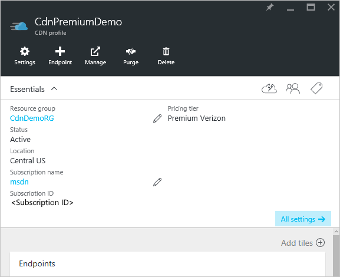
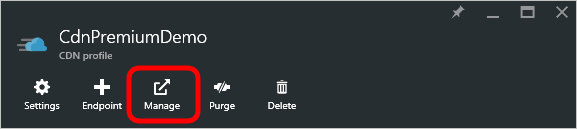
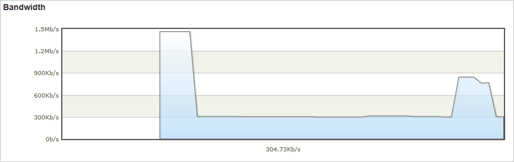
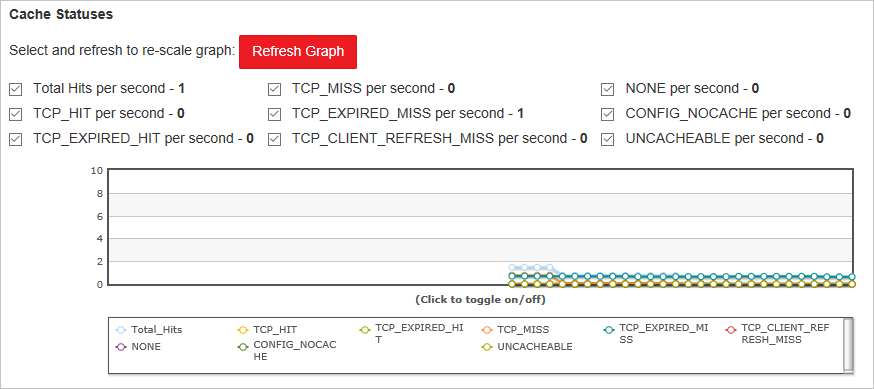
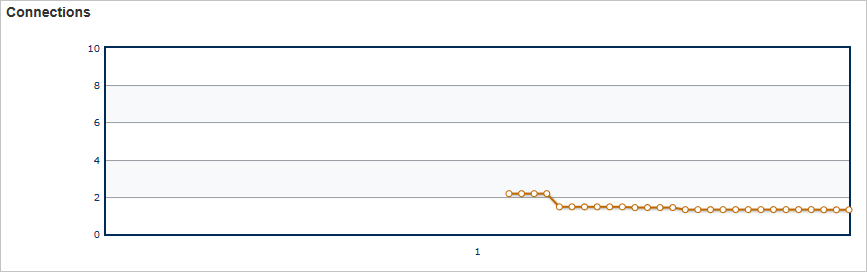

# Real-time stats in Microsoft Azure CDN
[!INCLUDE [cdn-premium-feature](../../includes/cdn-premium-feature.md)]

## Overview
This document explains real-time stats in Microsoft Azure CDN.  This functionality provides real-time data, such as bandwidth, cache statuses, and concurrent connections to your CDN profile when delivering content to your clients. This enables continuous monitoring of the health of your service at any time, including go-live events.

The following graphs are available:

* [Bandwidth](#bandwidth)
* [Status Codes](#status-codes)
* [Cache Statuses](#cache-statuses)
* [Connections](#connections)

## Accessing real-time stats
1. In the [Azure Portal](https://portal.azure.com), browse to your CDN profile.
   
    
2. From the CDN profile blade, click the **Manage** button.
   
    
   
    The CDN management portal opens.
3. Hover over the **Analytics** tab, then hover over the **Real-Time Stats** flyout.  Click on **HTTP Large Object**.
   
    
   
    The real-time stats graphs are displayed.

Each of the graphs displays real-time statistics for the selected time span, starting when the page loads.  The graphs update automatically every few seconds.  The **Refresh Graph** button, if present, will clear the graph, after which it will only display the selected data.

## Bandwidth

The **Bandwidth** graph displays the amount of bandwidth used for the current platform over the selected time span. The shaded portion of the graph indicates bandwidth usage. The exact amount of bandwidth currently being used is displayed directly below the line graph.

## Status Codes

The **Status Codes** graph indicates how often certain HTTP response codes are occurring over the selected time span.

> [!TIP]
> For a description of each HTTP status code option, see [Azure CDN HTTP Status Codes](/previous-versions/azure/mt759238(v=azure.100)).
> 
> 

A list of HTTP status codes is displayed directly above the graph. This list indicates each status code that can be included in the line graph and the current number of occurrences per second for that status code. By default, a line is displayed for each of these status codes in the graph. However, you can choose to only monitor the status codes that have special significance for your CDN configuration. To do this, check the desired status codes and clear all other options, then click **Refresh Graph**. 

You can temporarily hide logged data for a particular status code.  From the legend directly below the graph, click the status code you want to hide. The status code will be immediately hidden from the graph. Clicking that status code again will cause that option to be displayed again.

## Cache Statuses

The **Cache Statuses** graph indicates how often certain types of cache statuses are occurring over the selected time span. 

> [!TIP]
> For a description of each cache status code option, see [Azure CDN Cache Status Codes](/previous-versions/azure/mt759237(v=azure.100)).
> 
> 

A list of cache status codes is displayed directly above the graph. This list indicates each status code that can be included in the line graph and the current number of occurrences per second for that status code. By default, a line is displayed for each of these status codes in the graph. However, you can choose to only monitor the status codes that have special significance for your CDN configuration. To do this, check the desired status codes and clear all other options, then click **Refresh Graph**. 

You can temporarily hide logged data for a particular status code.  From the legend directly below the graph, click the status code you want to hide. The status code will be immediately hidden from the graph. Clicking that status code again will cause that option to be displayed again.

## Connections

This graph indicates how many connections have been established to your edge servers. Each request for an asset that passes through our CDN results in a connection.

## Next Steps
* Get notified with [Real-time alerts in Azure CDN](cdn-real-time-alerts.md)
* Dig deeper with [advanced HTTP reports](cdn-advanced-http-reports.md)
* Analyze [usage patterns](cdn-analyze-usage-patterns.md)

