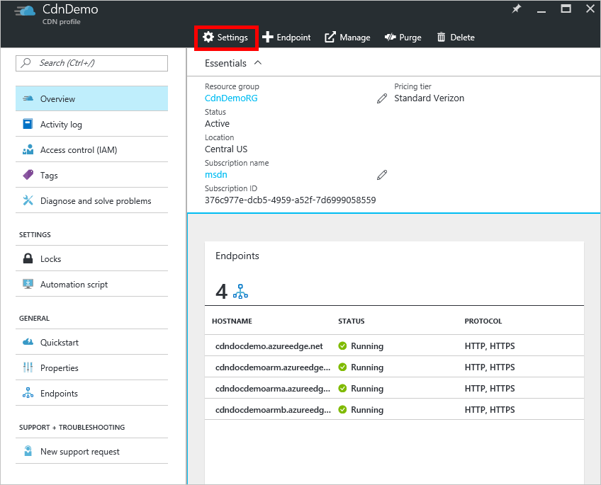
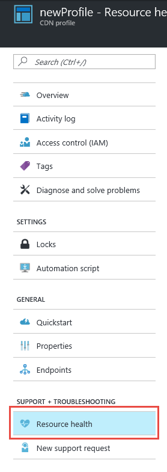
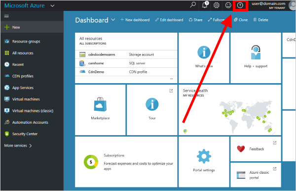

# Monitor the health of Azure CDN resources
  
Azure CDN Resource health is a subset of [Azure resource health](../service-health/resource-health-overview.md).  You can use Azure resource health to monitor the health of CDN resources and receive actionable guidance to troubleshoot problems.

>[!IMPORTANT] 
>Azure CDN resource health only currently accounts for the health of global CDN delivery and API capabilities.  Azure CDN resource health does not verify individual CDN endpoints.
>
>The signals that feed Azure CDN resource health may be up to 15 minutes delayed.

## How to find Azure CDN resource health

1. In the [Azure portal](https://portal.azure.com), browse to your CDN profile.

2. Select the **Settings** button.

    

3. Under *Support + troubleshooting*, select **Resource health**.

    

>[!TIP] 
>You can also find CDN resources listed in the *Resource health* tile in the *Help + support* blade.  You can quickly get to *Help + support* by clicking the circled **?** in the upper right corner of the portal.
>
> 

## Azure CDN-specific messages

Statuses related to Azure CDN resource health can be found in the following table:

|Message | Recommended Action |
|---|---|
|You may have stopped, removed, or misconfigured one or more of your CDN endpoints | You may have stopped, removed, or misconfigured one or more of your CDN endpoints.|
|We're sorry, the CDN management service is currently unavailable | Check back here for status updates; If your problem persists after the expected resolution time, contact support.|
|We're sorry, your CDN endpoints may be impacted by ongoing issues with some of our CDN providers | Check back here for status updates; Use the Troubleshoot tool to learn how to test your origin and CDN endpoint; If your problem persists after the expected resolution time, contact support. |
|We're sorry, CDN endpoint configuration changes are experiencing propagation delays | Check back here for status updates; If your configuration changes aren't fully propagated in the expected time, contact support.|
|We're sorry, we're experiencing issues loading the supplemental portal | Check back here for status updates; If your problem persists after the expected resolution time, contact support.|
We're sorry, we're experiencing issues with some of our CDN providers | Check back here for status updates; If your problem persists after the expected resolution time, contact support. |

## Next steps

- [Read an overview of Azure resource health](../service-health/resource-health-overview.md)
- [Troubleshoot issues with CDN compression](./cdn-troubleshoot-compression.md)
- [Troubleshoot issues with 404 errors](./cdn-troubleshoot-endpoint.md)