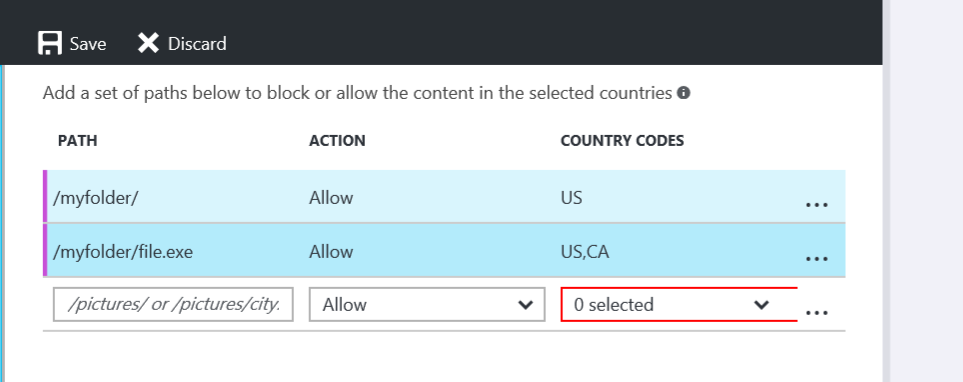

# Restrict access to your content by country - Akamai
> [!div class="op_single_selector"]
> * [Verizon](cdn-restrict-access-by-country.md)
> * [Akamai Standard](cdn-restrict-access-by-country-akamai.md)
> 
> 

## Overview
When a user requests your content, by default, the content is served regardless of where the user made this request from. In some cases, you may want to restrict access to your content by country. This topic explains how to use the **Geo-Filtering** feature in order to configure the service to allow or block access by country.

> [!IMPORTANT]
> The Verizon and Akamai products provide the same geo-filtering functionality, but the user interface differs. This document describes the interface for **Azure CDN Standard from Akamai**. For geo-filtering with **Azure CDN Standard/Premium from Verizon**, see [Restrict access to your content by country - Verizon](cdn-restrict-access-by-country.md).
> 
> 

For information about considerations that apply to configuring this type of restriction, see the [Considerations](cdn-restrict-access-by-country.md#considerations) section at the end of the topic.  

## Step 1: Define the directory path
Select your endpoint within the portal, and find the Geo-Filtering tab on the left-hand navigation to find this feature.

When configuring a country filter, you must specify the relative path to the location to which users will be allowed or denied access. You can apply geo-filtering for all your files with "/" or selected folders by specifying directory paths "/pictures/". You can also apply geo-filtering to a single file by specifying the file, and leaving out the trailing slash "/pictures/city.png".

Example directory path filter:

    /                                 
    /Photos/
    /Photos/Strasbourg/
      /Photos/Strasbourg/city.png

## Step 2: Define the action: block or allow
**Block:** Users from the specified countries will be denied access to assets requested from that recursive path. If no other country filtering options have been configured for that location, then all other users will be allowed access.

**Allow:** Only users from the specified countries will be allowed access to assets requested from that recursive path.

## Step 3: Define the countries
Select the countries that you want to block or allow for the path. For more information, see [Azure CDN from Akamai Country Codes](https://msdn.microsoft.com/library/mt761717.aspx).

For example, the rule of blocking /Photos/Strasbourg/ will filter files including:

    http://<endpoint>.azureedge.net/Photos/Strasbourg/1000.jpg
    http://<endpoint>.azureedge.net/Photos/Strasbourg/Cathedral/1000.jpg

## Country codes
The **Geo-Filtering** feature uses country codes to define the countries from which a request will be allowed or blocked for a secured directory. You will find the country codes in [Azure CDN from Akamai Country Codes](https://msdn.microsoft.com/library/mt761717.aspx). 

## Considerations
* It may take up to a couple minutes for changes to your country filtering configuration to take effect.
* This feature does not support wildcard characters (for example, ‘*’).
* The geo-filtering configuration associated with the relative path will be applied recursively to that path.
* Only one rule can be applied to the same relative path (you cannot create multiple country filters that point to the same relative path. However, a folder may have multiple country filters. This is due to the recursive nature of country filters. In other words, a subfolder of a previously configured folder can be assigned a different country filter.

