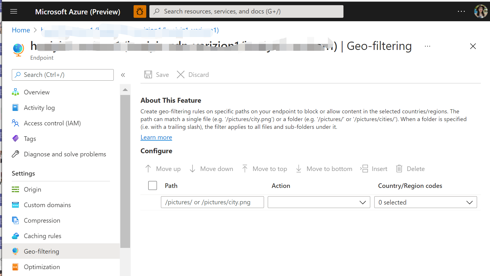
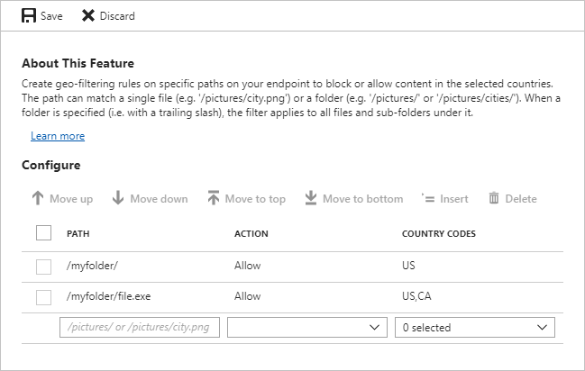
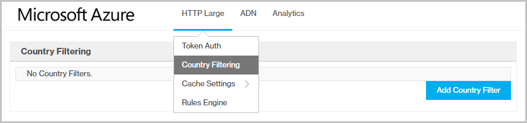
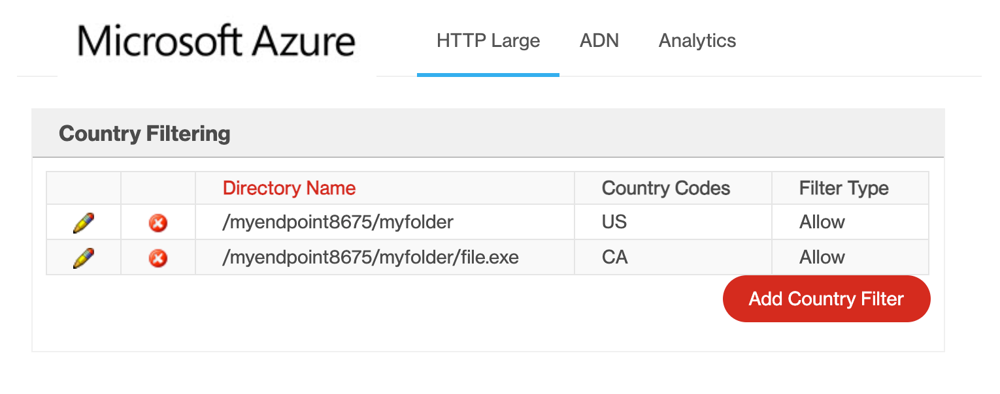

# Restrict Azure CDN content by country

## Overview
When a user requests your content, by default, the content is served regardless of the location of the user making the request. However, in some cases, you may want to restrict access to your content by country. With the *geo-filtering* feature, you can create rules on specific paths on your CDN endpoint to allow or block content in selected countries.

> [!IMPORTANT]
> **Azure CDN Standard from Microsoft** profiles do not support path-based geo-filtering.
> 

## Standard profiles
The procedures in this section are for **Azure CDN Standard from Akamai** and **Azure CDN Standard from Verizon** profiles only. 

For **Azure CDN Premium from Verizon** profiles, you must use the **Manage** portal to activate geo-filtering. For more information, see [Azure CDN Premium from Verizon profiles](#azure-cdn-premium-from-verizon-profiles).

### Define the directory path
To access the geo-filtering feature, select your CDN endpoint within the portal, then select **Geo-filtering** under SETTINGS in the left-hand menu. 

From the **PATH** box, specify the relative path to the location to which users will be allowed or denied access. 

You can apply geo-filtering for all your files with a forward slash (/) or select specific folders by specifying directory paths (for example, */pictures/*). You can also apply geo-filtering to a single file (for example */pictures/city.png*). Multiple rules are allowed; after you enter a rule, a blank row appears for you to enter the next rule.

For example, all of the following directory path filters are valid:   
*/*                                 
*/Photos/*     
*/Photos/Strasbourg/*     
*/Photos/Strasbourg/city.png*

### Define the type of action

From the **ACTION** list, select **Allow** or **Block**: 

- **Allow**: Only users from the specified countries are allowed access to assets requested from the recursive path.

- **Block**: Users from the specified countries are denied access to the assets requested from the recursive path. If no other country filtering options have been configured for that location, then all other users will be allowed access.

For example, a geo-filtering rule for blocking the path */Photos/Strasbourg/* filters the following files:     
*http://<endpoint>.azureedge.net/Photos/Strasbourg/1000.jpg*
*http://<endpoint>.azureedge.net/Photos/Strasbourg/Cathedral/1000.jpg*

### Define the countries
From the **COUNTRY CODES** list, select the countries that you want to block or allow for the path. 

After you have finished selecting the countries, select **Save** to activate the new geo-filtering rule. 

### Clean up resources
To delete a rule, select it from the list on the **Geo-filtering** page, then choose **Delete**.

## Azure CDN Premium from Verizon profiles
For **For Azure CDN Premium from Verizon** profiles, the user interface for creating a geo-filtering rule is different:

1. From the top menu in your Azure CDN profile, select **Manage**.

2. From the Verizon portal, select **HTTP Large**, then select **Country Filtering**.

    

3. Select **Add Country Filter**.

    The **Step One:** page appears.

4. Enter the directory path, select **Block** or **Add**, then select **Next**.

    The **Step Two:** page appears. 

5. Select one or more countries from the list, then select **Finish** to activate the rule. 
    
    The new rule appears in the table on the **Country Filtering** page.

    

### Clean up resources
In the country filtering rules table, select the delete icon next to a rule to delete it or the edit icon to modify it.

## Considerations
* Changes to your geo-filtering configuration do not take effect immediately:
   * For **Azure CDN Standard from Microsoft** profiles, propagation usually completes in 10 minutes. 
   * For **Azure CDN Standard from Akamai** profiles, propagation usually completes within one minute. 
   * For **Azure CDN Standard from Verizon** and **Azure CDN Premium from Verizon** profiles, propagation usually completes in 10 minutes. 
 
* This feature does not support wildcard characters (for example, *).

* The geo-filtering configuration associated with the relative path is applied recursively to that path.

* Only one rule can be applied to the same relative path. That is, you cannot create multiple country filters that point to the same relative path. However, because country filters are recursive, a folder can have multiple country filters. In other words, a subfolder of a previously configured folder can be assigned a different country filter.

* The geo-filtering feature uses country codes to define the countries from which a request is allowed or blocked for a secured directory. Although Akamai and Verizon profiles support most of the same country codes, there are a few differences. For more information, see [Azure CDN country codes](https://msdn.microsoft.com/library/mt761717.aspx). 

