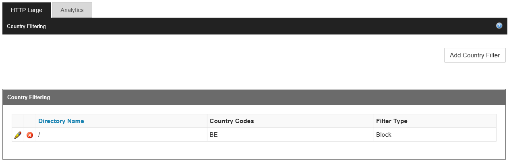

<properties
	pageTitle="CDN - Restrict access to your content by country"
	description="When a user requests your content, by default, the content is served regardless of where the user made this request from. In some cases, you may want to restrict access to your content by country. This topic explains how to use the **Country Filtering** feature in order to configure the service to allow or block access by country."
	services="cdn"
	documentationCenter=""
	authors="camsoper"
	manager="erikre"
	editor=""/>

<tags
	ms.service="cdn"
	ms.workload="tbd"
	ms.tgt_pltfrm="na"
	ms.devlang="na"
	ms.topic="article"
	ms.date="07/14/2016"
	ms.author="casoper"/>

#Restrict access to your content by country

[AZURE.INCLUDE [cdn-verizon-only](../../includes/cdn-verizon-only.md)]

When a user requests your content, by default, the content is served regardless of where the user made this request from. In some cases, you may want to restrict access to your content by country. This topic explains how to use the **Country Filtering** feature in order to configure the service to allow or block access by country.

>[AZURE.NOTE] Once the configuration is set up, it will apply to all **Azure CDN from Verizon** endpoints in this Azure CDN profile.

For information about considerations that apply to configuring this type of restriction, see the [Considerations](cdn-restrict-access-by-country.md#considerations) section at the end of the topic.  

##Step 1: Define the directory path

When configuring a country filter, you must specify the relative path to the location to which users will be allowed or denied access. You can apply country filtering for all your files with "/" or selected folders by specifying directory paths.

Example directory path filter:

	/                                 
	/Photos/
	/Photos/Strasbourg

##Step 2: Define the action: block or allow

**Block:** Users from the specified countries will be denied access to assets requested from that recursive path. If no other country filtering options have been configured for that location, then all other users will be allowed access.

**Allow:** Only users from the specified countries will be allowed access to assets requested from that recursive path.

##Step 3: Define the countries

Select the countries that you want to block or allow for the path. For more information, see the [Country codes](cdn-country-codes.md) topic.

For example, the rule of blocking /Photos/Strasbourg/ will filter files including:

	http://az123456.azureedge.net/Photos/Strasbourg/1000.jpg
	http://az123456.azureedge.net/Photos/Strasbourg/Cathedral/1000.jpg

##Country codes

The **Country Filtering** feature uses country codes to define the countries from which a request will be allowed or blocked for a secured directory. You will find the country codes in [this](cdn-country-codes.md) topic. If you specify “EU” (Europe) or "AP" (Asia/Pacific), a subset of IP addresses that originate from any country in that regions will be blocked or allowed.

##Considerations

- It may take up to an hour for changes to your country filtering configuration to take effect.
- This feature does not support wildcard characters (for example, ‘*’).
- The country filtering configuration associated with the relative path will be applied recursively to that path.
- Only one rule can be applied to the same relative path (you cannot create multiple country filters that point to the same relative path. However, a folder may have multiple country filters. This is due to the recursive nature of country filters. In other words, a subfolder of a previously configured folder can be assigned a different country filter.
