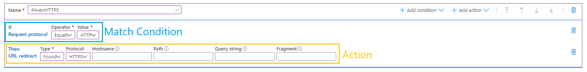

# Standard rules engine reference for Azure CDN

In the [Standard rules engine](cdn-standard-rules-engine.md) for Azure Content Delivery Network (Azure CDN), a rule consists of one or more match conditions and an action. This article provides detailed descriptions of the match conditions and features that are available in the Standard rules engine for Azure CDN.

The rules engine is designed to be the final authority on how specific types of requests are processed by Standard Azure CDN.

**Common uses for the rules**:

- Override or define a custom cache policy.
- Redirect requests.
- Modify HTTP request and response headers.

## Terminology

To define a rule in the rules engine, set [match conditions](cdn-standard-rules-engine-match-conditions.md) and [actions](cdn-standard-rules-engine-actions.md):

 

Each rule can have up to ten match conditions and five actions. Each Azure CDN endpoint can have up to 25 rules. 

Included in this limit is a default *global rule*. The global rule doesn't have match conditions; actions that are defined in a global rule always triggered.

## Syntax

How special characters are treated in a rule varies based on how different match conditions and actions handle text values. A match condition or action can interpret text in one of the following ways:

- [Literal values](#literal-values)
- [Wildcard values](#wildcard-values)

### Literal values

Text that's interpreted as a literal value treats all special characters *except the % symbol* as part of the value that must be matched in a rule. For example, a literal match condition set to `'*'` is satisfied only when the exact value `'*'` is found.

A percent sign is used to indicate URL encoding (for example, `%20`).

### Wildcard values

Text that's interpreted as a wildcard value assigns additional meaning to special characters. The following table describes how specific special characters are interpreted in the Standard rules engine:

Character | Description
----------|------------
\ | A backslash is used to escape any of the characters specified in this table. A backslash must be specified directly before the special character that should be escaped. For example, the following syntax escapes an asterisk: `\*`
% | A percent sign is used to indicate URL encoding (for example, `%20`).
\* | An asterisk is a wildcard that represents one or more characters.
space | A space character indicates that a match condition can be satisfied by either of the specified values or patterns.
single quotation marks | A single quotation mark doesn't have special meaning. However, a set of single quotation marks indicates that a value should be treated as a literal value. Single quotation marks can be used in the following ways:<ul><li>To allow a match condition to be satisfied whenever the specified value matches any portion of the comparison value.  For example, `'ma'` would match any of the following strings: <ul><li>/business/**ma**rathon/asset.htm</li><li>**ma**p.gif</li><li>/business/template.**ma**p</li></ul><li>To allow a special character to be specified as a literal character. For example, you can specify a literal space character by enclosing a space character in a set of single quotation marks (`' '` or `'<sample value>'`).</li><li>To allow a blank value to be specified. Specify a blank value by specifying a set of single quotation marks (**''**).</li></ul>**Important**: <ul><li>If the specified value doesn't contain a wildcard, the value is automatically considered a literal value. You don't need to specify a set of single quotation marks for a literal value.</li><li>If a backslash isn't used to escape another character in this table, the backslash is ignored when it's specified in a set of single quotation marks.</li><li>Another way to specify a special character as a literal character is to escape it by using a backslash (`\`).</li></ul>

## Next steps

- [Match conditions in the Standard rules engine](cdn-standard-rules-engine-match-conditions.md)
- [Actions in the Standard rules engine](cdn-standard-rules-engine-actions.md)
- [Enforce HTTPS by using the Standard rules engine](cdn-standard-rules-engine.md)
- [Azure CDN overview](cdn-overview.md)
