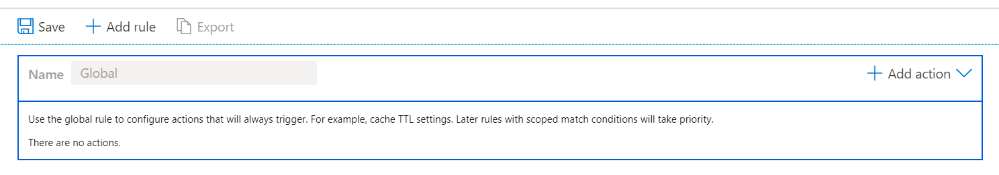
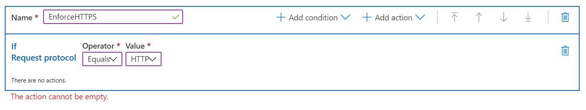
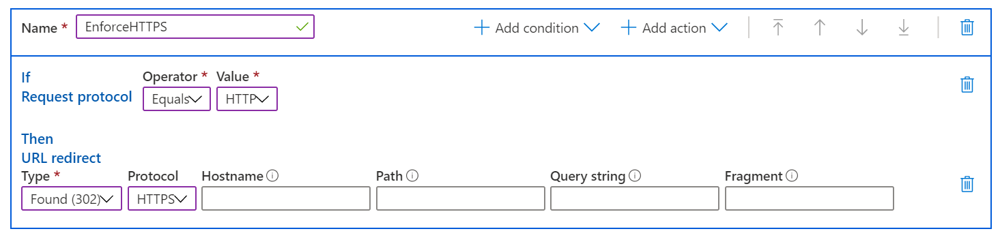

# Azure CDN Standard Rules Engine

> [!NOTE]
> Standard Rules Engine is only available for Azure CDN from Microsoft. 

The Azure CDN Standard Rules Engine allows you to customize how HTTP requests are handled. For example, enforcing content delivery over specific protocols, defining a caching policy, or modifying an HTTP header. This tutorial demonstrates how to create a rule that will automatically redirect your users to HTTPS. 

## Tutorial

1. From the **CDN profile** page on Azure CDN from Microsoft profiles, select the endpoint you want to configure rules for.
  
2. Select the **Rules Engine** tab on the left.
   
    The Rules Engine blade is displayed, with the Global rule. 
   
    
   
   > [!IMPORTANT]
   > The order in which multiple rules are listed affects how they are handled. A subsequent rule may override the actions specified by a previous rule.
   >

3. Click the **Add rule** button, and provide a rule name. Rule names must start with a letter, and contain only numbers and letters.

4. Identify the type of requests the rule applies to. Use the drop down to select the **Request protocol** match condition, and use the value **Equals** **HTTP**.
   
   
   
   > [!NOTE]
   > Multiple match conditions are available in the dropdown list. 
   > For a detailed list of match conditions, see [Rules engine match conditions](cdn-standard-rules-engine-match-conditions.md).
   
5. Choose the action that will be applied to the identified requests. Use the dropdown to select the **URL redirect** action, and use the Value **Found (302)** for Type, and **HTTPS** for protocol. Leave all other fields blank to use the incoming values.
   
   
   
   > [!NOTE]
   > Multiple Actions are available in the dropdown list. 
   > For a detailed list of Actions, see [Rules engine actions](cdn-standard-rules-engine-actions.md).

6. Select **Save** to save the new rule.  The new rule will now be deployed.
   
   > [!IMPORTANT]
   > Rules changes can take up to 15 minutes to propagate through Azure CDN.
   >
   

## See also

- [Azure CDN overview](cdn-overview.md)
- [Standard Rules engine reference](cdn-standard-rules-engine-reference.md)
- [Standard Rules engine match conditions](cdn-standard-rules-engine-match-conditions.md)
- [Standard Rules engine actions](cdn-standard-rules-engine-actions.md)
