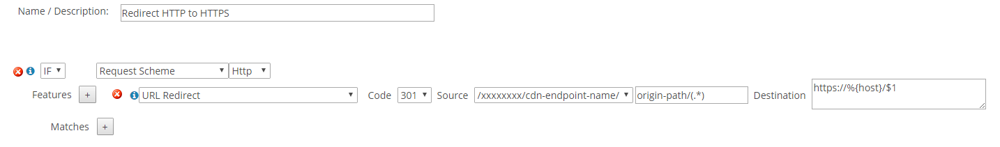

# Tutorial: Access storage blobs using an Azure CDN custom domain over HTTPS

After you've integrated your Azure storage account with Azure Content Delivery Network (CDN), you can add a custom domain and enable HTTPS on that domain for your custom blob storage endpoint. 

## Prerequisites

Before you can complete the steps in this tutorial, you must first integrate your Azure storage account with Azure CDN. For more information, see [Quickstart: Integrate an Azure storage account with Azure CDN](cdn-create-a-storage-account-with-cdn.md).

## Add a custom domain
When you create a CDN endpoint in your profile, the endpoint name, which is a subdomain of azureedge.net, is included in the URL for delivering CDN content by default. You also have the option of associating a custom domain with a CDN endpoint. With this option, you deliver your content with a custom domain in your URL instead of an endpoint name. To add a custom domain to your endpoint, follow the instructions in this tutorial: [Add a custom domain to your Azure CDN endpoint](cdn-map-content-to-custom-domain.md).

## Configure HTTPS
By using the HTTPS protocol on your custom domain, you ensure that your data is delivered securely on the internet via TLS/SSL encryption. When your web browser is connected to a web site via HTTPS, it validates the web site’s security certificate and verifies it’s issued by a legitimate certificate authority. To configure HTTPS on your custom domain, follow the instructions in this tutorial: [Configure HTTPS on an Azure CDN custom domain](cdn-custom-ssl.md).

## Shared Access Signatures
If your blob storage endpoint is configured to disallow anonymous read access, you should provide a [Shared Access Signature (SAS)](cdn-sas-storage-support.md) token in each request you make to your custom domain. By default, blob storage endpoints disallow anonymous read access. For more information about SAS, see [Managing anonymous read access to containers and blobs](../storage/blobs/storage-manage-access-to-resources.md).

Azure CDN ignores any restrictions added to the SAS token. For example, all SAS tokens have an expiration time, which means that content can still be accessed with an expired SAS until that content is purged from the CDN point-of-presence (POP) servers. You can control how long data is cached on Azure CDN by setting the cache response header. For more information, see [Managing expiration of Azure Storage blobs in Azure CDN](cdn-manage-expiration-of-blob-content.md).

If you create multiple SAS URLs for the same blob endpoint, consider enabling query string caching. Doing so ensures that each URL is treated as a unique entity. For more information, see [Controlling Azure CDN caching behavior with query strings](cdn-query-string.md).

## HTTP-to-HTTPS redirection
You can elect to redirect HTTP traffic to HTTPS by creating a [URL Redirect rule](cdn-rules-engine-reference-features.md#url-redirect) with the [Azure CDN rules engine](cdn-rules-engine.md). This option requires an **Azure CDN Premium from Verizon** profile. 

In this rule, *Cdn-endpoint-name* refers to the name that you configured for your CDN endpoint, which you can select from the drop-down list. The value for *origin-path* refers to the path within your origin storage account where your static content resides. If you're  hosting all static content in a single container, replace *origin-path* with the name of that container.

## Pricing and billing
When you access blobs through Azure CDN, you pay [Blob storage prices](https://azure.microsoft.com/pricing/details/storage/blobs/) for traffic between the POP servers and the origin (Blob storage), and [Azure CDN pricing](https://azure.microsoft.com/pricing/details/cdn/) for data accessed from the POP servers.

If, for example, you have a storage account in the United States that's being accessed using Azure CDN and someone in Europe attempts to access one of the blobs in that storage account via Azure CDN, Azure CDN first checks the POP closest to Europe for that blob. If found, Azure CDN accesses that copy of the blob and uses CDN pricing, because it's being accessed on Azure CDN. If it's not found, Azure CDN copies the blob to the POP server, which results in egress and transaction charges as specified in the Blob storage pricing, and then accesses the file on the POP server, which results in Azure CDN billing.

## Next steps
[Tutorial: Set Azure CDN caching rules](cdn-caching-rules-tutorial.md)

