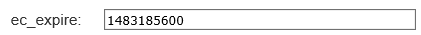
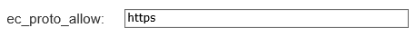
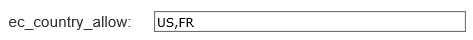
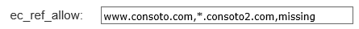
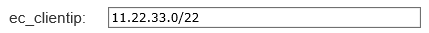

# Securing Azure CDN assets with token authentication

[!INCLUDE [cdn-premium-feature](../../includes/cdn-premium-feature.md)]

##Overview

Token authentication is a mechanism that allows you to prevent Azure CDN from serving assets to unauthorized clients.  This is typically done to prevent "hotlinking" of content, where a different website, often a message board, uses your assets without permission.  This can have an impact on your content delivery costs. By enabling this feature on CDN, requests will be authenticated by CDN edge POPs before delivering the content. 

## How it works

Token authentication verifies requests are generated by a trusted site by requiring requests to contain a token value containing encoded information about the requester. Content will only be served to requester when the encoded information meet the requirements, otherwise requests will be denied. You can set up the requirement using one or multiple parameters below.

- Country: allow or deny requests that originated from specified countries.  [List of valid country codes.](https://msdn.microsoft.com/library/mt761717.aspx) 
- URL: only allow specified asset or path to request.  
- Host: allow or deny requests using specified hosts in the request header.
- Referrer: allow or deny specified referrer to request.
- IP address: only allow requests that originated from specific IP address or IP subnet.
- Protocol: allow or block requests based on the protocol used to request the content.
- Expiration time: assign a date and time period to ensure that a link only remains valid for a limited time period.

See detailed configuration example of each parameter.

## Reference architecture

See below a reference architecture of setting up token authentication on CDN to work with your Web App.

## Token validation logic on CDN endpoint
	
This chart describes how Azure CDN validates client request when token authentication is configured on CDN endpoint.

## Setting up token authentication

1. From the [Azure portal](https://portal.azure.com), browse to your CDN profile, and then click the **Manage** button to launch the supplemental portal.

	

2. Hover over **HTTP Large**, and then click **Token Auth** in the flyout. You will set up encryption key and encryption parameters in this tab.

	1. Enter a unique encryption key for **Primary Key**.  Enter another for **Backup Key**

		
	
	2. Set up encryption parameters with encryption tool (allow or deny requests based on expiration time, country, referrer, protocol, client IP. You can use any combination.)

		

		- ec-expire: assigns an expiration time of a token after a specified time period. Requests submitted after the expiration time will be denied. This parameter uses Unix timestamp (based on seconds since standard epoch of 1/1/1970 00:00:00 GMT. You can use online tools to provide conversion between standard time and Unix time.)  For example, If you want to set up the token to be expired at 12/31/2016 12:00:00 GMT, use the Unix time:1483185600 as below:
	
		
	
		- ec-url-allow: allows you to tailor tokens to a particular asset or path. It restricts access to requests whose URL start with a specific relative path. You can input multiple paths separating each path with a comma. URLs are case-sensitive. Depending on the requirement, you can set up different value to provide different level of access. Below are a couple of scenarios:
		
			If you have a URL: http://www.mydomain.com/pictures/city/strasbourg.png. See input value "" and its access level accordingly

			1. Input value "/": all requests will be allowed
			2. Input value "/pictures": all the following requests will be allow
			
				- http://www.mydomain.com/pictures.png
				- http://www.mydomain.com/pictures/city/strasbourg.png
				- http://www.mydomain.com/picturesnew/city/strasbourgh.png
			3. Input value "/pictures/": only requests for /pictures/ will be allowed
			4. Input value "/pictures/city/strasbourg.png": only allows request for this asset
	
		
	
		- ec-country-allow: only allows requests that originate from one or more specified countries. Requests that originate from all other countries will be denied. Use country code to set up the parameters and separating each country code with a comma. For example, If you want to allow access from United States and France, input US, FR in the column as below.  
		
		

		- ec-country-deny: denies requests that originated from one or more specified countries. Requests that originate from all other countries will be allowed. Use country code to set up the parameters and separating each country code with a comma. For example, If you want to deny access from United States and France, input US, FR in the column.
	
		- ec-ref-allow: only allows requests from specified referrer. A referrer identifies the URL of the web page that linked to the resource being requested. The referrer parameter value shouldn't include the protocol. You can input a hostname and/or a particular path on that hostname. You can also add multiple referrers within a single parameter separating each one with a comma. If you have specified a referrer value, but the referrer information is not sent in the request due to some browser configuration, these requests will be denied by default. You can assign "Missing" or a blank value in the parameter to allow these requests with missing referrer information. You can also use "*.consoto.com" to allow all subdomains of consoto.com.  For example, if you want to allow access for requests from www.consoto.com, all subdomains under consoto2.com and erquests with blank or missing reffers, input value below:
		
		
	
		- ec-ref-deny: denies requests from specified referrer. Refer to details and example in "ec-ref-allow" parameter.
		 
		- ec-proto-allow: only allows requests from specified protocol. For example, http or https.
		
		
			
		- ec-proto-deny: denies requests from specified protocol. For example, http or https.
	
		- ec-clientip: restricts access to specified requester's IP address. Both IPV4 and IPV6 are supported. You can specify single request IP address or IP subnet.
			
		
		
	3. You can test your token with the decription tool.

	4. You can also customize the type of response that will be returned to user when request is denied. By default we use 403.

3. Now click **Rules Engine** tab under **HTTP Large**. You will use this tab to define paths to apply the feature, enable the token authentication feature, and enable additional token authentication related capabilities.

	- Use "IF" column to define asset or path that you want to apply token authentication. 
	- Click to add "Token Auth" from the feature dropdown to enable token authentication.
		
	

4. In the **Rules Engine** tab, there are a few additional capabilities you can enable.
	
	- Token auth denial code: determines the type of response that will be returned to user when a request is denied. Rules set up here will override the denial code setting in the token auth tab.
	- Token auth ignore: determines whether URL used to validate token will be case sensitive.
	- Token auth parameter: rename the token auth query string parameter showing in the requested URL. 
		
	

5. You can customize your token which is an application that generates token for Token-based authentication features. Source code can be accessed here in [GitHub](https://github.com/VerizonDigital/ectoken).
Available languages include:
	
	- C
	- C#
	- PHP
	- Perl
	- Java
	- Python	

## Azure CDN features and provider pricing

See the [CDN Overview](cdn-overview.md) topic.
