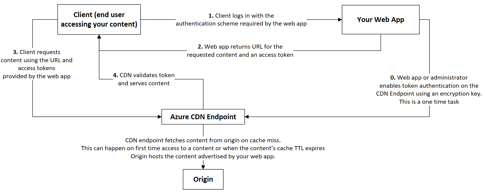
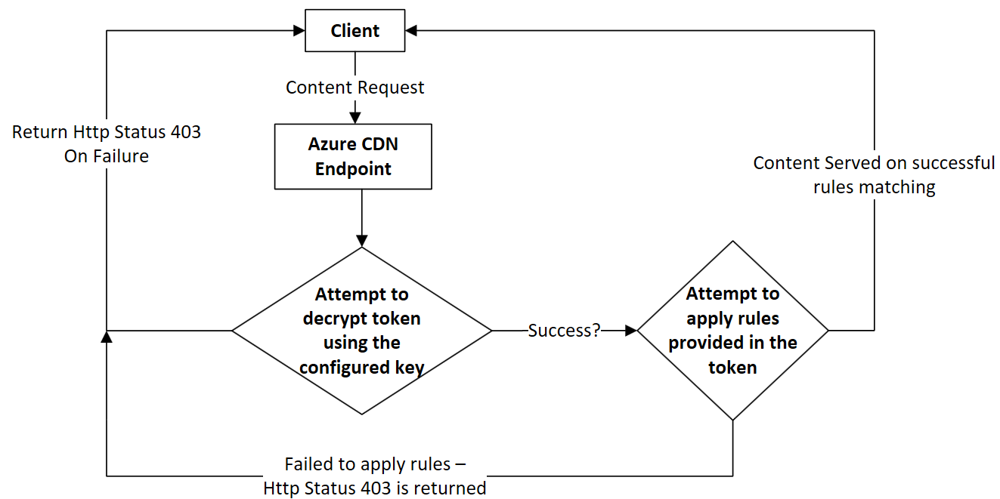
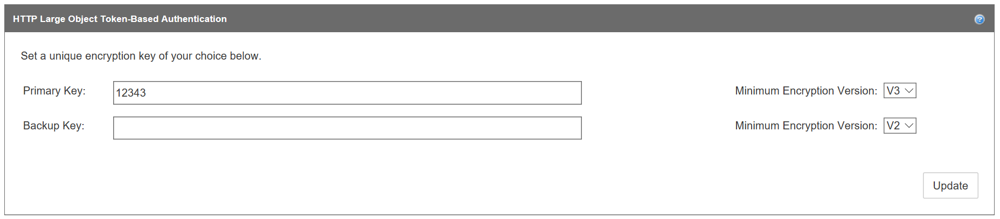
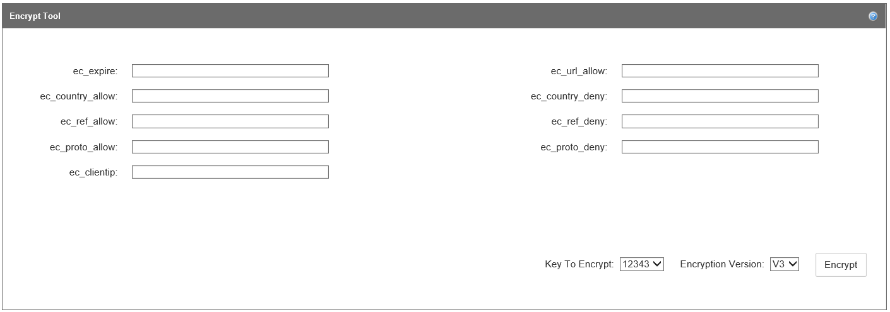
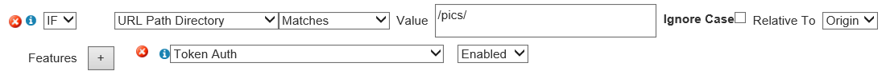
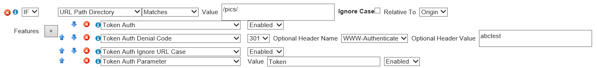

# Securing Azure Content Delivery Network assets with token authentication

[!INCLUDE [cdn-premium-feature](../../includes/cdn-premium-feature.md)]

## Overview

Token authentication is a mechanism that allows you to prevent the Azure content delivery network from serving assets to unauthorized clients. Token authentication is typically done to prevent *hotlinking* of content, in which a different website, such as a message board, uses your assets without permission. Hotlinking can have an effect on your content delivery costs. When you enable token authentication on content delivery network, requests get authenticated by content delivery network edge server before the content delivery network delivers the content.

## How it works

Token authentication verifies that requests get generated by a trusted site by requiring requests to contain a token value that holds encoded information about the requester. Content is served to a requester only if the encoded information meets the requirements; otherwise, requests are denied. You can set up the requirements by using one or more of the following parameters:

- Country/Region: Allow or deny requests that originate from the countries/regions specified by their [country/region code](/previous-versions/azure/mt761717(v=azure.100)).
- URL: Allow only requests that match the specified asset or path.
- Host: Allow or deny requests that use the specified hosts in the request header.
- Referrer: Allow or deny request from the specified referrer.
- IP address: Allow only requests that originated from specific IP address or IP subnet.
- Protocol: Allow or deny requests based on the protocol used to request the content.
- Expiration time: Assign a date and time period to ensure that a link remains valid only for a limited time period.

For more information, see the detailed configuration examples for each parameter in [Setting up token authentication](#setting-up-token-authentication).

>[!IMPORTANT]
> If token authorization is enabled for any path on this account, standard-cache mode is the only mode that can be used for query string caching. For more information, see [Control Azure Content Delivery Network caching behavior with query strings](cdn-query-string-premium.md).

## Reference architecture

The following workflow diagram describes how the content delivery network uses token authentication to work with your web app.

## Token validation logic on content delivery network endpoint

The following flowchart describes how Azure Content Delivery Network validates a client request when token authentication is configured on content delivery network endpoint.

## Setting up token authentication

1. From the [Azure portal](https://portal.azure.com), browse to your content delivery network profile, then select **Manage** to launch the supplemental portal.

    

2. Hover over **HTTP Large**, then select **Token Auth** in the flyout. You can then set up the encryption key and encryption parameters as follows:

   1. Create one or more encryption keys. An encryption key is case-sensitive and can contain any combination of alphanumeric characters. Any other types of characters, including spaces, aren't allowed. The maximum length is 250 characters. To ensure that your encryption keys are random, it's recommended that you create them by using the [OpenSSL tool](https://www.openssl.org/).

      The OpenSSL tool has the following syntax:

      `rand -hex <key length>`

      For example:

      `OpenSSL> rand -hex 32`

      To avoid downtime, create both a primary and a backup key. A backup key provides uninterrupted access to your content when your primary key is being updated.

   2. Enter a unique encryption key in the **Primary Key** box and optionally enter a backup key in the **Backup Key** box.

   3. Select the minimum encryption version for each key from its **Minimum Encryption Version** list, then select **Update**:
      - **V2:** Indicates that the key can be used to generate version 2.0 and 3.0 tokens. Use this option only if you're transitioning from a legacy version 2.0 encryption key to a version 3.0 key.
      - **V3:** (Recommended) Indicates that the key can only be used to generate version 3.0 tokens.

      

   4. Use the encrypt tool to set up encryption parameters and generate a token. With the encrypt tool, you can allow or deny requests based on expiration time, country/region, referrer, protocol, and client IP (in any combination). Although there's no limit to the number and combination of parameters that can be combined to form a token, the total length of a token is limited to 512 characters.

      

      Enter values for one or more of the following encryption parameters in the **Encrypt Tool** section:

      > [!div class="mx-tdCol2BreakAll"]
      > <table>
      > <tr>
      >   <th>Parameter name</th>
      >   <th>Description</th>
      > </tr>
      > <tr>
      >    <td><b>ec_expire</b></td>
      >    <td>Assigns an expiration time to a token, after which the token expires. Requests submitted after the expiration time are denied. This parameter uses a Unix timestamp, which is based on the number of seconds since the standard Unix epoch of `1/1/1970 00:00:00 GMT`. (You can use online tools to convert between standard time and Unix time.)
      >
      >    For example, if you want the token to expire at `12/31/2016 12:00:00 GMT`, enter the Unix timestamp value, `1483185600`.
      > </tr>
      > <tr>
      >    <td><b>ec_url_allow</b></td>
      >    <td>Allows you to tailor tokens to a particular asset or path. It restricts access to requests whose URL start with a specific relative path. URLs are case-sensitive. Input multiple paths by separating each path with a comma; do not add spaces. Depending on your requirements, you can set up different values to provide different level of access.
      >
      >    For example, for the URL `http://www.mydomain.com/pictures/city/strasbourg.png`, these requests are allowed for the following input values:
      >    <ul>
      >       <li>Input value `/`: All requests are allowed.</li>
      >       <li>Input value `/pictures`, the following requests are allowed:
      >       <ul>
      >          <li>`http://www.mydomain.com/pictures.png`</li>
      >          <li>`http://www.mydomain.com/pictures/city/strasbourg.png`</li>
      >          <li>`http://www.mydomain.com/picturesnew/city/strasbourgh.png`</li>
      >       </ul></li>
      >       <li>Input value `/pictures/`: Only requests containing the `/pictures/` path are allowed. For example, `http://www.mydomain.com/pictures/city/strasbourg.png`.</li>
      >       <li>Input value `/pictures/city/strasbourg.png`: Only requests for this specific path and asset are allowed.</li>
      >    </ul>
      > </tr>
      > <tr>
      >    <td><b>ec_country_allow</b></td>
      >    <td>Only allows requests that originate from one or more specified countries/regions. Requests that originate from all other countries/regions are denied. Use a two-letter [ISO 3166 country/region code](/previous-versions/azure/mt761717(v=azure.100)) for each country/region and separate each one with a comma; do not add a space. For example, if you want to allow access from only the United States and France, enter `US,FR`.</td>
      > </tr>
      > <tr>
      >    <td><b>ec_country_deny</b></td>
      >    <td>Denies requests that originate from one or more specified countries/regions. Requests that originate from all other countries/regions are allowed. The implementation is the same as the <b>ec_country_allow</b> parameter. If a country/region code is present in both the <b>ec_country_allow</b> and <b>ec_country_deny</b> parameters, the <b>ec_country_allow</b> parameter takes precedence.</td>
      > </tr>
      > <tr>
      >    <td><b>ec_ref_allow</b></td>
      >    <td>Only allows requests from the specified referrer. A referrer identifies the URL of the web page that is linked to the resource being requested. Do not include the protocol in the parameter value.
      >
      >    The following types of input are allowed:
      >    <ul>
      >       <li>A hostname or a hostname and a path.</li>
      >       <li>Multiple referrers. To add multiple referrers, separate each referrer with a comma; do not add a space. If you specify a referrer value, but the referrer information is not sent in the request due to the browser configuration, the request is denied by default.</li>
      >       <li>Requests with missing or blank referrer information. By default, the <b>ec_ref_allow</b> parameter blocks these types of requests. To allow these requests, enter either the text, "missing", or enter a blank value (by using a trailing comma).</li>
      >       <li>Subdomains. To allow subdomains, enter an asterisk (\*). For example, to allow all subdomains of `contoso.com`, enter `*.contoso.com`.</li>
      >    </ul>
      >
      >    For example, to allow access for requests from `www.contoso.com`, all subdomains under `contoso2.com`, and requests with blank or missing referrers, enter `www.contoso.com,*.contoso.com,missing`.</td>
      > </tr>
      > <tr>
      >    <td><b>ec_ref_deny</b></td>
      >    <td>Denies requests from the specified referrer. The implementation is the same as the <b>ec_ref_allow</b> parameter. If a referrer is present in both the <b>ec_ref_allow</b> and <b>ec_ref_deny</b> parameters, the <b>ec_ref_allow</b> parameter takes precedence.</td>
      > </tr>
      > <tr>
      >    <td><b>ec_proto_allow</b></td>
      >    <td>Only allows requests from the specified protocol. Valid values are `http`, `https`, or `http,https`.</td>
      > </tr>
      > <tr>
      >    <td><b>ec_proto_deny</b></td>
      >    <td>Denies requests from the specified protocol. The implementation is the same as the <b>ec_proto_allow</b> parameter. If a protocol is present in both the <b>ec_proto_allow</b> and <b>ec_proto_deny</b> parameters, the <b>ec_proto_allow</b> parameter takes precedence.</td>
      > </tr>
      > <tr>
      >    <td><b>ec_clientip</b></td>
      >    <td>Restricts access to the specified requester's IP address. Both Internet Protocol version 4 (IPv4) and Internet Protocol version 6 (IPv6) are supported. You can specify either a single request IP address or IP addresses associated with a specific subnet. For example, `11.22.33.0/22` allows requests from IP addresses 11.22.32.1 to 11.22.35.254.</td>
      > </tr>
      > </table>

   5. After you have finished entering encryption parameter values, select a key to encrypt (if you've created both a primary and a backup key) from the **Key To Encrypt** list.

   6. Select an encryption version from the **Encryption Version** list: **V2** for version 2 or **V3** for version 3 (recommended).

   7. Select **Encrypt** to generate the token.

      After the token is generated, it's displayed in the **Generated Token** box. To use the token, append it as a query string to the end of the file in your URL path. For example, `http://www.domain.com/content.mov?a4fbc3710fd3449a7c99986b`.

   8. Optionally, test your token with the decrypt tool so that you can view your token's parameters. Paste the token value in the **Token to Decrypt** box. Select the encryption key to use from the **Key To Decrypt** list, then select **Decrypt**.

      After the token is decrypted, its parameters are displayed in the **Original Parameters** box.

   9. Optionally, customize the type of response code that is returned when a request is denied. Select **Enabled**, then select the response code from the **Response Code** list. **Header Name** is automatically set to **Location**. Select **Save** to implement the new response code. For certain response codes, you must also enter the URL of your error page in the **Header Value** box. The **403** response code (Forbidden) is selected by default.

3. Under **HTTP Large**, select **Rules Engine**. You use the rules engine to define paths to apply the feature, enable the token authentication feature, and enable extra token authentication-related capabilities. For more information, see [Rules engine reference](./cdn-verizon-premium-rules-engine-reference.md).

   1. Select an existing rule or create a new rule to define the asset or path for which you want to apply token authentication.
   2. To enable token authentication on a rule, select **[Token Auth](https://docs.vdms.com/cdn/Content/HRE/F/Token-Auth.htm)** from the **Features** list, then select **Enabled**. Select **Update** if you're updating a rule or **Add** if you're creating a rule.

      

4. In the rules engine, you can also enable more token authentication-related features. To enable any of the following features, select it from the **Features** list, then select **Enabled**.

   - **[Token Auth Denial Code](https://docs.vdms.com/cdn/Content/HRE/F/Token-Auth-Denial-Code.htm):** Determines the type of response that is returned to a user when a request is denied. Rules set here override the response code set in the **Custom Denial Handling** section on the token-based authentication page.

   - **[Token Auth Ignore URL Case](https://docs.vdms.com/cdn/Content/HRE/F/Token-Auth-Ignore-URL-Case.htm):** Determines whether the URL used to validate the token is case-sensitive.

   - **[Token Auth Parameter](https://docs.vdms.com/cdn/Content/HRE/F/Token-Auth-Parameter.htm):** Renames the token auth query string parameter that appears in the requested URL.

     

5. You can customize your token by accessing source code in [GitHub](https://github.com/VerizonDigital/ectoken).
   Available languages include:

   - C
   - C#
   - PHP
   - Perl
   - Java
   - Python

## Azure Content Delivery Network features and provider pricing

For information about features, see [Azure Content Delivery Network product features](cdn-features.md). For information about pricing, see [Content Delivery Network pricing](https://azure.microsoft.com/pricing/details/cdn/).
