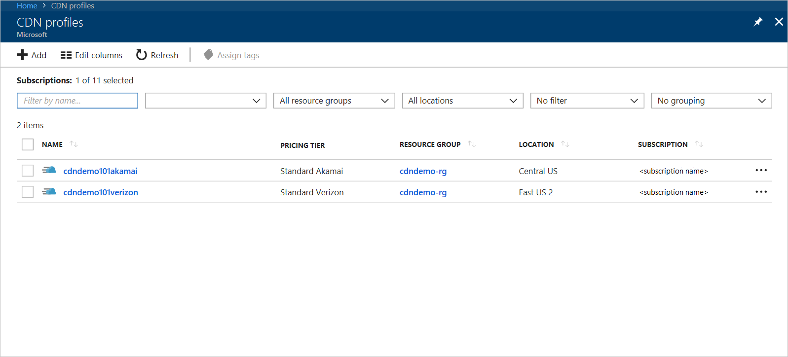
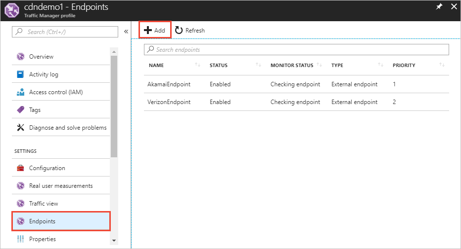

# Failover across multiple endpoints with Azure Traffic Manager

When you configure Azure Content Delivery Network (CDN), you can select the optimal provider and pricing tier for your needs. 

Azure CDN, with its globally distributed infrastructure, by default creates local and geographic redundancy and global load balancing to improve service availability and performance. 

If a location isn't available to serve content, requests are automatically routed to another location. The optimal point of presence (POP) is used to serve each client request. The automatic routing is based on factors as request location and server load.
 
If you have multiple CDN profiles, you can further improve availability and performance with Azure Traffic Manager. 

Use Azure Traffic Manager with Azure CDN to load balance among multiple CDN endpoints for:
 
* Failover
* Geo-load balancing 

In a typical failover scenario, all client requests are directed to the primary CDN profile. 

If the profile is unavailable, requests are directed to the secondary profile.  Requests resume to your primary profile when it comes back online.

Using Azure Traffic Manager in this way ensures your web application is always available. 

This article provides guidance and an example of how to configure failover with profiles from: 

* **Azure CDN Standard from Edgio**
* **Azure CDN Standard from Akamai**

**Azure CDN from Microsoft** is also supported.

## Create Azure CDN profiles
Create two or more Azure CDN profiles and endpoints with different providers.

1. Create two CDN profiles:
    * **Azure CDN Standard from Edgio**
    * **Azure CDN Standard from Akamai** 

    Create the profiles by following the steps in [Create a new CDN profile](cdn-create-new-endpoint.md#create-a-new-cdn-profile).
 
   

2. In each of the new profiles, create at least one endpoint by following the steps in [Create a new CDN endpoint](cdn-create-new-endpoint.md#create-a-new-cdn-endpoint).

## Create traffic manager profile
Create an Azure Traffic Manager profile and configure load balancing across your CDN endpoints. 

1. Create an Azure Traffic Manager profile by following the steps in [Create a Traffic Manager profile](../traffic-manager/quickstart-create-traffic-manager-profile.md). 

    * **Routing method**, select **Priority**.

2. Add your CDN endpoints in your Traffic Manager profile by following the steps in [Add Traffic Manager endpoints](../traffic-manager/quickstart-create-traffic-manager-profile.md#add-traffic-manager-endpoints)

    * **Type**, select **External endpoints**.
    * **Priority**, enter a number.

    For example, create **cdndemo101akamai.azureedge.net** with a priority of **1** and **cdndemo101verizon.azureedge.net** with a priority of **2**.

   

## Configure custom domain on Azure CDN and Azure Traffic Manager
After you configure your CDN and Traffic Manager profiles, follow these steps to add DNS mapping and register custom domain to the CDN endpoints. For this example, the custom domain name is **cdndemo101.dustydogpetcare.online**.

1. Go to the web site for the domain provider of your custom domain, such as GoDaddy, and create two DNS CNAME entries. 

    a. For the first CNAME entry, map your custom domain, with the cdnverify subdomain, to your CDN endpoint. This entry is a required step to register the custom domain to the CDN endpoint that you added to Traffic Manager in step 2.

      For example: 

      `cdnverify.cdndemo101.dustydogpetcare.online  CNAME  cdnverify.cdndemo101akamai.azureedge.net`  

    b. For the second CNAME entry, map your custom domain, without the cdnverify subdomain, to your CDN endpoint. This entry maps the custom domain to Traffic Manager. 

      For example: 
      
      `cdndemo101.dustydogpetcare.online  CNAME  cdndemo101.trafficmanager.net`   

    > [!NOTE]
    > If your domain is currently live and cannot be interrupted, do this step last. Verify that the CDN endpoints and traffic manager domains are live before you update your custom domain DNS to Traffic Manager.
    >
   
    > [!NOTE]
    > For implementing this fail over scenario both endpoints need to be in different profiles, and the different profiles should be by different CDN providers to avoid domain name conflicts.
    > 

2.	From your Azure CDN profile, select the first CDN endpoint (Akamai). Select **Add custom domain** and input **cdndemo101.dustydogpetcare.online**. Verify that the checkmark to validate the custom domain is green. 

    Azure CDN uses the **cdnverify** subdomain to validate the DNS mapping to complete this registration process. For more information, see [Create a CNAME DNS record](cdn-map-content-to-custom-domain.md#create-a-cname-dns-record). This step enables Azure CDN to recognize the custom domain so that it can respond to its requests.
    
    > [!NOTE]
    > To enable TLS on an **Azure CDN from Akamai** profiles, you must directly cname the custom domain to your endpoint. cdnverify for enabling TLS is not yet supported. 
    >

3.	Return to the web site for the domain provider of your custom domain. Update the first DNS mapping you created. Map the custom domain to your second CDN endpoint.
                             
    For example: 

    `cdnverify.cdndemo101.dustydogpetcare.online  CNAME  cdnverify.cdndemo101verizon.azureedge.net`  

4. From your Azure CDN profile, select the second CDN endpoint (Edgio) and repeat step 2. Select **Add custom domain**, and enter **cdndemo101.dustydogpetcare.online**.
 
After you complete these steps, your multi-CDN service with failover capabilities is configured with Azure Traffic Manager. 

You can access the test URLs from your custom domain. 

To test the functionality, disable the primary CDN endpoint and verify that the request is correctly moved over to the secondary CDN endpoint. 

## Next steps
You can configure other routing methods, such as geographic, to balance the load among different CDN endpoints. 

For more information, see [Configure the geographic traffic routing method using Traffic Manager](../traffic-manager/traffic-manager-configure-geographic-routing-method.md).
