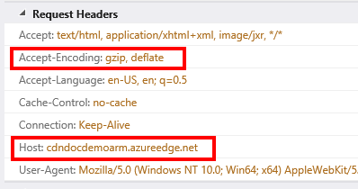
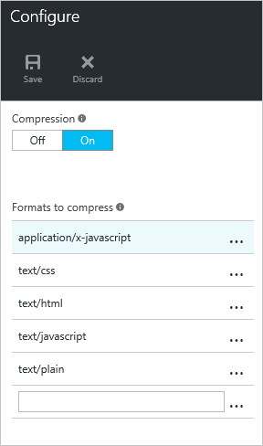
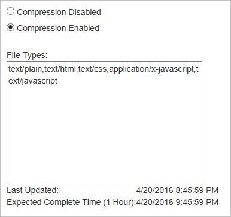
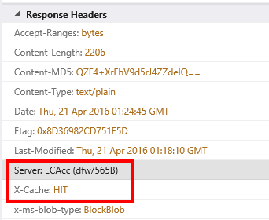

# Troubleshooting CDN file compression

This article helps you troubleshoot issues with [CDN file compression](cdn-improve-performance.md).

If you need more help at any point in this article, you can contact the Azure experts on [the MSDN Azure and the Stack Overflow forums](https://azure.microsoft.com/support/forums/). Alternatively, you can also file an Azure support incident. Go to the [Azure Support site](https://azure.microsoft.com/support/options/) and select **Get Support**.

## Symptom

Compression for your endpoint is enabled, but files are being returned uncompressed.

> [!TIP]
> To check whether your files are being returned compressed, you need to use a tool like [Fiddler](https://www.telerik.com/fiddler) or your browser's [developer tools](https://developer.microsoft.com/microsoft-edge/platform/documentation/f12-devtools-guide/).  Check the HTTP response headers returned with your cached CDN content.  If there is a header named `Content-Encoding` with a value of **gzip**, **bzip2**, **brotli**, or **deflate**, your content is compressed.
> 
> 
> 
> 

## Cause

There are several possible causes, including:

* The requested content isn't eligible for compression.
* Compression isn't enabled for the requested file type.
* The HTTP request didn't include a header requesting a valid compression type.
* Origin is sending chunked content.

## Troubleshooting steps

> [!TIP]
> As with deploying new endpoints, CDN configuration changes take some time to propagate through the network.  Usually, changes are applied within 90 minutes.  If this is the first time you've set up compression for your CDN endpoint, you should consider waiting 1-2 hours to be sure the compression settings have propagated to the POPs. 
> 
> 

### Verify the request
First, we should do a quick sanity check on the request.  You can use your browser's [developer tools](https://developer.microsoft.com/microsoft-edge/platform/documentation/f12-devtools-guide/) to view the requests being made.

* Verify the request is being sent to your endpoint URL, `<endpointname>.azureedge.net`, and not your origin.
* Verify the request contains an **Accept-Encoding** header, and the value for that header contains **gzip**, **deflate**, **brotli**, or **bzip2**.

> [!NOTE]
> **Azure CDN from Akamai** profiles only support **gzip** encoding.
> 
> 

### Verify compression settings (standard CDN profiles)
> [!NOTE]
> This step applies only if your CDN profile is an **Azure CDN Standard from Microsoft**, **Azure CDN Standard from Edgio**, or **Azure CDN Standard from Akamai** profile. 
> 
> 

Navigate to your endpoint in the [Azure portal](https://portal.azure.com) and select the **Configure** button.

* Verify compression is enabled.
* Verify the MIME type for the content to be compressed is included in the list of compressed formats.

### Verify compression settings (Premium CDN profiles)
> [!NOTE]
> This step applies only if your CDN profile is an **Azure CDN Premium from Edgio** profile.
> 
> 

Navigate to your endpoint in the [Azure portal](https://portal.azure.com) and select the **Manage** button.  The supplemental portal opens.  Hover over the **HTTP Large** tab, then hover over the **Cache Settings** flyout.  Select **Compression**. 

* Verify compression is enabled.
* Verify the **File Types** list contains a comma-separated list (no spaces) of MIME types.
* Verify the MIME type for the content to be compressed is included in the list of compressed formats.

### Verify the content is cached (Edgio CDN profiles)
> [!NOTE]
> This step applies only if your CDN profile is an **Azure CDN Standard from Edgio** or **Azure CDN Premium from Edgio** profile.
> 
> 

Using your browser's developer tools, check the response headers to ensure the file is cached in the region where it's being requested.

* Check the **Server** response header.  The header should have the format **Platform (POP/Server ID)**, as seen in the following example.
* Check the **X-Cache** response header.  The header should read **HIT**.  

### Verify the file meets the size requirements (Edgio CDN profiles)
> [!NOTE]
> This step applies only if your CDN profile is an **Azure CDN Standard from Edgio** or **Azure CDN Premium from Edgio** profile.
> 
> 

To be eligible for compression, a file must meet the following size requirements:

* Larger than 128 bytes (Content-Length: 128)
* Smaller than 3 MB

### Check the request at the origin server for a **Via** header
The **Via** HTTP header indicates to the web server that the request is being passed by a proxy server.  Microsoft IIS web servers by default don't compress responses when the request contains a **Via** header.  To override this behavior, perform the following:

* **IIS 6**: [Set HcNoCompressionForProxies="FALSE" in the IIS Metabase properties](/previous-versions/iis/6.0-sdk/ms525390(v=vs.90))
* **IIS 7 and up**: [Set both **noCompressionForHttp10** and **noCompressionForProxies** to False in the server configuration](https://www.iis.net/configreference/system.webserver/httpcompression)
