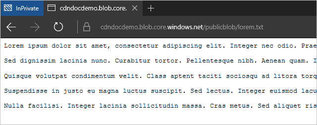
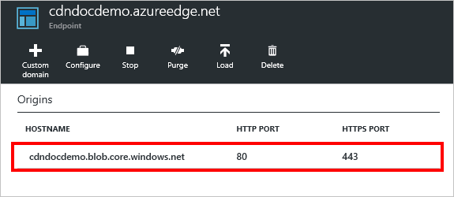
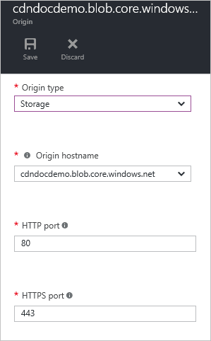
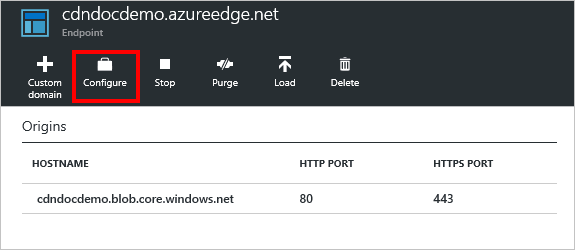
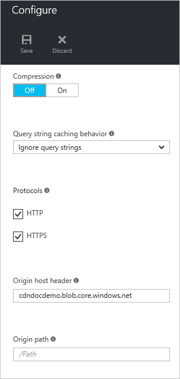

<properties
	pageTitle="Troubleshooting Azure CDN endpoints returning 404 status | Microsoft Azure"
	description="Troubleshoot 404 response codes with Azure CDN endpoints."
	services="cdn"
	documentationCenter=""
	authors="camsoper"
	manager="erikre"
	editor=""/>

<tags
	ms.service="cdn"
	ms.workload="tbd"
	ms.tgt_pltfrm="na"
	ms.devlang="na"
	ms.topic="article"
	ms.date="07/28/2016"
	ms.author="casoper"/>
    
# Troubleshooting CDN endpoints returning 404 statuses

This article helps you troubleshoot issues with [CDN endpoints](cdn-create-new-endpoint.md) returning 404 errors.

If you need more help at any point in this article, you can contact the Azure experts on [the MSDN Azure and the Stack Overflow forums](https://azure.microsoft.com/support/forums/). Alternatively, you can also file an Azure support incident. Go to the [Azure Support site](https://azure.microsoft.com/support/options/) and click on **Get Support**.

## Symptom

You've created a CDN profile and an endpoint, but your content doesn't seem to be available on the CDN.  Users who attempt to access your content via the CDN URL receive HTTP 404 status codes. 

## Cause

There are several possible causes, including:

- The file's origin isn't visible to the CDN
- The endpoint is misconfigured, causing the CDN to look in the wrong place
- The host is rejecting the host header from the CDN
- The endpoint hasn't had time to propagate throughout the CDN

## Troubleshooting steps

> [AZURE.IMPORTANT] After creating a CDN endpoint, it will not immediately be available for use, as it takes time for the registration to propagate through the CDN.  For <b>Azure CDN from Akamai</b> profiles, propagation usually completes within one minute.  For <b>Azure CDN from Verizon</b> profiles, propagation will usually complete within 90 minutes, but in some cases can take longer.  If you complete the steps in this document and you're still getting 404 responses, consider waiting a few hours to check again before opening a support ticket.

### Check the origin file

First, we should verify the that the file we want cached is available on our origin and is publicly accessible.  The quickest way to do that is to open a browser in an In-Private or Incognito session and browse directly to the file.  Just type or paste the URL into the address box and see if that results in the file you expect.  For this example, I'm going to use a file I have in an Azure Storage account, accessible at `https://cdndocdemo.blob.core.windows.net/publicblob/lorem.txt`.  As you can see, it successfully passes the test.

> [AZURE.WARNING] While this is the quickest and easiest way to verify your file is publicly available, some network configurations in your organization could give you the illusion that this file is publicly available when it is, in fact, only visible to users of your network (even if it's hosted in Azure).  If you have an external browser from which you can test, such as a mobile device that is not connected to your organization's network, or a virtual machine in Azure, that would be best.

### Check the origin settings

Now that we've verified the file is publicly available on the internet, we should verify our origin settings.  In the [Azure Portal](https://portal.azure.com), browse to your CDN profile and click the endpoint you're troubleshooting.  In the resulting **Endpoint** blade, click the origin.  

The **Origin** blade appears. 

#### Origin type and hostname

Verify the **Origin type** is correct, and verify the **Origin hostname**.  In my example, `https://cdndocdemo.blob.core.windows.net/publicblob/lorem.txt`, the hostname portion of the URL is `cdndocdemo.blob.core.windows.net`.  As you can see in the screenshot, this is correct.  For Azure Storage, Web App, and Cloud Service origins, the **Origin hostname** field is a dropdown, so we don't need to worry about spelling it correctly.  However, if you're using a custom origin, it is *absolutely critical* your hostname is spelled correctly!

#### HTTP and HTTPS ports

The other thing to check here is your **HTTP** and **HTTPS ports**.  In most cases, 80 and 443 are correct, and you will require no changes.  However, if the origin server is listening on a different port, that will need to be represented here.  If you're not sure, just look at the URL for your origin file.  The HTTP and HTTPS specifications specify ports 80 and 443 as the defaults. In my URL, `https://cdndocdemo.blob.core.windows.net/publicblob/lorem.txt`, a port is not specified, so the default of 443 is assumed and my settings are correct.  

However, say the URL for your origin file that you tested earlier is `http://www.contoso.com:8080/file.txt`.  Note the `:8080` at the end of the hostname segment.  That tells the browser to use port `8080` to connect to the web server at `www.contoso.com`, so you'll need to enter 8080 in the **HTTP port** field.  It's important to note that these port settings only affect what port the endpoint uses to retrieve information from the origin.

> [AZURE.NOTE] **Azure CDN from Akamai** endpoints do not allow the full TCP port range for origins.  For a list of origin ports that are not allowed, see [Azure CDN from Akamai Allowed Ports](https://msdn.microsoft.com/library/mt757337.aspx).  
  
### Check the endpoint settings

Back on the **Endpoint** blade, click the **Configure** button.

The endpoint's **Configure** blade appears.

#### Protocols

For **Protocols**, verify that the protocol being used by the clients is selected.  The same protocol used by the client will be the one used to access the origin, so it's important to have the origin ports configured correctly in the previous section.  The endpoint only listens on the default HTTP and HTTPS ports (80 and 443), regardless of the origin ports.

Let's return to our hypothetical example with `http://www.contoso.com:8080/file.txt`.  As you'll remember, Contoso specified `8080` as their HTTP port, but let's also assume they specified `44300` as their HTTPS port.  If they created an endpoint named `contoso`, their CDN endpoint hostname would be `contoso.azureedge.net`.  A request for `http://contoso.azureedge.net/file.txt` is an HTTP request, so the endpoint would use HTTP on port 8080 to retrieve it from the origin.  A secure request over HTTPS, `https://contoso.azureedge.net/file.txt`, would cause the endpoint to use HTTPS on port 44300 when retriving the file from the origin.

#### Origin host header

The **Origin host header** is the host header value sent to the origin with each request.  In most cases, this should be the same as the **Origin hostname** we verified earlier.  An incorrect value in this field won't generally cause 404 statuses, but is likely to cause other 4xx statuses, depending on what the origin expects.

#### Origin path

Lastly, we should verify our **Origin path**.  By default this is blank.  You should only use this field if you want to narrow the scope of the origin-hosted resources you want to make available on the CDN.  

For example, in my endpoint, I wanted all resources on my storage account to be available, so I left **Origin path** blank.  This means that a request to `https://cdndocdemo.azureedge.net/publicblob/lorem.txt` results in a connection from my endpoint to `cdndocdemo.core.windows.net` that requests `/publicblob/lorem.txt`.  Likewise, a request for `https://cdndocdemo.azureedge.net/donotcache/status.png` results in the endpoint requesting `/donotcache/status.png` from the origin.

But what if I don't want to use the CDN for every path on my origin?  Say I only wanted to expose the `publicblob` path.  If I enter */publicblob* in my **Origin path** field, that will cause the endpoint to insert */publicblob* before every request being made to the origin.  This means that the request for `https://cdndocdemo.azureedge.net/publicblob/lorem.txt` will now actually take the request portion of the URL, `/publicblob/lorem.txt`, and append `/publicblob` to the beginning. This results in a request for `/publicblob/publicblob/lorem.txt` from the origin.  If that path doesn't resolve to an actual file, the origin will return a 404 status.  The correct URL to retrieve lorem.txt in this example would actually be `https://cdndocdemo.azureedge.net/lorem.txt`.  Note that we don't include the */publicblob* path at all, because the request portion of the URL is `/lorem.txt` and the endpoint adds `/publicblob`, resulting in `/publicblob/lorem.txt` being the request passed to the origin.
