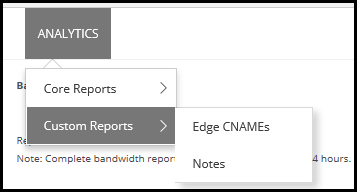
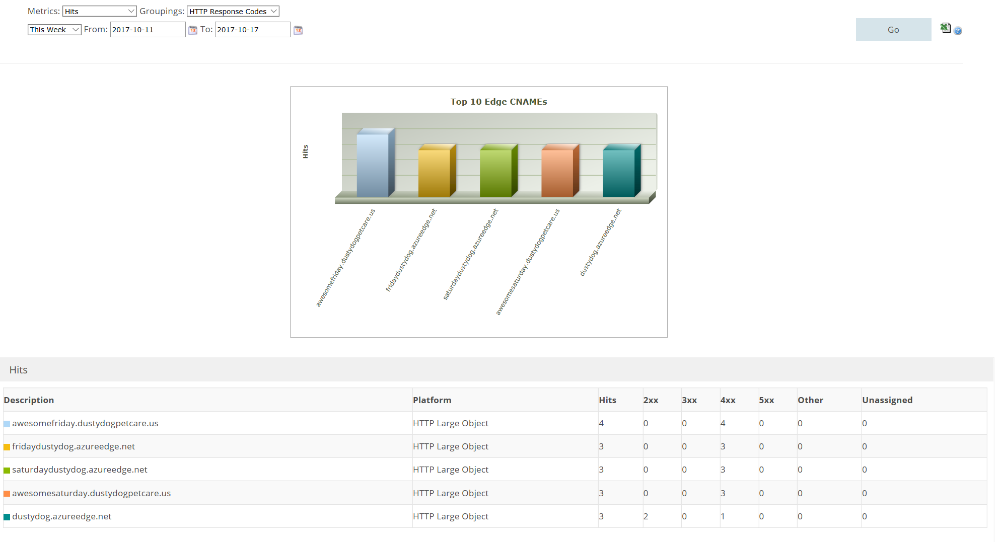

# Custom Reports from Edgio

[!INCLUDE [cdn-verizon-only](../../includes/cdn-verizon-only.md)]

By using Edgio Custom Reports via the Manage portal for Edgio profiles, you can define the type of data to be collected for edge CNAMEs reports.

## Accessing Edgio Custom Reports
1. From the CDN profile blade, click the **Manage** button.
   
    
   
    The CDN management portal opens.
2. Hover over the **Analytics** tab, then hover over the **Custom Reports** flyout. Click **Edge CNAMEs**.
   
    

## Edge CNAMES custom report
The Edge CNAMES custom report provides hits and data-transferred statistics for edge CNAMEs on which custom report logging has been enabled. Edge CNAMEs consist of Azure CDN endpoint hostnames and any associated custom domain hostnames. 

Custom report data logging begins one hour after you enable an edge CNAME's custom reporting capability. You can view report data by generating an Edge CNAMEs report for a specific platform or for all platforms. The coverage for this report is limited to the edge CNAMEs for which custom report data was collected during the specified time period. The edge CNAMEs report consists of a graph and data table for the top 10 edge CNAMEs according to the metric defined in the Metrics option. 

Generate a custom report by defining the following report options:

- Metrics: The following options are supported:

   - Hits: Indicates the total number of requests that are directed to an edge CNAME on which the custom reporting capability is enabled. This metric does not include the status code returned to the client.

   - Data Transferred: Indicates the total amount of data transferred from the edge servers to the HTTP clients (for example, web browsers) for requests that are directed to an edge CNAME on which the custom reporting capability is enabled. The amount of data transferred is calculated by adding HTTP response headers to the response body. As a result, the amount of data transferred for each asset is greater than its actual file size.

- Groupings: Determines the type of statistics that are shown below the bar chart. The following options are supported:

   - HTTP Response Codes: Organizes statistics by HTTP response code (for example, 200, 403, etc.) returned to the client. 

   - Cache Status: Organizes statistics by cache status.

To set the date range for the report, you can either select a pre-defined date range, such as **Today** or **This Week**, from the drop-down list or you can select **Custom** and manually enter a date range by clicking the calendar icons. 

After you have selected the date range, click **Go** to generate the report.

You can export the data in Excel format by clicking the Excel symbol to the right of the **Go** button.

## Edge CNAMES custom report fields

| Field                     | Description   |
|---------------------------|---------------|
| 2xx                       | Indicates the total number of requests or data transferred (MB) for the edge CNAME that results in a 2xx HTTP status code (for example, 200 OK). |
| 3xx                       | Indicates the total number of requests or data transferred (MB) for the edge CNAME that results in a 3xx HTTP status code  (for example, 302 Found or 304 Not Modified. |
| 4xx                       | Indicates the total number of requests or data transferred (MB) for the edge CNAME that results in a 4xx HTTP status code (for example, 400 Bad Request, 403 Forbidden, or 404 Not Found). |
| 5xx                       | Indicates the total number of requests or data transferred (MB) for the edge CNAME that results in a 5xx HTTP status code (for example, 500 Internal Server Error or 502 Bad Gateway). |
| Cache Hit %               | Indicates the percentage of cacheable requests that were served directly from cache to the requester. |
| Cache Hits                | Indicates the total number of requests or data transferred (MB) for the edge CNAME that results in a cache hit (for example, TCP_EXPIRED_HIT, TCP_HIT, or TCP_PARTIAL_HIT). A cache hit occurs when a cached version of the requested content is found. |
| Data Transferred (MB)     | Indicates the total amount of data transferred (MB) from the edge servers to HTTP clients (web browsers) for the edge CNAME. The amount of data transferred is calculated by adding the HTTP response headers to the response body. As a result, the amount of data transferred for each asset is greater than its actual file size. |
| Description               | Identifies an edge CNAME by its hostname |
| Hits                      | Indicates the total number of requests to the edge CNAME |
| Misses                    | Indicates the total number of requests or data transferred (MB) for the edge CNAME that results in a cache miss (for example, TCP_CLIENT_REFRESH_MISS, TCP_EXPIRED_MISS, or TCP_MISS). A cache miss occurs when the requested content was not cached on the edge server that honored the request. | 
| No Cache                  | Indicates the total number of requests or data transferred (MB) for the edge CNAME that results in a CONFIG_NOCACHE cache status code.  |
| Other                     | Indicates the total number of requests or data transferred (MB) for the edge CNAME indicated that results in an HTTP status code that falls outside of the 2xx - 5xx range. |
| Platform                  | Indicates the platform that handles the edge CNAME's traffic. |
| Unassigned               | Indicates the total number of requests or data transferred (MB) for the edge CNAME for which cache status code or HTTP status code information was not logged.  |
| Uncacheable               | Indicates the total number of requests or data transferred (MB) for the edge CNAME that results in an UNCACHEABLE cache status code.  |

## Considerations
Reports can be generated only within the last 18 months.
