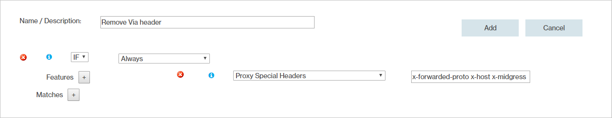

# Verizon-specific HTTP headers for Azure CDN rules engine

For **Azure CDN Premium from Verizon** products, when an HTTP request is sent to the origin server, the point-of-presence (POP) server can add one or more reserved headers (or proxy special headers) in the client request to the POP. These headers are in addition to the standard forwarding headers received. For information about standard request headers, see [Request fields](https://en.wikipedia.org/wiki/List_of_HTTP_header_fields#Request_fields).

If you want to prevent one of these reserved headers from being added in the Azure CDN (Content Delivery Network) POP request to the origin server, you must create a rule with the [Proxy Special Headers feature](https://docs.vdms.com/cdn/Content/HRE/F/Proxy-Special-Headers.htm) in the rules engine. In this rule, exclude the header you want to remove from the default list of headers in the headers field. If you've enabled the [Debug Cache Response Headers feature](https://docs.vdms.com/cdn/Content/HRE/F/Debug-Cache-Response-Headers.htm), be sure to add the necessary `X-EC-Debug` headers. 

For example, to remove the `Via` header, the headers field of the rule should include the following list of headers: *X-Forwarded-For, X-Forwarded-Proto, X-Host, X-Midgress, X-Gateway-List, X-EC-Name, Host*. 

The following table describes the headers that can be added by the Verizon CDN POP in the request:

Request header | Description | Example
---------------|-------------|--------
[Via](#via-request-header) | Identifies the POP server that proxied the request to an origin server. | HTTP/1.1 ECS (dca/1A2B)
X-Forwarded-For | Indicates the requester's IP address.| 10.10.10.10
X-Forwarded-Proto | Indicates the request's protocol. | http
X-Host | Indicates the request's hostname. | cdn.mydomain.com
X-Midgress | Indicates whether the request was proxied through an additional CDN server. For example, a POP server-to-origin shield server or a POP server-to-ADN gateway server.  This header is added to the request only when midgress traffic takes place. In this case, the header is set to 1 to indicate that the request was proxied through an additional CDN server.| 1
[Host](#host-request-header) | Identifies the host and the port where the requested content may be found. | marketing.mydomain.com:80
[X-Gateway-List](#x-gateway-list-request-header) | ADN: Identifies the failover list of ADN Gateway servers assigned to a customer origin.  Origin shield: Indicates the set of origin shield servers assigned to a customer origin. | `icn1,hhp1,hnd1`
X-EC-_&lt;name&gt;_ | Request headers that begin with *X-EC* (for example, X-EC-Tag, [X-EC-Debug](cdn-http-debug-headers.md)) are reserved for use by the CDN.| waf-production

## Via request header
The format through which the `Via` request header identifies a POP server is specified by the following syntax:

`Via: Protocol from Platform (POP/ID)` 

The terms used in the syntax are defined as follows:
- Protocol: Indicates the version of the protocol (for example, HTTP/1.1) used to proxy the request. 

- Platform: Indicates the platform on which the content was requested. The following codes are valid for this field: 

    Code | Platform
    -----|---------
    ECAcc | HTTP Large
    ECS   | HTTP Small
    ECD   | Application delivery network (ADN)

- POP: Indicates the [POP](cdn-pop-abbreviations.md) that handled the request. 

- ID: For internal use only.

### Example Via request header

`Via: HTTP/1.1 ECD (dca/1A2B)`

## Host request header
The POP servers will overwrite the `Host` header when both of the following conditions are true:
- The source for the requested content is a customer origin server.
- The corresponding customer origin's HTTP Host Header option is not blank.

The `Host` request header will be overwritten to reflect the value defined in the HTTP Host Header option.
If the customer origin's HTTP Host Header option is set to blank, then the `Host` request header that is submitted by the requester will be forwarded to the customer's origin server.

## X-Gateway-List request header
A POP server will add/overwrite the `X-Gateway-List request header when either of the following conditions are met:
- The request points to the ADN platform.
- The request is forwarded to a customer origin server that is protected by the Origin Shield feature.

