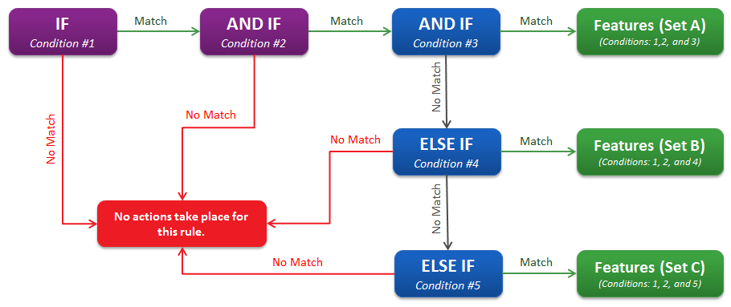

# Azure CDN from Verizon Premium rules engine conditional expressions

This article lists detailed descriptions of the Conditional Expressions for Azure Content Delivery Network (CDN) [Rules Engine](cdn-verizon-premium-rules-engine.md).

The first part of a rule is the Conditional Expression.

Conditional Expression | Description
-----------------------|-------------
IF | An IF expression is always a part of the first statement in a rule. Like all other conditional expressions, this IF statement must be associated with a match. If no additional conditional expressions are defined, this match determines the criterion that must be met before a set of features may be applied to a request.
AND IF | An AND IF expression may only be added after the following types of conditional expressions:IF,AND IF. It indicates that there is another condition that must be met for the initial IF statement.
ELSE IF| An ELSE IF expression specifies an alternative condition that must be met before a set of features specific to this ELSE IF statement takes place. The presence of an ELSE IF statement indicates the end of the previous statement. The only conditional expression that may be placed after an ELSE IF statement is another ELSE IF statement. This means that an ELSE IF statement may only be used to specify a single additional condition that has to be met.

**Example**:

 > [!TIP]
   > A subsequent rule may override the actions specified by a previous rule.
   > Example: A catch-all rule secures all requests via Token-Based Authentication. Another rule may be created directly below it to make an exception for certain types of requests.

## Next steps

- [Azure CDN overview](cdn-overview.md)
- [Rules engine reference](cdn-verizon-premium-rules-engine-reference.md)
- [Rules engine match conditions](cdn-verizon-premium-rules-engine-reference-match-conditions.md)
- [Rules engine features](cdn-verizon-premium-rules-engine-reference-features.md)
- [Overriding default HTTP behavior using the rules engine](cdn-verizon-premium-rules-engine.md)