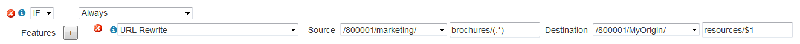
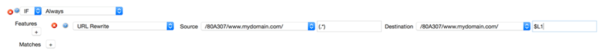

# Azure CDN from Verizon Premium rules engine features

This article lists detailed descriptions of the available features for Azure Content Delivery Network (CDN) [Rules Engine](cdn-verizon-premium-rules-engine.md).

The third part of a rule is the feature. A feature defines the type of action that is applied to the request type that is identified by a set of match conditions.

## Access features

These features are designed to control access to content.

Name | Purpose
-----|--------
[Deny Access (403)](#deny-access-403) | Determines whether all requests are rejected with a 403 Forbidden response.
[Token Auth](#token-auth) | Determines whether Token-Based Authentication is applied to a request.
[Token Auth Denial Code](#token-auth-denial-code) | Determines the type of response that is returned to a user when a request is denied due to token-based authentication.
[Token Auth Ignore URL Case](#token-auth-ignore-url-case) | Determines whether URL comparisons made by Token-Based Authentication are case-sensitive.
[Token Auth Parameter](#token-auth-parameter) | Determines whether the Token-Based Authentication query string parameter should be renamed.

## Caching features

These features are designed to customize when and how content is cached.

Name | Purpose
-----|--------
[Bandwidth Parameters](#bandwidth-parameters) | Determines whether bandwidth throttling parameters (for example, ec_rate and ec_prebuf) are active.
[Bandwidth Throttling](#bandwidth-throttling) | Throttles the bandwidth for the response provided by the point-of-presence (POP).
[Bypass Cache](#bypass-cache) | Determines whether the request should bypass caching.
[Cache-Control Header Treatment](#cache-control-header-treatment) | Controls the generation of `Cache-Control` headers by the POP when External Max-Age feature is active.
[Cache-Key Query String](#cache-key-query-string) | Determines whether the cache-key includes or excludes query string parameters associated with a request.
[Cache-Key Rewrite](#cache-key-rewrite) | Rewrites the cache-key associated with a request.
[Complete Cache Fill](#complete-cache-fill) | Determines what happens when a request results in a partial cache miss on a POP.
[Compress File Types](#compress-file-types) | Defines the file formats for the files that are compressed on the server.
[Default Internal Max-Age](#default-internal-max-age) | Determines the default max-age interval for POP to origin server cache revalidation.
[Expires Header Treatment](#expires-header-treatment) | Controls the generation of `Expires` headers by a POP when the External Max-Age feature is active.
[External Max-Age](#external-max-age) | Determines the max-age interval for browser to POP cache revalidation.
[Force Internal Max-Age](#force-internal-max-age) | Determines the max-age interval for POP to origin server cache revalidation.
[H.264 Support (HTTP Progressive Download)](#h264-support-http-progressive-download) | Determines the types of H.264 file formats that may be used to stream content.
[Honor No-Cache Request](#honor-no-cache-request) | Determines whether an HTTP client's no-cache requests are forwarded to the origin server.
[Ignore Origin No-Cache](#ignore-origin-no-cache) | Determines whether the CDN ignores certain directives served from an origin server.
[Ignore Unsatisfiable Ranges](#ignore-unsatisfiable-ranges) | Determines the response that is returned to clients when a request generates a 416 Requested Range Not Satisfiable status code.
[Internal Max-Stale](#internal-max-stale) | Controls how long past the normal expiration time a cached asset may be served from a POP when the POP is unable to revalidate the cached asset with the origin server.
[Partial Cache Sharing](#partial-cache-sharing) | Determines whether a request can generate partially cached content.
[Prevalidate Cached Content](#prevalidate-cached-content) | Determines whether cached content is eligible for early revalidation before its TTL expires.
[Refresh Zero-Byte Cache Files](#refresh-zero-byte-cache-files) | Determines how an HTTP client's request for a 0-byte cache asset is handled by the POPs.
[Set Cacheable Status Codes](#set-cacheable-status-codes) | Defines the set of status codes that can result in cached content.
[Stale Content Delivery on Error](#stale-content-delivery-on-error) | Determines whether expired cached content is delivered when an error occurs during cache revalidation or when retrieving the requested content from the customer origin server.
[Stale While Revalidate](#stale-while-revalidate) | Improves performance by allowing the POPs to serve stale client to the requester while revalidation takes place.

## Comment feature

This feature is designed to provide additional information within a rule.

Name | Purpose
-----|--------
[Comment](#comment) | Allows a note to be added within a rule.

## Header features

These features are designed to add, modify, or delete headers from the request or response.

Name | Purpose
-----|--------
[Age Response Header](#age-response-header) | Determines whether an Age response header is included in the response sent to the requester.
[Debug Cache Response Headers](#debug-cache-response-headers) | Determines whether a response may include the X-EC-Debug response header, which provides information on the cache policy for the requested asset.
[Modify Client Request Header](#modify-client-request-header) | Overwrites, appends, or deletes a header from a request.
[Modify Client Response Header](#modify-client-response-header) | Overwrites, appends, or deletes a header from a response.
[Set Client IP Custom Header](#set-client-ip-custom-header) | Allows the IP address of the requesting client to be added to the request as a custom request header.

## Logging features

These features are designed to customize the data stored in raw log files.

Name | Purpose
-----|--------
[Custom Log Field 1](#custom-log-field-1) | Determines the format and the content that is assigned to the custom log field in a raw log file.
[Log Query String](#log-query-string) | Determines whether a query string is stored along with the URL in access logs.

<!---
## Optimize

These features determine whether a request will undergo the optimizations provided by Edge Optimizer.

Name | Purpose
-----|--------
Edge Optimizer | Determines whether Edge Optimizer can be applied to a request.
Edge Optimizer – Instantiate Configuration | Instantiates or activates the Edge Optimizer configuration associated with a site.

### Edge Optimizer
**Purpose:** Determines whether Edge Optimizer can be applied to a request.

If this feature has been enabled, then the following criteria must also be met before the request will be processed by Edge Optimizer:

- The requested content must use an edge CNAME URL.
- The edge CNAME referenced in the URL must correspond to a site whose configuration has been activated in a rule.

This feature requires the ADN platform and the Edge Optimizer feature.

Value|Result
-|-
Enabled|Indicates that the request is eligible for Edge Optimizer processing.
Disabled|Restores the default behavior. The default behavior is to deliver content over the ADN platform without any additional processing.

**Default Behavior:** Disabled

### Edge Optimizer - Instantiate Configuration
**Purpose:** Instantiates or activates the Edge Optimizer configuration associated with a site.

This feature requires the ADN platform and the Edge Optimizer feature.

Key information:

- Instantiation of a site configuration is required before requests to the corresponding edge CNAME can be processed by Edge Optimizer.
- This instantiation only needs to be performed a single time per site configuration. A site configuration that has been instantiated will remain in that state until the Edge Optimizer – Instantiate Configuration feature that references it is removed from the rule.
- The instantiation of a site configuration does not mean that all requests to the corresponding edge CNAME will automatically be processed by Edge Optimizer. The Edge Optimizer feature determines whether an individual request will be processed.

If the desired site does not appear in the list, then you should edit its configuration and verify that the Active option has been marked.

**Default Behavior:** Site configurations are inactive by default.
--->

## Origin features

These features are designed to control how the CDN communicates with an origin server.

Name | Purpose
-----|--------
[Maximum Keep-Alive Requests](#maximum-keep-alive-requests) | Defines the maximum number of requests for a Keep-Alive connection before it is closed.
[Proxy Special Headers](#proxy-special-headers) | Defines the set of CDN-specific request headers that are forwarded from a POP to an origin server.

## Specialty features

These features provide advanced functionality for advanced users.

Name | Purpose
-----|--------
[Cacheable HTTP Methods](#cacheable-http-methods) | Determines the set of additional HTTP methods that can be cached on the network.
[Cacheable Request Body Size](#cacheable-request-body-size) | Defines the threshold for determining whether a POST response can be cached.
[User Variable](#user-variable) | For internal use only.

## URL features

These features allow a request to be redirected or rewritten to a different URL.

Name | Purpose
-----|--------
[Follow Redirects](#follow-redirects) | Determines whether requests can be redirected to the hostname defined in the Location header returned by a customer origin server.
[URL Redirect](#url-redirect) | Redirects requests via the Location header.
[URL Rewrite](#url-rewrite)  | Rewrites the request URL.

## Azure CDN from Verizon Premium rules engine features reference

---

### Age Response Header

**Purpose**: Determines whether an Age response header is included in the response sent to the requester.

Value|Result
--|--
Enabled | The Age response header is included in the response sent to the requester.
Disabled | The Age response header is excluded from the response sent to the requester.

**Default Behavior**: Disabled.

[Back to top](#azure-cdn-from-verizon-premium-rules-engine-features)

 

---

### Bandwidth Parameters

**Purpose:** Determines whether bandwidth throttling parameters (for example, ec_rate and ec_prebuf) are active.

Bandwidth throttling parameters determine whether the data transfer rate for a client's request are limited to a custom rate.

Value|Result
--|--
Enabled|Allows the POPs to honor bandwidth throttling requests.
Disabled|Causes the POPs to ignore bandwidth throttling parameters. The requested content is served normally (that is, without bandwidth throttling).

**Default Behavior:** Enabled.

[Back to top](#azure-cdn-from-verizon-premium-rules-engine-features)

 

---

### Bandwidth Throttling

**Purpose:** Throttles the bandwidth for the response provided by the POPs.

Both of the following options must be defined to properly set up bandwidth throttling.

Option|Description
--|--
Kbytes per second|Set this option to the maximum bandwidth (Kb per second) that may be used to deliver the response.
Prebuf seconds|Set this option to the number of seconds for the POPs to wait until bandwidth is throttled. The purpose of this time period of unrestricted bandwidth is to prevent a media player from experiencing stuttering or buffering issues due to bandwidth throttling.

**Default Behavior:** Disabled.

[Back to top](#azure-cdn-from-verizon-premium-rules-engine-features)

 

---

### Bypass Cache

**Purpose:** Determines whether the request should bypass caching.

Value|Result
--|--
Enabled|Causes all requests to fall through to the origin server, even if the content was previously cached on POPs.
Disabled|Causes POPs to cache assets according to the cache policy defined in its response headers.

**Default Behavior:**

- **HTTP Large:** Disabled

<!---
- **ADN:** Enabled

--->

[Back to top](#azure-cdn-from-verizon-premium-rules-engine-features)

 

---

### Cacheable HTTP Methods

**Purpose:** Determines the set of additional HTTP methods that can be cached on the network.

Key information:

- This feature assumes that GET responses should always be cached. As a result, the GET HTTP method should not be included when setting this feature.
- This feature supports only the POST HTTP method. Enable POST response caching by setting this feature to `POST`.
- By default, only requests whose body is smaller than 14 Kb are cached. Use the Cacheable Request Body Size Feature to set the maximum request body size.

**Default Behavior:** Only GET responses are cached.

[Back to top](#azure-cdn-from-verizon-premium-rules-engine-features)

 

---

### Cacheable Request Body Size

**Purpose:** Defines the threshold for determining whether a POST response can be cached.

This threshold is determined by specifying a maximum request body size. Requests that contain a larger request body are not cached.

Key information:

- This Feature is only applicable when POST responses are eligible for caching. Use the Cacheable HTTP Methods Feature to enable POST request caching.
- The request body is taken into consideration for:
    - x-www-form-urlencoded values
    - Ensuring a unique cache-key
- Defining a large maximum request body size may impact data delivery performance.
    - **Recommended Value:** 14 Kb
    - **Minimum Value:** 1 Kb

**Default Behavior:** 14 Kb

[Back to top](#azure-cdn-from-verizon-premium-rules-engine-features)

 

---

### Cache-Control Header Treatment

**Purpose:** Controls the generation of `Cache-Control` headers by the POP when the External Max-Age Feature is active.

The easiest way to achieve this type of configuration is to place the External Max-Age and the Cache-Control Header Treatment features in the same statement.

Value|Result
--|--
Overwrite|Ensures that the following actions occur:  - Overwrites the `Cache-Control` header generated by the origin server.  - Adds the `Cache-Control` header produced by the External Max-Age feature to the response.
Pass Through|Ensures that the `Cache-Control` header produced by the External Max-Age feature is never added to the response.   If the origin server produces a `Cache-Control` header, it passes through to the end user.   If the origin server does not produce a `Cache-Control` header, then this option may cause the response header to not contain a `Cache-Control` header.
Add if Missing|If a `Cache-Control` header was not received from the origin server, then this option adds the `Cache-Control` header produced by the External Max-Age feature. This option is useful for ensuring that all assets are assigned a `Cache-Control` header.
Remove| This option ensures that a `Cache-Control` header is not included with the header response. If a `Cache-Control` header has already been assigned, then it is removed from the header response.

**Default Behavior:** Overwrite.

[Back to top](#azure-cdn-from-verizon-premium-rules-engine-features)

 

---

### Cache-Key Query String

**Purpose:** Determines whether the cache-key includes or excludes query string parameters associated with a request.

Key information:

- Specify one or more query string parameter names and separate each parameter name with a single space.
- This feature determines whether query string parameters are included or excluded from the cache-key. Additional information is provided for each option in the following table.

Type|Description
--|--
 Include|  Indicates that each specified parameter should be included in the cache-key. A unique cache-key is generated for each request that contains a unique value for a query string parameter defined in this feature.
 Include All  |Indicates that a unique cache-key is created for each request to an asset that includes a unique query string. This type of configuration is not typically recommended because it can lead to a small percentage of cache hits. A low number of cache hits increases the load on the origin server, because it must serve more requests. This configuration duplicates the caching behavior known as "unique-cache" on the Query-String Caching page.
 Exclude | Indicates that only the specified parameter(s) is excluded from the cache-key. All other query string parameters are included in the cache-key.
 Exclude All  |Indicates that all query string parameters are excluded from the cache-key. This configuration duplicates the "standard-cache" default caching behavior on the Query-String Caching page.  

The rules engine allows you to customize the manner in which query string caching is implemented. For example, you can specify that query string caching is performed only on certain locations or file types.

To duplicate the "no-cache" query string caching behavior on the Query-String Caching page, create a rule that contains a URL Query Wildcard match condition and a Bypass Cache feature. Set the URL Query Wildcard match condition to an asterisk (*).

>[!IMPORTANT]
> If token authorization is enabled for any path on this account, standard-cache mode is the only mode that can be used for query string caching. For more information, see [Control Azure CDN caching behavior with query strings](cdn-query-string-premium.md).

#### Sample Scenarios

The following sample usage for this feature provides a sample request and the default cache-key:

- **Sample request:** http://wpc.0001.&lt;Domain&gt;/800001/Origin/folder/asset.htm?sessionid=1234&language=EN&userid=01
- **Default cache-key:** /800001/Origin/folder/asset.htm

##### Include

Sample configuration:

- **Type:** Include
- **Parameter(s):** language

This type of configuration would generate the following query string parameter cache-key:

	/800001/Origin/folder/asset.htm?language=EN

##### Include All

Sample configuration:

- **Type:** Include All

This type of configuration would generate the following query string parameter cache-key:

	/800001/Origin/folder/asset.htm?sessionid=1234&language=EN&userid=01

##### Exclude

Sample configuration:

- **Type:** Exclude
- **Parameter(s):** sessioned userid

This type of configuration would generate the following query string parameter cache-key:

	/800001/Origin/folder/asset.htm?language=EN

##### Exclude All

Sample configuration:

- **Type:** Exclude All

This type of configuration would generate the following query string parameter cache-key:

	/800001/Origin/folder/asset.htm

[Back to top](#azure-cdn-from-verizon-premium-rules-engine-features)

 

---

### Cache-Key Rewrite

**Purpose:** Rewrites the cache-key associated with a request.

A cache-key is the relative path that identifies an asset for the purposes of caching. In other words, the servers check for a cached version of an asset according to its path as defined by its cache-key.

Configure this feature by defining both of the following options:

Option|Description
--|--
Original Path| Define the relative path to the types of requests whose cache-key is rewritten. A relative path can be defined by selecting a base origin path and then defining a regular expression pattern.
New Path|Define the relative path for the new cache-key. A relative path can be defined by selecting a base origin path and then defining a regular expression pattern. This relative path can be dynamically constructed through the use of [HTTP variables](cdn-http-variables.md).

**Default Behavior:** A request's cache-key is determined by the request URI.

[Back to top](#azure-cdn-from-verizon-premium-rules-engine-features)

 

---

### Comment

**Purpose:** Allows a note to be added within a rule.

One use for this feature is to provide additional information on the general purpose of a rule or why a particular match condition or feature was added to the rule.

Key information:

- A maximum of 150 characters may be specified.
- Use only alphanumeric characters.
- This feature does not affect the behavior of the rule. It is merely meant to provide an area where you can provide information for future reference or that may help when troubleshooting the rule.

[Back to top](#azure-cdn-from-verizon-premium-rules-engine-features)

 

---

### Complete Cache Fill

**Purpose:** Determines what happens when a request results in a partial cache miss on a POP.

A partial cache miss describes the cache status for an asset that was not completely downloaded to a POP. If an asset is only partially cached on a POP, then the next request for that asset will be forwarded again to the origin server.
<!---
This feature is not available for the ADN platform. The typical traffic on this platform consists of relatively small assets. The size of the assets served through these platforms helps mitigate the effects of partial cache misses, since the next request will typically result in the asset being cached on that POP.

--->
A partial cache miss typically occurs after a user aborts a download or for assets that are solely requested using HTTP range requests. This feature is most useful for large assets that are not typically downloaded from start to finish (for example, videos). As a result, this feature is enabled by default on the HTTP Large platform. It is disabled on all other platforms.

Keep the default configuration for the HTTP Large platform, because it reduces the load on your customer origin server and increases the speed at which your customers download your content.

Value|Result
--|--
Enabled|Restores the default behavior. The default behavior is to force the POP to initiate a background fetch of the asset from the origin server. After which, the asset will be in the POP's local cache.
Disabled|Prevents a POP from performing a background fetch for the asset. The result is that the next request for that asset from that region causes a POP to request it from the customer origin server.

**Default Behavior:** Enabled.

#### Compatibility

Due to the manner in which cache settings are tracked, this feature cannot be associated with the following match conditions:

- AS Number
- Client IP Address
- Cookie Parameter
- Cookie Parameter Regex
- Country
- Device
- Microsoft Edge Cname
- Referring Domain
- Request Header Literal
- Request Header Regex
- Request Header Wildcard
- Request Method
- Request Scheme
- URL Query Literal
- URL Query Regex
- URL Query Wildcard
- URL Query Parameter

[Back to top](#azure-cdn-from-verizon-premium-rules-engine-features)

 

---

### Compress File Types

**Purpose:** Defines the file formats for the files that are compressed on the server.

A file format can be specified using its Internet media type (for example, Content-Type). Internet media type is platform-independent metadata that allows the servers to identify the file format of a particular asset. A list of common Internet media types is provided below.

Internet Media Type|Description
--|--
text/plain|Plain text files
text/html| HTML files
text/css|Cascading Style Sheets (CSS)
application/x-javascript|Javascript
application/javascript|Javascript

Key information:

- Specify multiple Internet media types by delimiting each one with a single space.
- This feature only compresses assets whose size is less than 1 MB. Larger assets are not compressed by the servers.
- Certain types of content, such as images, video, and audio media assets (for example, JPG, MP3, MP4, etc.), are already compressed. Because additional compression on these types of assets does not significantly diminish file size, it is recommended that you do not enable compression on them.
- Wildcard characters, such as asterisks, are not supported.
- Before you add this feature to a rule, ensure that you set the Compression Disabled option on the Compression page for the platform to which this rule is applied.

[Back to top](#azure-cdn-from-verizon-premium-rules-engine-features)

 

---

### Custom Log Field 1

**Purpose:** Determines the format and the content that will be assigned to the custom log field in a raw log file.

This custom field allows you to determine which request and response header values are stored in your log files.

By default, the custom log field is called "x-ec_custom-1." The name of this field can be customized from the Raw Log Settings page.

The format for specifying request and response headers is defined as follows:

Header Type|Format|Examples
-|-|-
Request Header|`%{[RequestHeader]()}[i]()` | %{Accept-Encoding}i   {Referrer}i   %{Authorization}i
Response Header|`%{[ResponseHeader]()}[o]()`| %{Age}o   %{Content-Type}o   %{Cookie}o

Key information:

- A custom log field can contain any combination of header fields and plain text.
- Valid characters for this field are as follows: alphanumeric (0-9, a-z, and A-Z), dashes, colons, semi-colons, apostrophes, commas, periods, underscores, equal signs, parentheses, brackets, and spaces. The percentage symbol and curly braces are only allowed when used to specify a header field.
- The spelling for each specified header field must match the desired request/response header name.
- If you want to specify multiple headers, use a separator to indicate each header. For example, you could use an abbreviation for each header:
	- AE: %{Accept-Encoding}i A: %{Authorization}i CT: %{Content-Type}o

**Default Value:** -

[Back to top](#azure-cdn-from-verizon-premium-rules-engine-features)

 

---
### Debug Cache Response Headers

**Purpose:** Determines whether a response can include [X-EC-Debug response headers](cdn-http-debug-headers.md), which provides information on the cache policy for the requested asset.

Debug cache response headers will be included in the response when both of the following are true:

- The Debug Cache Response Headers feature has been enabled on the specified request.
- The specified request defines the set of debug cache response headers that will be included in the response.

Debug cache response headers may be requested by including the following header and the specified directives in the request:

`X-EC-Debug: _&lt;Directive1&gt;_,_&lt;Directive2&gt;_,_&lt;DirectiveN&gt;_`

**Example:**

X-EC-Debug: x-ec-cache,x-ec-check-cacheable,x-ec-cache-key,x-ec-cache-state

Value|Result
-|-
Enabled|Requests for debug cache response headers will return a response that includes the X-EC-Debug header.
Disabled|The X-EC-Debug response header will be excluded from the response.

**Default Behavior:** Disabled.

[Back to top](#azure-cdn-from-verizon-premium-rules-engine-features)

 

---
### Default Internal Max-Age

**Purpose:** Determines the default max-age interval for POP to origin server cache revalidation. In other words, the amount of time that will pass before a POP will check whether a cached asset matches the asset stored on the origin server.

Key information:

- This action will only take place for responses from an origin server that did not assign a max-age indication in the `Cache-Control` or `Expires` header.
- This action will not take place for assets that are not deemed cacheable.
- This action does not affect browser to POP cache revalidations. These types of revalidations are determined by the `Cache-Control` or `Expires` headers sent to the browser, which can be customized with the External Max-Age feature.
- The results of this action do not have an observable effect on the response headers and the content returned from POPs for your content, but it may have an effect on the amount of revalidation traffic sent from POPs to your origin server.
- Configure this feature by:
    - Selecting the status code for which a default internal max-age can be applied.
    - Specifying an integer value and then selecting the desired time unit (for example, seconds, minutes, hours, etc.). This value defines the default internal max-age interval.

- Setting the time unit to "Off" will assign a default internal max-age interval of 7 days for requests that have not been assigned a max-age indication in their `Cache-Control` or `Expires` header.

**Default Value:** 7 days

#### Compatibility

Due to the manner in which cache settings are tracked, this feature cannot be associated with the following match conditions:
- AS Number
- Client IP Address
- Cookie Parameter
- Cookie Parameter Regex
- Country
- Device
- Edge Cname
- Referring Domain
- Request Header Literal
- Request Header Regex
- Request Header Wildcard
- Request Method
- Request Scheme
- URL Query Literal
- URL Query Regex
- URL Query Wildcard
- URL Query Parameter

[Back to top](#azure-cdn-from-verizon-premium-rules-engine-features)

 

---

### Deny Access (403)

**Purpose**: Determines whether all requests are rejected with a 403 Forbidden response.

Value | Result
------|-------
Enabled| Causes all requests that satisfy the matching criteria to be rejected with a 403 Forbidden response.
Disabled| Restores the default behavior. The default behavior is to allow the origin server to determine the type of response that will be returned.

**Default Behavior**: Disabled

> [!TIP]
   > One possible use for this feature is to associate it with a Request Header match condition to block access to HTTP referrers that are using inline links to your content.

[Back to top](#azure-cdn-from-verizon-premium-rules-engine-features)

 

---

### Expires Header Treatment

**Purpose:** Controls the generation of `Expires` headers by a POP when the External Max-Age feature is active.

The easiest way to achieve this type of configuration is to place the External Max-Age and the Expires Header Treatment features in the same statement.

Value|Result
--|--
Overwrite|Ensures that the following actions will take place: - Overwrites the `Expires` header generated by the origin server. - Adds the `Expires` header produced by the External Max-Age feature to the response.
Pass Through|Ensures that the `Expires` header produced by the External Max-Age feature is never added to the response.   If the origin server produces an `Expires` header, it will pass through to the end user.  If the origin server does not produce an `Expires` header, then this option may cause the response header to not contain an `Expires` header.
Add if Missing| If an `Expires` header was not received from the origin server, then this option adds the `Expires` header produced by the External Max-Age feature. This option is useful for ensuring that all assets will be assigned an `Expires` header.
Remove| Ensures that an `Expires` header is not included with the header response. If an `Expires` header has already been assigned, then it is removed from the header response.

**Default Behavior:** Overwrite

[Back to top](#azure-cdn-from-verizon-premium-rules-engine-features)

 

---

### External Max-Age

**Purpose:** Determines the max-age interval for browser to POP cache revalidation. In other words, the amount of time that will pass before a browser can check for a new version of an asset from a POP.

Enabling this feature will generate `Cache-Control: max-age` and `Expires` headers from the POPs and send them to the HTTP client. By default, these headers will overwrite those headers created by the origin server. However, the Cache-Control Header Treatment and the Expires Header Treatment features may be used to alter this behavior.

Key information:

- This action does not affect POP to origin server cache revalidations. These types of revalidations are determined by the `Cache-Control` and `Expires` headers received from the origin
server, and can be customized with the Default Internal Max-Age and the Force Internal Max-Age features.
- Configure this feature by specifying an integer value and selecting the desired time unit (for example, seconds, minutes, hours, etc.).
- Setting this feature to a negative value causes the POPs to send a `Cache-Control: no-cache` and an `Expires` time that is set in the past with each response to the browser. Although an HTTP client will not cache the response, this setting will not affect the POPs' ability to cache the response from the origin server.
- Setting the time unit to "Off" will disable this feature. The `Cache-Control` and `Expires` headers cached with the response of the origin server will pass through to the browser.

**Default Behavior:** Off

[Back to top](#azure-cdn-from-verizon-premium-rules-engine-features)

 

---

### Follow Redirects

**Purpose:** Determines whether requests can be redirected to the hostname defined in the Location header returned by a customer origin server.

Key information:

- Requests can only be redirected to edge CNAMEs that correspond to the same platform.

Value|Result
-|-
Enabled|Requests can be redirected.
Disabled|Requests will not be redirected.

**Default Behavior:** Disabled.

[Back to top](#azure-cdn-from-verizon-premium-rules-engine-features)

 

---

### Force Internal Max-Age

**Purpose:** Determines the max-age interval for POP to origin server cache revalidation. In other words, the amount of time that will pass before a POP can check whether a cached asset matches the asset stored on the origin server.

Key information:

- This feature will override the max-age interval defined in `Cache-Control` or `Expires` headers generated from an origin server.
- This feature does not affect browser to POP cache revalidations. These types of revalidations are determined by the `Cache-Control` or `Expires` headers sent to the browser.
- This feature does not have an observable effect on the response delivered by a POP to the requester. However, it may have an effect on the amount of revalidation traffic sent from the POPs to the origin server.
- Configure this feature by:
    - Selecting the status code for which an internal max-age will be applied.
    - Specifying an integer value and selecting the desired time unit (for example, seconds, minutes, hours, etc.). This value defines the request's max-age interval.

- Setting the time unit to "Off" disables this feature. An internal max-age interval will not be assigned to requested assets. If the original header does not contain caching instructions, then the asset will be cached according to the active setting in the Default Internal Max-Age feature.

**Default Behavior:** Off

#### Compatibility

Due to the manner in which cache settings are tracked, this feature cannot be associated with the following match conditions:
- AS Number
- Client IP Address
- Cookie Parameter
- Cookie Parameter Regex
- Country
- Device
- Edge Cname
- Referring Domain
- Request Header Literal
- Request Header Regex
- Request Header Wildcard
- Request Method
- Request Scheme
- URL Query Literal
- URL Query Regex
- URL Query Wildcard
- URL Query Parameter

[Back to top](#azure-cdn-from-verizon-premium-rules-engine-features)

 

---

### H.264 Support (HTTP Progressive Download)

**Purpose:** Determines the types of H.264 file formats that may be used to stream content.

Key information:

- Define a space-delimited set of allowed H.264 filename extensions in the File Extensions option. The File Extensions option will override the default behavior. Maintain MP4 and F4V support by including those filename extensions when setting this option.
- Include a period when you specify each filename extension (for example, _.mp4_, _.f4v_).

**Default Behavior:** HTTP Progressive Download supports MP4 and F4V media by default.

[Back to top](#azure-cdn-from-verizon-premium-rules-engine-features)

 

---

### Honor No-Cache Request

**Purpose:** Determines whether an HTTP client's no-cache requests will be forwarded to the origin server.

A no-cache request occurs when the HTTP client sends a `Cache-Control: no-cache` and/or `Pragma: no-cache` header in the HTTP request.

Value|Result
--|--
Enabled|Allows an HTTP client's no-cache requests to be forwarded to the origin server, and the origin server will return the response headers and the body through the POP back to the HTTP client.
Disabled|Restores the default behavior. The default behavior is to prevent no-cache requests from being forwarded to the origin server.

For all production traffic, it is highly recommended to leave this feature in its default disabled state. Otherwise, origin servers will not be shielded from end users who may inadvertently trigger many no-cache requests when refreshing web pages, or from the many popular media players that are coded to send a no-cache header with every video request. Nevertheless, this feature can be useful to apply to certain non-production staging or testing directories, in order to allow fresh content to be pulled on-demand from the origin server.

The cache status that is reported for a request that can be forwarded to an origin server due to this feature is `TCP_Client_Refresh_Miss`. The Cache Statuses report, which is available in the Core reporting module, provides statistical information by cache status. This report allows you to track the number and percentage of requests that are being forwarded to an origin server due to this feature.

**Default Behavior:** Disabled.

[Back to top](#azure-cdn-from-verizon-premium-rules-engine-features)

 

---

### Ignore Origin No-Cache

**Purpose:** Determines whether the CDN will ignore the following directives served from an origin server:

- `Cache-Control: private`
- `Cache-Control: no-store`
- `Cache-Control: no-cache`
- `Pragma: no-cache`

Key information:

- Configure this feature by defining a space-delimited list of status codes for which the above directives will be ignored.
- The set of valid status codes for this feature are: 200, 203, 300, 301, 302, 305, 307, 400, 401, 402, 403, 404, 405, 406, 407, 408, 409, 410, 411, 412, 413, 414, 415, 416, 417, 500, 501, 502, 503, 504, and 505.
- Disable this feature by setting it to a blank value.

**Default Behavior:** The default behavior is to honor the above directives.

#### Compatibility

Due to the manner in which cache settings are tracked, this feature cannot be associated with the following match conditions:
- AS Number
- Client IP Address
- Cookie Parameter
- Cookie Parameter Regex
- Country
- Device
- Edge Cname
- Referring Domain
- Request Header Literal
- Request Header Regex
- Request Header Wildcard
- Request Method
- Request Scheme
- URL Query Literal
- URL Query Regex
- URL Query Wildcard
- URL Query Parameter

[Back to top](#azure-cdn-from-verizon-premium-rules-engine-features)

 

---

### Ignore Unsatisfiable Ranges

**Purpose:** Determines the response that will be returned to clients when a request generates a 416 Requested Range Not Satisfiable status code.

By default, this status code is returned when the specified byte-range request cannot be satisfied by a POP and an If-Range request header field was not specified.

Value|Result
-|-
Enabled|Prevents the POPs from responding to an invalid byte-range request with a 416 Requested Range Not Satisfiable status code. Instead the servers will deliver the requested asset and return a 200 OK to the client.
Disabled|Restores the default behavior. The default behavior is to honor the 416 Requested Range Not Satisfiable status code.

**Default Behavior:** Disabled.

[Back to top](#azure-cdn-from-verizon-premium-rules-engine-features)

 

---

### Internal Max-Stale

**Purpose:** Controls how long past the normal expiration time a cached asset may be served from a POP when the POP is unable to revalidate the cached asset with the origin server.

Normally, when an asset's max-age time expires, the POP will send a revalidation request to the origin server. The origin server will then respond with either a 304 Not Modified to give the POP a fresh lease on the cached asset, or else with 200 OK to provide the POP with an updated version of the cached asset.

If the POP is unable to establish a connection with the origin server while attempting such a revalidation, then this Internal Max-Stale feature controls whether, and for how long, the POP may continue to serve the now-stale asset.

Note that this time interval starts when the asset's max-age expires, not when the failed revalidation occurs. Therefore, the maximum period during which an asset can be served without successful revalidation is the amount of time specified by the combination of max-age plus max-stale. For example, if an asset was cached at 9:00 with a max-age of 30 minutes and a max-stale of 15 minutes, then a failed revalidation attempt at 9:44 would result in an end user receiving the stale cached asset, while a failed revalidation attempt at 9:46 would result in the end user receiving a 504 Gateway Timeout.

Any value configured for this feature is superseded by `Cache-Control: must-revalidate` or `Cache-Control: proxy-revalidate` headers received from the origin server. If either of those headers is received from the origin server when an asset is initially cached, then the POP will not serve a stale cached asset. In such a case, if the POP is unable to revalidate with the origin when the asset's max-age interval has expired, the POP returns a 504 Gateway Timeout error.

Key information:

- Configure this feature by:
    - Selecting the status code for which a max-stale will be applied.
    - Specifying an integer value and then selecting the desired time unit (for example, seconds, minutes, hours, etc.). This value defines the internal max-stale that will be applied.

- Setting the time unit to "Off" will disable this feature. A cached asset will not be served beyond its normal expiration time.

**Default Behavior:** Two minutes

#### Compatibility

Due to the manner in which cache settings are tracked, this feature cannot be associated with the following match conditions:
- AS Number
- Client IP Address
- Cookie Parameter
- Cookie Parameter Regex
- Country
- Device
- Edge Cname
- Referring Domain
- Request Header Literal
- Request Header Regex
- Request Header Wildcard
- Request Method
- Request Scheme
- URL Query Literal
- URL Query Regex
- URL Query Wildcard
- URL Query Parameter

[Back to top](#azure-cdn-from-verizon-premium-rules-engine-features)

 

---

### Log Query String

**Purpose:** Determines whether a query string will be stored along with the URL in access logs.

Value|Result
-|-
Enabled|Allows the storage of query strings when recording URLs in an access log. If a URL does not contain a query string, then this option will not have an effect.
Disabled|Restores the default behavior. The default behavior is to ignore query strings when recording URLs in an access log.

**Default Behavior:** Disabled.

[Back to top](#azure-cdn-from-verizon-premium-rules-engine-features)

 

---

### Maximum Keep-Alive Requests

**Purpose:** Defines the maximum number of requests for a Keep-Alive connection before it is closed.

Setting the maximum number of requests to a low value is discouraged and may result in performance degradation.

Key information:

- Specify this value as a whole integer.
- Do not include commas or periods in the specified value.

**Default Value:** 10,000 requests

[Back to top](#azure-cdn-from-verizon-premium-rules-engine-features)

 

---

### Modify Client Request Header

**Purpose:** Each request contains a set of request headers that describe it. This feature can either:

- Append or overwrite the value assigned to a request header. If the specified request header does not exist, then this feature will add it to the request.
- Delete a request header from the request.

Requests that are forwarded to an origin server will reflect the changes made by this feature.

One of the following actions can be performed on a request header:

Option|Description|Example
-|-|-
Append|The specified value will be added to the end of the existing request header value.|**Request header value (client):** Value1 **Request header value (rules engine):** Value2  **New request header value:**  Value1Value2
Overwrite|The request header value will be set to the specified value.|**Request header value (client):** Value1 **Request header value (rules engine):** Value2 **New request header value:**  Value2  
Delete|Deletes the specified request header.|**Request header value (client):** Value1 **Modify client request header configuration:** Delete the request header in question. **Result:** The specified request header will not be forwarded to the origin server.

Key information:

- Ensure that the value specified in the Name option is an exact match for the desired request header.
- Case is not taken into account for the purpose of identifying a header. For example, any of the following variations of the `Cache-Control` header name can be used to identify it:
    - cache-control
    - CACHE-CONTROL
    - cachE-Control
- When specifying a header name, use only alphanumeric characters, dashes, or underscores.
- Deleting a header will prevent it from being forwarded to an origin server by the POPs.
- The following headers are reserved and cannot be modified by this feature:
    - forwarded
    - host
    - via
    - warning
    - x-forwarded-for
    - All header names that start with "x-ec" are reserved.

[Back to top](#azure-cdn-from-verizon-premium-rules-engine-features)

 

---

### Modify Client Response Header

Each response contains a set of response headers that describe it. This feature can either:

- Append or overwrite the value assigned to a response header. If the specified response header does not exist, then this feature will add it to the response.
- Delete a response header from the response.

By default, response header values are defined by an origin server and by the POPs.

One of the following actions can be performed on a response header:

Option|Description|Example
-|-|-
Append|The specified value will be added to the end of the existing response header value.|**Response header value (client):** Value1 **Response header value (rules engine):** Value2 **New response header value:** Value1Value2
Overwrite|The response header value will be set to the specified value.|**Response header value (client):** Value1 **Response header value (rules engine):** Value2  **New response header value:** Value2  
Delete|Deletes the specified response header.|**Response header value (client):** Value1 **Modify client response header configuration:** Delete the response header in question. **Result:** The specified response header will not be forwarded to the requester.

Key information:

- Ensure that the value specified in the Name option is an exact match for the desired response header.
- Case is not taken into account for the purpose of identifying a header. For example, any of the following variations of the `Cache-Control` header name can be used to identify it:
	- cache-control
	- CACHE-CONTROL
	- cachE-Control
- Deleting a header prevents it from being forwarded to the requester.
- The following headers are reserved and cannot be modified by this feature:
    - accept-encoding
    - age
    - connection
    - content-encoding
    - content-length
    - content-range
    - date
    - server
    - trailer
    - transfer-encoding
    - upgrade
    - vary
    - via
    - warning
    - All header names that start with "x-ec" are reserved.

[Back to top](#azure-cdn-from-verizon-premium-rules-engine-features)

 

---

### Partial Cache Sharing

**Purpose:** Determines whether a request can generate partially cached content.

This partial cache may then be used to fulfill new requests for that content until the requested content is fully cached.

Value|Result
-|-
Enabled|Requests can generate partially cached content.
Disabled|Requests can only generate a fully cached version of the requested content.

**Default Behavior:** Disabled.

[Back to top](#azure-cdn-from-verizon-premium-rules-engine-features)

 

---

### Prevalidate Cached Content

**Purpose:** Determines whether cached content will be eligible for early revalidation before its TTL expires.

Define the amount of time prior to the expiration of the requested content's TTL during which it will be eligible for early revalidation.

Key information:

- Selecting "Off" as the time unit requires revalidation to take place after the cached content's TTL has expired. Time should not be specified and is ignored.

**Default Behavior:** Off. Revalidation may only take place after the cached content's TTL has expired.

[Back to top](#azure-cdn-from-verizon-premium-rules-engine-features)

 

---

### Proxy Special Headers

**Purpose:** Defines the set of [Verizon-specific HTTP request headers](cdn-verizon-http-headers.md) that will be forwarded from a POP to an origin server.

Key information:

- Each CDN-specific request header defined in this feature is forwarded to an origin server. Excluded headers are not forwarded.
- To prevent a CDN-specific request header from being forwarded, remove it from space-separated list in the header list field.

The following HTTP headers are included in the default list:
- Via
- X-Forwarded-For
- X-Forwarded-Proto
- X-Host
- X-Midgress
- X-Gateway-List
- X-EC-Name
- Host

**Default Behavior:** All CDN-specific request headers will be forwarded to the origin server.

[Back to top](#azure-cdn-from-verizon-premium-rules-engine-features)

 

---

### Refresh Zero-Byte Cache Files

**Purpose:** Determines how an HTTP client's request for a 0-byte cache asset is handled by the POPs.

Valid values are:

Value|Result
--|--
Enabled|Causes the POP to refetch the asset from the origin server.
Disabled|Restores the default behavior. The default behavior is to serve up valid cache assets upon request.

This feature is not required for correct caching and content delivery, but may be useful as a workaround. For example, dynamic content generators on origin servers can inadvertently result in 0-byte responses being sent to the POPs. These types of responses are typically cached by the POPs. If you know that a 0-byte response is never a valid response for such content, this feature can prevent these types of assets from being served to your clients.

**Default Behavior:** Disabled.

[Back to top](#azure-cdn-from-verizon-premium-rules-engine-features)

 

---

### Set Cacheable Status Codes

**Purpose:** Defines the set of status codes that can result in cached content.

By default, caching is only enabled for 200 OK responses.

Define a space-delimited set of the desired status codes.

Key information:

- Enable the Ignore Origin No-Cache feature. If this feature is not enabled, then non-200 OK responses may not be cached.
- The set of valid status codes for this feature are: 203, 300, 301, 302, 305, 307, 400, 401, 402, 403, 404, 405, 406, 407, 408, 409, 410, 411, 412, 413, 414, 415, 416, 417, 500, 501, 502, 503, 504, and 505.
- This feature cannot be used to disable caching for responses that generate a 200 OK status code.

**Default Behavior:** Caching is enabled only for responses that generate a 200 OK status code.

[Back to top](#azure-cdn-from-verizon-premium-rules-engine-features)

 

---

### Set Client IP Custom Header

**Purpose:** Adds a custom header that identifies the requesting client by IP address to the request.

The Header name option defines the name of the custom request header where the client's IP address is stored.

This feature allows a customer origin server to find out client IP addresses through a custom request header. If the request is served from cache, then the origin server will not be informed of the client's IP address. Therefore, it is recommended that this feature be used with assets that aren't cached.

Ensure that the specified header name does not match any of the following names:

- Standard request header names. A list of standard header names can be found in [RFC 2616](https://www.w3.org/Protocols/rfc2616/rfc2616-sec14.html).
- Reserved header names:
    - forwarded-for
    - host
    - vary
    - via
    - warning
    - x-forwarded-for
    - All header names that start with "x-ec" are reserved.

[Back to top](#azure-cdn-from-verizon-premium-rules-engine-features)

 

---

### Stale Content Delivery on Error

**Purpose:** Determines whether expired cached content will be delivered when an error occurs during cache revalidation or when retrieving the requested content from the customer origin server.

Value|Result
-|-
Enabled|Stale content is served to the requester when an error occurs during a connection to an origin server.
Disabled|The origin server's error is forwarded to the requester.

**Default Behavior:** Disabled

[Back to top](#azure-cdn-from-verizon-premium-rules-engine-features)

 

---

### Stale While Revalidate

**Purpose:** Improves performance by allowing the POPs to serve stale content to the requester while revalidation takes place.

Key information:

- The behavior of this feature varies according to the selected time unit.
    - **Time Unit:** Specify a length of time and select a time unit (for example, Seconds, Minutes, Hours, etc.) to allow stale content delivery. This type of setup allows the CDN to extend the length of time that it may deliver content before requiring validation according to the following formula: **TTL** + **Stale While Revalidate Time**
    - **Off:** Select "Off" to require revalidation before a request for stale content may be served.
        - Do not specify a length of time since it is inapplicable and will be ignored.

**Default Behavior:** Off. Revalidation must take place before the requested content can be served.

[Back to top](#azure-cdn-from-verizon-premium-rules-engine-features)

 

---

### Token Auth

**Purpose:** Determines whether Token-Based Authentication will be applied to a request.

If Token-Based Authentication is enabled, then only requests that provide an encrypted token and comply to the requirements specified by that token will be honored.

The encryption key that is used to encrypt and decrypt token values is determined by the Primary Key and the Backup Key options on the Token Auth page. Keep in mind that encryption keys are platform-specific.

**Default Behavior:** Disabled.

This feature takes precedence over most features with the exception of the URL Rewrite feature.

Value | Result
------|---------
Enabled | Protects the requested content with Token-Based Authentication. Only requests from clients that provide a valid token and meet its requirements will be honored. FTP transactions are excluded from Token-Based Authentication.
Disabled| Restores the default behavior. The default behavior is to allow your Token-Based Authentication configuration to determine whether a request will be secured.

#### Compatibility

Do not use Token Auth with an Always match condition.

[Back to top](#azure-cdn-from-verizon-premium-rules-engine-features)

 

---

### Token Auth Denial Code

**Purpose:** Determines the type of response that will be returned to a user when a request is denied due to token-based authentication.

The available response codes are listed in the following table.

Response Code|Response Name|Description
-------------|-------------|--------
301|Moved Permanently|This status code redirects unauthorized users to the URL specified in the Location header.
302|Found|This status code redirects unauthorized users to the URL specified in the Location header. This status code is the industry standard method of performing a redirect.
307|Temporary Redirect|This status code redirects unauthorized users to the URL specified in the Location header.
401|Unauthorized|Combining this status code with the WWW-Authenticate response header allows you to prompt a user for authentication.
403|Forbidden|This message is the standard 403 Forbidden status message that an unauthorized user will see when trying to access protected content.
404|File Not Found|This status code indicates that the HTTP client was able to communicate with the server, but the requested content was not found.

#### Compatibility

Do not use Token Auth Denial Code with an Always match condition. Instead, use the **Custom Denial Handling** section in the **Token Auth** page of the **Manage** portal. For more information, see [Securing Azure CDN assets with token authentication](cdn-token-auth.md).

#### URL Redirection

This feature supports URL redirection to a user-defined URL when it is configured to return a 3xx status code. This user-defined URL can be specified by performing the following steps:

1. Select a 3xx response code for the Token Auth Denial Code feature.
2. Select "Location" from the Optional Header Name option.
3. Set the Optional Header Value option to the desired URL.

If a URL is not defined for a 3xx status code, then the standard response page for a 3xx status code will be returned to the user.

URL redirection is only applicable for 3xx response codes.

The Optional Header Value option supports alphanumeric characters, quotation marks, and spaces.

#### Authentication

This feature supports the capability to include the WWW-Authenticate header when responding to an unauthorized request for content protected by Token-Based Authentication. If the WWW-Authenticate header has been set to "basic" in your configuration, then the unauthorized user will be prompted for account credentials.

The above configuration can be achieved by performing the following steps:

1. Select "401" as the response code for the Token Auth Denial Code feature.
2. Select "WWW-Authenticate" from the Optional Header Name option.
3. Set the Optional Header Value option to "basic."

The WWW-Authenticate header is only applicable for 401 response codes.

[Back to top](#azure-cdn-from-verizon-premium-rules-engine-features)

 

---

### Token Auth Ignore URL Case

**Purpose:** Determines whether URL comparisons made by Token-Based Authentication are case-sensitive.

The parameters affected by this feature are:

- ec_url_allow
- ec_ref_allow
- ec_ref_deny

Valid values are:

Value|Result
---|----
Enabled|Causes the POP to ignore case when comparing URLs for Token-Based Authentication parameters.
Disabled|Restores the default behavior. The default behavior is for URL comparisons for Token Authentication to be case-sensitive.

**Default Behavior:** Disabled.

[Back to top](#azure-cdn-from-verizon-premium-rules-engine-features)

 

---

### Token Auth Parameter

**Purpose:** Determines whether the Token-Based Authentication query string parameter should be renamed.

Key information:

- The Value option defines the query string parameter name through which a token may be specified.
- The Value option cannot be set to "ec_token."
- Ensure that the name defined in the Value option contains only valid URL characters.

Value|Result
----|----
Enabled|The Value option defines the query string parameter name through which tokens should be defined.
Disabled|A token may be specified as an undefined query string parameter in the request URL.

**Default Behavior:** Disabled. A token may be specified as an undefined query string parameter in the request URL.

[Back to top](#azure-cdn-from-verizon-premium-rules-engine-features)

 

---

### URL Redirect

**Purpose:** Redirects requests via the Location header.

The configuration of this feature requires setting the following options:

Option|Description
-|-
Code|Select the response code that will be returned to the requester.
Source & Pattern| These settings define a request URI pattern that identifies the type of requests that may be redirected. Only requests whose URL satisfies both of the following criteria will be redirected:     **Source (or content access point):** Select a relative path that identifies an origin server. This path is the  _/XXXX/_ section and your endpoint name.    **Source (pattern):** A pattern that identifies requests by relative path must be defined. This regular expression pattern must define a path that starts directly after the previously selected content access point (see above).   - Ensure that the request URI criteria (that is, Source & Pattern) previously defined doesn't conflict with any match conditions defined for this feature.   - Specify a pattern; if you use a blank value as the pattern, all strings are matched.
Destination| Define the URL to which the above requests will be redirected.    Dynamically construct this URL using:   - A regular expression pattern  - [HTTP variables](cdn-http-variables.md)    Substitute the values captured in the source pattern into the destination pattern using $_n_ where _n_ identifies a value by the order in which it was captured. For example, $1 represents the first value captured in the source pattern, while $2 represents the second value.  

It is highly recommended to use an absolute URL. The use of a relative URL may redirect CDN URLs to an invalid path.

**Sample Scenario**

This example, demonstrates how to redirect an edge CNAME URL that resolves to this base CDN URL:
http:\//marketing.azureedge.net/brochures

Qualifying requests will be redirected to this base edge CNAME URL:
http:\//cdn.mydomain.com/resources

This URL redirection may be achieved through the following configuration:

**Key points:**

- The URL Redirect feature defines the request URLs that will be redirected. As a result, additional match conditions are not required. Although the match condition was defined as "Always," only requests that point to the "brochures" folder on the "marketing" customer origin will be redirected.
- All matching requests will be redirected to the edge CNAME URL defined in the Destination option.
	- Sample scenario #1:
		- Sample request (CDN URL): http:\//marketing.azureedge.net/brochures/widgets.pdf
		- Request URL (after redirect): http:\//cdn.mydomain.com/resources/widgets.pdf  
	- Sample scenario #2:
		- Sample request (Edge CNAME URL): http:\//marketing.mydomain.com/brochures/widgets.pdf
		- Request URL (after redirect): http:\//cdn.mydomain.com/resources/widgets.pdf  Sample scenario
	- Sample scenario #3:
		- Sample request (Edge CNAME URL): http:\//brochures.mydomain.com/campaignA/final/productC.ppt
		- Request URL (after redirect): http:\//cdn.mydomain.com/resources/campaignA/final/productC.ppt 
- The Request Scheme (%{scheme}) variable is leveraged in the Destination option, which ensures that the request's scheme remains unchanged after redirection.
- The URL segments that were captured from the request are appended to the new URL via "$1."

[Back to top](#azure-cdn-from-verizon-premium-rules-engine-features)

 

---

### URL Rewrite

**Purpose:** Rewrites the request URL.

Key information:

- The configuration of this feature requires setting the following options:

Option|Description
-|-
 Source & Pattern | These settings define a request URI pattern that identifies the type of requests that may be rewritten. Only requests whose URL satisfies both of the following criteria will be rewritten:     - **Source (or content access point):** Select a relative path that identifies an origin server. This path is the  _/XXXX/_ section and your endpoint name.    - **Source (pattern):** A pattern that identifies requests by relative path must be defined. This regular expression pattern must define a path that starts directly after the previously selected content access point (see above).   Verify that the request URI criteria (that is, Source & Pattern) previously defined doesn't conflict with any of the match conditions defined for this feature. Specify a pattern; if you use a blank value as the pattern, all strings are matched.
 Destination  |Define the relative URL to which the above requests will be rewritten by:      1. Selecting a content access point that identifies an origin server.      2. Defining a relative path using:          - A regular expression pattern          - [HTTP variables](cdn-http-variables.md)     Substitute the values captured in the source pattern into the destination pattern using $_n_ where _n_ identifies a value by the order in which it was captured. For example, $1 represents the first value captured in the source pattern, while $2 represents the second value.

 This feature allows the POPs to rewrite the URL without performing a traditional redirect. That is, the requester receives the same response code as if the rewritten URL had been requested.

**Sample Scenario 1**

This example demonstrates how to redirect an edge CNAME URL that resolves to this base CDN URL:
http:\//marketing.azureedge.net/brochures/

Qualifying requests will be redirected to this base edge CNAME URL:
http:\//MyOrigin.azureedge.net/resources/

This URL redirection may be achieved through the following configuration:

**Sample Scenario 2**

This example demonstrates how to redirect an edge CNAME URL from UPPERCASE to lowercase using regular expressions.

This URL redirection may be achieved through the following configuration:

**Key points:**

- The URL Rewrite feature defines the request URLs that will be rewritten. As a result, additional match conditions are not required. Although the match condition was defined as "Always," only requests that point to the "brochures" folder on the "marketing" customer origin will be rewritten.

- The URL segments that were captured from the request are appended to the new URL via "$1."

#### Compatibility

This feature includes matching criteria that must be met before it can be applied to a request. In order to prevent setting up conflicting match criteria, this feature is incompatible with the following match conditions:

- AS Number
- CDN Origin
- Client IP Address
- Customer Origin
- Request Scheme
- URL Path Directory
- URL Path Extension
- URL Path Filename
- URL Path Literal
- URL Path Regex
- URL Path Wildcard
- URL Query Literal
- URL Query Parameter
- URL Query Regex
- URL Query Wildcard

[Back to top](#azure-cdn-from-verizon-premium-rules-engine-features)

 

---

### User Variable

**Purpose:** For internal use only.

[Back to top](#azure-cdn-from-verizon-premium-rules-engine-features)

 

## Next steps

- [Rules engine reference](cdn-verizon-premium-rules-engine-reference.md)
- [Rules engine conditional expressions](cdn-verizon-premium-rules-engine-reference-conditional-expressions.md)
- [Rules engine match conditions](cdn-verizon-premium-rules-engine-reference-match-conditions.md)
- [Override HTTP behavior using the rules engine](cdn-verizon-premium-rules-engine.md)
- [Azure CDN overview](cdn-overview.md)