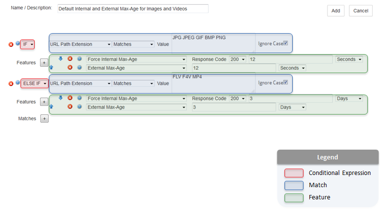

# Azure CDN from Verizon Premium rules engine reference

This article lists detailed descriptions of the available match conditions and features for the Azure Content Delivery Network (CDN) [rules engine](cdn-verizon-premium-rules-engine.md).

The rules engine is designed to be the final authority on how specific types of requests are processed by the CDN.

**Common uses**:

- Override or define a custom cache policy.
- Secure or deny requests for sensitive content.
- Redirect requests.
- Store custom log data.

## Terminology

A rule is defined through the use of [**conditional expressions**](cdn-verizon-premium-rules-engine-reference-conditional-expressions.md), [**match conditions**](cdn-verizon-premium-rules-engine-reference-match-conditions.md), and [**features**](cdn-verizon-premium-rules-engine-reference-features.md). These elements are highlighted in the following illustration:

 

## Syntax

The manner in which special characters are treated varies according to how a match condition or feature handles text values. A match condition or feature may interpret text in one of the following ways:

1. [**Literal values**](#literal-values)
2. [**Wildcard values**](#wildcard-values)
3. [**Regular expressions**](#regular-expressions)

### Literal values

Text that is interpreted as a literal value treats all special characters, with the exception of the % symbol, as a part of the value that must be matched. In other words, a literal match condition set to `\'*'\` is only satisfied when that exact value (that is, `\'*'\`) is found.

A percentage symbol is used to indicate URL encoding (for example, `%20`).

### Wildcard values

Text that is interpreted as a wildcard value assigns additional meaning to special characters. The following table describes how the following set of characters is interpreted:

Character | Description
----------|------------
\ | A backslash is used to escape any of the characters specified in this table. A backslash must be specified directly before the special character that should be escaped. For example, the following syntax escapes an asterisk: `\*`
% | A percentage symbol is used to indicate URL encoding (for example, `%20`).
\* | An asterisk is a wildcard that represents one or more characters.
Space | A space character indicates that a match condition may be satisfied by either of the specified values or patterns.
'value' | A single quote does not have special meaning. However, a set of single quotes is used to indicate that a value should be treated as a literal value. It can be used in the following ways:  - It allows a match condition to be satisfied whenever the specified value matches any portion of the comparison value.  For example, `'ma'` would match any of the following strings:   /business/**ma**rathon/asset.htm **ma**p.gif /business/template.**ma**p  - It allows a special character to be specified as a literal character. For example, you may specify a literal space character by enclosing a space character within a set of single quotes (that is, `' '` or `'sample value'`). - It allows a blank value to be specified. Specify a blank value by specifying a set of single quotes (that is, '').  **Important:** - If the specified value does not contain a wildcard, then it is automatically considered a literal value, which means that it is not necessary to specify a set of single quotes. - If a backslash does not escape another character in this table, it is ignored when it is specified within a set of single quotes. - Another way to specify a special character as a literal character is to escape it using a backslash (that is, `\`).

### Regular expressions

Regular expressions define a pattern that is searched for within a text value. Regular expression notation defines specific meanings to a variety of symbols. The following table indicates how special characters are treated by match conditions and features that support regular expressions.

Special Character | Description
------------------|------------
\ | A backslash escapes the character the follows it, which causes that character to be treated as a literal value instead of taking on its regular expression meaning. For example, the following syntax escapes an asterisk: `\*`
% | The meaning of a percentage symbol depends on its usage.   `%{HTTPVariable}`: This syntax identifies an HTTP variable. `%{HTTPVariable%Pattern}`: This syntax uses a percentage symbol to identify an HTTP variable and as a delimiter. `\%`: Escaping a percentage symbol allows it to be used as a literal value or to indicate URL encoding (for example, `\%20`).
\* | An asterisk allows the preceding character to be matched zero or more times.
Space | A space character is typically treated as a literal character.
'value' | Single quotes are treated as literal characters. A set of single quotes does not have special meaning.

## Next steps

- [Rules engine match conditions](cdn-verizon-premium-rules-engine-reference-match-conditions.md)
- [Rules engine conditional expressions](cdn-verizon-premium-rules-engine-reference-conditional-expressions.md)
- [Rules engine features](cdn-verizon-premium-rules-engine-reference-features.md)
- [Override HTTP behavior using the rules engine](cdn-verizon-premium-rules-engine.md)
- [Azure CDN overview](cdn-overview.md)