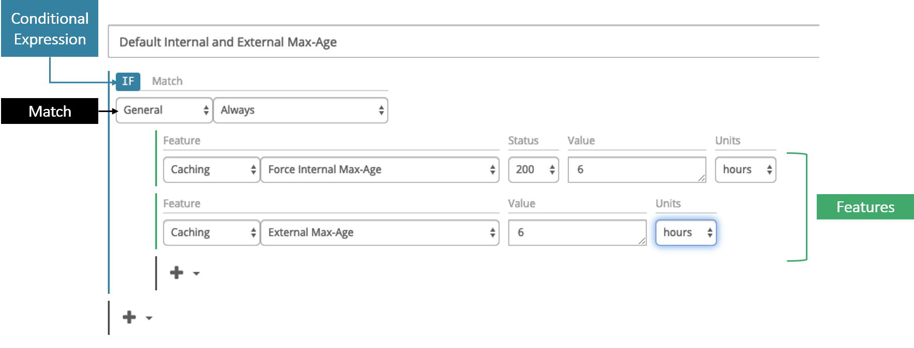
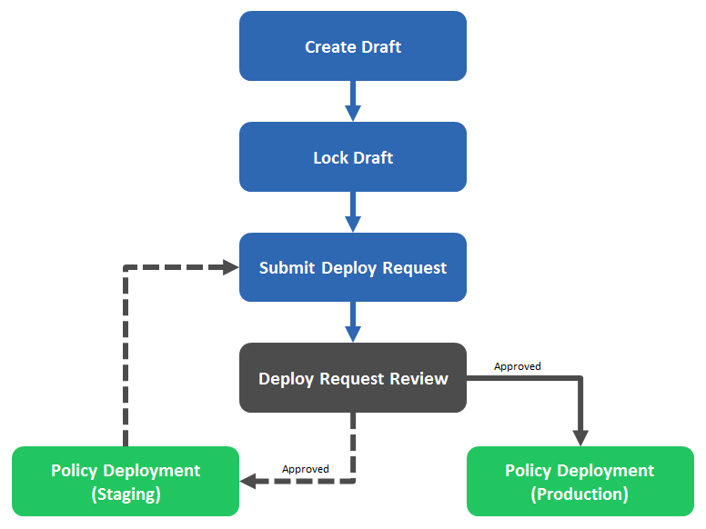

# Azure Content Delivery Network from Edgio Premium rules engine reference

This article lists detailed descriptions of the available match conditions and features for the Azure content delivery network [rules engine](cdn-verizon-premium-rules-engine.md).

The rules engine is designed to be the final authority on how specific types of requests get processed by the content delivery network.

**Common uses**:

- Override or define a custom cache policy.
- Secure or deny requests for sensitive content.
- Redirect requests.
- Store custom log data.

## Key concepts

Key concepts for setting up Rules Engine are described in this article.

### Draft

A draft of a policy consists of one or more rules meant to identify requests and the set of actions that gets applied to them. A draft is a work in progress that allows frequent configuration updates without affecting site traffic. Once a draft is ready to be finalized, it should be converted into a read-only policy.

### Rule

A rule identifies one or more types of requests and the set of actions that gets applied to them.

It consists of:

- A set of conditional expressions that define the logic through which requests are identified.
- A set of match conditions that define the criteria used to identify requests.
- A set of features that define how the content delivery network handles the above requests.
These elements are identified in the following illustration.

### Policy

A policy, which consists of a set of read-only rules, provides the means to:

- Create, store, and manage multiple variants of your rules.
- Roll back to a previously deployed version.
- Prepare event-specific rules in advance (for example, a rule that redirects traffic as a result of a customer origin maintenance.)

> [!NOTE]
> Although only a single policy per environment is allowed, policies might be deployed as needed.

### Deploy request

A deploy request provides a simple and streamlined procedure through which a policy might be quickly applied to the Staging or Production environment. A history of deploy requests is provided to facilitate the tracking of changes applied to those environments.

> [!NOTE]
> Only requests that do not pass our automated validation and error detection system will require manual review and approval.

### Rule precedence

The rules contained in a Policy are typically processed in the order in which they're listed (for example, top to bottom). If the request matches conflicting rules, then the last rule to be processed takes precedence.

### Policy deployment workflow

The workflow through which a policy might be applied to either the Production or Staging environment is illustrated as followed.

|Step |Description |
|---------|---------|
|[Create Draft](https://docs.vdms.com/cdn/index.html#HRE/AdministeringDraftsandRules.htm#Create)    |    A draft consists of a set of rules that define how requests for your content get handled by the content delivery network.     |
|Lock Draft   |     Once a draft has been finalized, it should be locked and converted into a read-only policy.    |
|[Submit Deploy Request](https://docs.vdms.com/cdn/index.html#HRE/DeployRequest.htm)   |     A deploy request allows a policy to be applied to either test or production traffic.   Submit a deploy request to either the Staging or Production environment.      |
|Deploy Request Review   |     A deploy request undergoes automated validation and error detection.  Although most deploy requests are automatically approved, manual review is required for more complex policies.    |
|Policy Deployment ([Staging](https://docs.vdms.com/cdn/index.html#HRE/Environment.htm#Staging))   |    Upon approval of a deploy request to the Staging environment, a policy is applied to the Staging environment. This environment allows a policy to be tested against mock site traffic.  Once the policy is ready to be applied to live site traffic, a new deploy request for the Production environment should be submitted.       |
|Policy Deployment ([Production](https://docs.vdms.com/cdn/index.html#HRE/Environment.htm#Producti))   |  Upon approval of a deploy request to the Production environment, a policy is applied to the Production environment. This environment allows a policy to act as the final authority for determining how the content delivery network should handle live traffic.     |

## Syntax

The manner in which special characters are treated varies according to how a match condition or feature handles text values. A match condition or feature might interpret text in one of the following ways:

- [**Literal values**](#literal-values)
- [**Wildcard values**](#wildcard-values)
- [**Regular expressions**](#regular-expressions)

### Literal values

Text that is interpreted as a literal value treats all special characters, except for the % symbol, as a part of the value that must be matched. In other words, a literal match condition set to `\'*'\` is only satisfied when that exact value (that is, `\'*'\`) is found.

A percentage symbol is used to indicate URL encoding (for example, `%20`).

### Wildcard values

Text that is interpreted as a wildcard value assigns extra meaning to special characters. The following table describes how the following set of characters is interpreted:

Character | Description
----------|------------
\ | A backslash is used to escape any of the characters specified in this table. A backslash must be specified directly before the special character that should be escaped. For example, the following syntax escapes an asterisk: `\*`
% | A percentage symbol is used to indicate URL encoding (for example, `%20`).
\* | An asterisk is a wildcard that represents one or more characters.
Space | A space character indicates that a match condition is satisfied by either of the specified values or patterns.
'value' | A single quote doesn't have special meaning. However, a set of single quotes is used to indicate that a value should be treated as a literal value. It can be used in the following ways:  - It allows a match condition to be satisfied whenever the specified value matches any portion of the comparison value. For example, `'ma'` would match any of the following strings:   /business/**ma**rathon/asset.htm **ma**p.gif /business/template.**ma**p  - It allows a special character to be specified as a literal character. For example, you might specify a literal space character by enclosing a space character within a set of single quotes (that is, `' '` or `'sample value'`). - It allows a blank value to be specified. Specify a blank value by specifying a set of single quotes (that is, '').  **Important:** - If the specified value doesn't contain a wildcard, then it's automatically considered a literal value, which means that it isn't necessary to specify a set of single quotes. - If a backslash doesn't escape another character in this table, it's ignored when it's specified within a set of single quotes. - Another way to specify a special character as a literal character is to escape it using a backslash (that is, `\`).

### Regular expressions

Regular expressions define a pattern that is searched for within a text value. Regular expression notation defines specific meanings to various symbols. The following table indicates how special characters get treated by match conditions and features that support regular expressions.

Special Character | Description
------------------|------------
\ | A backslash escapes the character the follows it, which causes that character to be treated as a literal value instead of taking on its regular expression meaning. For example, the following syntax escapes an asterisk: `\*`
% | The meaning of a percentage symbol depends on its usage.   `%{HTTPVariable}`: This syntax identifies an HTTP variable. `%{HTTPVariable%Pattern}`: This syntax uses a percentage symbol to identify an HTTP variable and as a delimiter. `\%`: Escaping a percentage symbol allows it to be used as a literal value or to indicate URL encoding (for example, `\%20`).
\* | An asterisk allows the preceding character to be matched zero or more times.
Space | A space character is typically treated as a literal character.
'value' | Single quotes are treated as literal characters. A set of single quotes doesn't have special meaning.

Match conditions and features that support regular expressions accept patterns defined by Perl Compatible Regular Expressions (PCRE).

## Next steps

- [Rules engine match conditions](cdn-verizon-premium-rules-engine-reference-match-conditions.md)
- [Rules engine conditional expressions](cdn-verizon-premium-rules-engine-reference-conditional-expressions.md)
- [Rules engine features](cdn-verizon-premium-rules-engine-reference-features.md)
- [Override HTTP behavior using the rules engine](cdn-verizon-premium-rules-engine.md)
- [Azure Content Delivery Network overview](cdn-overview.md)
