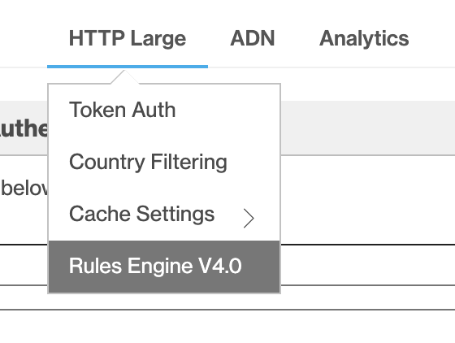
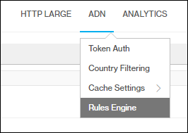
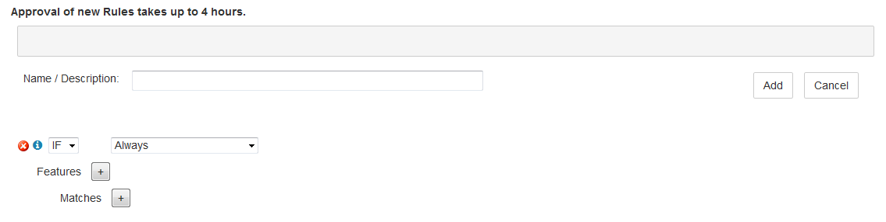

# Override HTTP behavior using the Azure CDN from Verizon Premium rules engine

[!INCLUDE [cdn-premium-feature](../../includes/cdn-premium-feature.md)]

## Overview

The Azure CDN rules engine allows you to customize how HTTP requests are handled. For example, blocking the delivery of certain content types, defining a caching policy, or modifying an HTTP header. This tutorial demonstrates how to create a rule that changes the caching behavior of CDN assets. For more information about the rules engine syntax, see [Azure CDN rules engine reference](cdn-verizon-premium-rules-engine-reference.md).

## Access

To access the rules engine, you must first select **Manage** from the top of the **CDN profile** page to access the Azure CDN management page. Depending on whether your endpoint is optimized for dynamic site acceleration (DSA), you then access the rules engine with the set of rules appropriate for your type of endpoint:

- Endpoints optimized for general web delivery or other non-DSA optimization:
    
    Select the **HTTP Large** tab, then select **Rules Engine**.

    

- Endpoints optimized for DSA:
    
    Select the **ADN** tab, then select **Rules Engine**.
    
    ADN is a term used by Verizon to specify DSA content. Any rules you create here are ignored by any endpoints in your profile that are not optimized for DSA.

    

## Tutorial

1. From the **CDN profile** page, select **Manage**.
   
    
   
    The CDN management portal opens.

2. Select the **HTTP Large** tab, then select **Rules Engine**.
   
    The options for a new rule are displayed.
   
    
   
   > [!IMPORTANT]
   > The order in which multiple rules are listed affects how they are handled. A subsequent rule may override the actions specified by a previous rule.
   >

3. Enter a name in the **Name / Description** textbox.

4. Identify the type of requests the rule applies to. Use the default match condition, **Always**.
   
   
   
   > [!NOTE]
   > Multiple match conditions are available in the dropdown list. For information about the currently selected match condition, select the blue informational icon to its left.
   >
   >  For a detailed list of conditional expressions, see [Rules engine conditional expressions](cdn-verizon-premium-rules-engine-reference-match-conditions.md).
   >  
   > For a detailed list of match conditions, see [Rules engine match conditions](cdn-verizon-premium-rules-engine-reference-match-conditions.md).
   >
   >

5. To add a new feature, select the **+** button next to **Features**.  In the dropdown on the left, select **Force Internal Max-Age**.  In the textbox that appears, enter **300**. Do not change the remaining default values.
   
   
   
   > [!NOTE]
   > Multiple features are available in the dropdown list. For information about the currently selected feature, select the blue informational icon to its left.
   >
   > For **Force Internal Max-Age**, the asset's `Cache-Control` and `Expires` headers are overridden to control when the CDN edge node refreshes the asset from the origin. In this example, the CDN edge node caches the asset for 300 seconds, or 5 minutes, before it refreshes the asset from its origin.
   >
   > For a detailed list of features, see [Rules engine features](cdn-verizon-premium-rules-engine-reference-features.md).
   >
   >

6. Select **Add** to save the new rule.  The new rule is now awaiting approval. After it has been approved, the status changes from **Pending XML** to **Active XML**.
   
   > [!IMPORTANT]
   > Rules changes can take up to 10 minutes to propagate through Azure CDN.
   >
   >

## See also

- [Azure CDN overview](cdn-overview.md)
- [Rules engine reference](cdn-verizon-premium-rules-engine-reference.md)
- [Rules engine match conditions](cdn-verizon-premium-rules-engine-reference-match-conditions.md)
- [Rules engine conditional expressions](cdn-verizon-premium-rules-engine-reference-conditional-expressions.md)
- [Rules engine features](cdn-verizon-premium-rules-engine-reference-features.md)
- [Azure Fridays: Azure CDN's powerful new premium features](https://azure.microsoft.com/documentation/videos/azure-cdns-powerful-new-premium-features/) (video)