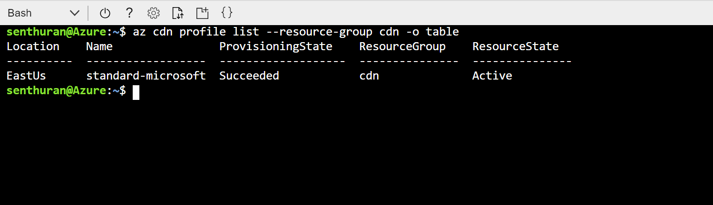

# Quickstart: Create an Azure CDN profile and endpoint using Resource Manager template

In this quickstart, you deploy an Azure Resource Manager template using CLI. The template that you create deploys a CDN profile and CDN endpoint to front your web application.
It should take about ten minutes to complete these steps.

[!INCLUDE [quickstarts-free-trial-note](../../includes/quickstarts-free-trial-note.md)]

## Prequisites

For the purposes of this quickstart, you must have a Web Application to use as your Origin. The example Web Application used in this quickstart was deployed to https://cdndemo.azurewebsites.net

For more information, see [Create a static HTML web app in Azure](https://docs.microsoft.com/azure/app-service/app-service-web-get-started-html).

## Create a resource group

All resources must be deployed in the same resource group.

Create the resource group in the location that you select. This example shows the creation of a resource group named cdn in the East US location.

```bash
az group create --name cdn --location eastus
```


## Create the Resource Manager template

In this step, you create a template file that deploys the resources.

While this example walks through a General Website Acceleration scenario, there are many other settings that can be configured. These settings are available in the Azure Resource Manager template reference. Please see references for [CDN Profile](https://docs.microsoft.com/azure/templates/microsoft.cdn/2017-10-12/profiles) and [CDN Profile Endpoint](https://docs.microsoft.com/azure/templates/microsoft.cdn/2017-10-12/profiles/endpoints).

Note that Microsoft CDN doesn't support modifying the content type list.

Save the template as **resource-manager-cdn.json**.

```json
{
    "$schema": "https://schema.management.azure.com/schemas/2015-01-01/deploymentTemplate.json#",
    "contentVersion": "1.0.0.0",
    "parameters": {
        "cdnProfileSku": {
            "type": "string",
            "allowedValues": [
                "Standard_Microsoft",
                "Standard_Akamai",
                "Standard_Verizon",
                "Premium_Verizon"
            ]
        },
        "endpointOriginHostName": {
            "type": "string"
        }
    },
    "variables": {
        "profile": {
            "name": "[replace(toLower(parameters('cdnProfileSku')), '_', '-')]"
        },
        "endpoint": {
            "name": "[replace(toLower(parameters('endpointOriginHostName')), '.', '-')]",
            "originHostName": "[parameters('endpointOriginHostName')]"
        }
    },
    "resources": [
        {
            "type": "Microsoft.Cdn/profiles",
            "apiVersion": "2017-10-12",
            "location": "[resourceGroup().location]",
            "name": "[variables('profile').name]",
            "sku": {
                "name": "[parameters('cdnProfileSku')]"
            }
        },
        {
            "dependsOn": [
                "[resourceId('Microsoft.Cdn/profiles', variables('profile').name)]"
            ],
            "type": "Microsoft.Cdn/profiles/endpoints",
            "apiVersion": "2017-10-12",
            "location": "[resourceGroup().location]",
            "name": "[concat(variables('profile').name, '/', variables('endpoint').name)]",
            "properties": {
                "hostName": "[concat(variables('endpoint').name, '.azureedge.net')]",
                "originHostHeader": "[variables('endpoint').originHostName]",
                "isHttpAllowed": true,
                "isHttpsAllowed": true,
                "queryStringCachingBehavior": "IgnoreQueryString",
                "origins": [
                    {
                        "name": "[replace(variables('endpoint').originHostName, '.', '-')]",
                        "properties": {
                            "hostName": "[variables('endpoint').originHostName]",
                            "httpPort": 80,
                            "httpsPort": 443
                        }
                    }
                ],
                "contentTypesToCompress": [
                    "application/eot",
                    "application/font",
                    "application/font-sfnt",
                    "application/javascript",
                    "application/json",
                    "application/opentype",
                    "application/otf",
                    "application/pkcs7-mime",
                    "application/truetype",
                    "application/ttf",
                    "application/vnd.ms-fontobject",
                    "application/xhtml+xml",
                    "application/xml",
                    "application/xml+rss",
                    "application/x-font-opentype",
                    "application/x-font-truetype",
                    "application/x-font-ttf",
                    "application/x-httpd-cgi",
                    "application/x-javascript",
                    "application/x-mpegurl",
                    "application/x-opentype",
                    "application/x-otf",
                    "application/x-perl",
                    "application/x-ttf",
                    "font/eot",
                    "font/ttf",
                    "font/otf",
                    "font/opentype",
                    "image/svg+xml",
                    "text/css",
                    "text/csv",
                    "text/html",
                    "text/javascript",
                    "text/js",
                    "text/plain",
                    "text/richtext",
                    "text/tab-separated-values",
                    "text/xml",
                    "text/x-script",
                    "text/x-component",
                    "text/x-java-source"
                ],
                "isCompressionEnabled": true,
                "optimizationType": "GeneralWebDelivery"
            }
        }
    ],
    "outputs": {
        "cdnUrl": {
            "type": "string",
            "value": "[concat('https://', variables('endpoint').name, '.azureedge.net')]"
        }
    }
}
```

## Create the resources

Deploy the template using Azure CLI. You will be prompted for 2 inputs:

**cdnProfileSku** - the CDN provider that you want to use. The options are:

* Standard_Microsoft
* Standard_Akamai
* Standard_Verizon
* Premium_Verizon.

**endpointOriginHostName** - the endpoint that will be served through the CDN, for example, cdndemo.azurewebsites.net.

```bash
az group deployment create --resource-group cdn --template-file arm-cdn.json
```


## View the CDN profile

```bash
az cdn profile list --resource-group cdn -o table
```



## View the CDN Endpoint for the profile standard-microsoft

```bash
az cdn endpoint list --profile-name standard-microsoft --resource-group cdn -o table
```


Use the HostName to view the content. For example, access https://cdndemo-azurewebsites-net.azureedge.net using your browser.

## Clean up

Deleting the resource group will automatically remove all of the resources that were deployed in it.

```bash
az group delete --name cdn
```


## References

* CDN Profile - [Azure Resource Manager Template Reference](https://docs.microsoft.com/azure/templates/microsoft.cdn/2017-10-12/profiles)
* CDN Endpoint - [Azure Resource Manager Template Reference Documentation](https://docs.microsoft.com/azure/templates/microsoft.cdn/2017-10-12/profiles/endpoints)

## Next steps

To learn about adding a custom domain to your CDN endpoint, see the following tutorial:

> [!div class="nextstepaction"]
> [Tutorial: Add a custom domain to your Azure CDN endpoint](cdn-map-content-to-custom-domain.md)
