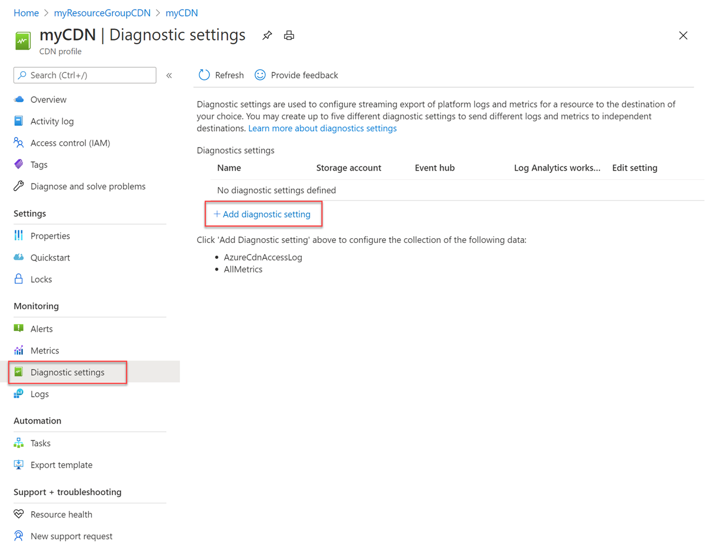

# Azure CDN HTTP raw logs
Raw logs provide rich information about operations and errors that are important for auditing and troubleshooting. Raw logs differ from activity logs. Activity logs provide visibility into the operations done on Azure resources. Raw logs provide a record of operations of your resource.

> [!IMPORTANT]
> The HTTP raw logs feature is available for Azure CDN from Microsoft.

If you don't have an Azure subscription, create a [free account](https://azure.microsoft.com/free/?WT.mc_id=A261C142F) before you begin. 

## Sign in to Azure

Sign in to the Azure portal at [https://portal.azure.com](https://portal.azure.com).

## Configuration

To configure Raw logs for your Azure CDN from Microsoft profile: 

1. From the Azure portal menu, select **All Resources** >> **\<your-CDN-profile>**.

2. Under **Monitoring**, select **Diagnostics settings**.

3. Select **+ Add diagnostic setting**.

    

    > [!IMPORTANT]
    > Raw logs is only available in the profile level while aggregated http status code logs are available in the endpoint level.

4. Under **Diagnostic settings**, enter a name for the diagnostic setting under **Diagnostic settings name**.

5. Select the **log** and set the retention in days.

6. Select the **Destination details**. Destination options are:
    * **Send to Log Analytics**
        * Select the **Subscription** and **Log Analytics workspace**.
    * **Archive to a storage account**
        * Select the **Subscription** and the **Storage Account**.
    * **Stream to an event hub**
        * Select the **Subscription**, **Event hub namespace**, **Event hub name (optional)**, and **Event hub policy name**.

    

7. Select **Save**.

## Raw logs properties

Azure CDN from Microsoft Service currently provides Raw logs. Raw logs provide individual API requests with each entry having the following schema: 

| Property              | Description                                                                                                                                                                                          |
|-----------------------|------------------------------------------------------------------------------------------------------------------------------------------------------------------------------------------------------|
| TrackingReference     | The unique reference string that identifies a request served by Front Door, also sent as X-Azure-Ref header to the client. Required for searching details in the access logs for a specific request. |
| HttpMethod            | HTTP method used by the request.                                                                                                                                                                     |
| HttpVersion           | Type of the request or connection.                                                                                                                                                                   |
| RequestUri            | URI of the received request.                                                                                                                                                                         |
| RequestBytes          | The size of the HTTP request message in bytes, including the request headers and the request body.                                                                                                   |
| ResponseBytes         | Bytes sent by the backend server as the response.                                                                                                                                                    |
| UserAgent             | The browser type that the client used.                                                                                                                                                               |
| ClientIp              | The IP address of the client that made the request.                                                                                                                                                  |
| TimeTaken             | The length of time that the action took, in milliseconds.                                                                                                                                            |
| SecurityProtocol      | The TLS/SSL protocol version used by the request or null if no encryption.                                                                                                                           |
| Endpoint              | The CDN endpoint host has configured under the parent CDN profile.                                                                                                                                   |
| Backend Host name     | The name of the backend host or origin where requests are being sent.                                                                                                                                |
| Sent to origin shield | If true, it means that request was answered from origin shield cache instead of the edge pop. Origin shield is a parent cache used to improve cache hit ratio.                                       |
| HttpStatusCode        | The HTTP status code returned from the proxy.                                                                                                                                                        |
| HttpStatusDetails     | Resulting status on the request. Meaning of this string value can be found at a Status reference table.                                                                                              |
| Pop                   | The edge pop, which responded to the user request. POPs' abbreviations are airport codes of their respective metros.                                                                                   |
| Cache Status          | Signifies if the object was returned from cache or came from the origin.                                                                                                             |
> [!IMPORTANT]
> The HTTP Raw logs feature is available automatically for any profiles created or updated after **25th February 2020**. For CDN profiles created earlier, one should update the CDN endpoint after setting up logging. For example, one can navigate to geo filtering under CDN endpoints and block any country/region not relevant to their workload and hit save. 

> [!NOTE]
> The logs can be viewed under your Log Analytics profile by running a query. A sample query would look like              AzureDiagnostics
| where Category == "AzureCdnAccessLog"

## Next Steps
In this article, you enabled HTTP raw logs for the Microsoft CDN service.

For more information on Azure CDN and the other Azure services mentioned in this article, see:

* [Analyze](cdn-log-analysis.md) Azure CDN usage patterns.

* Learn more about [Azure Monitor](https://docs.microsoft.com/azure/azure-monitor/overview).

* Configure [Log Analytics in Azure Monitor](https://docs.microsoft.com/azure/azure-monitor/log-query/get-started-portal).
