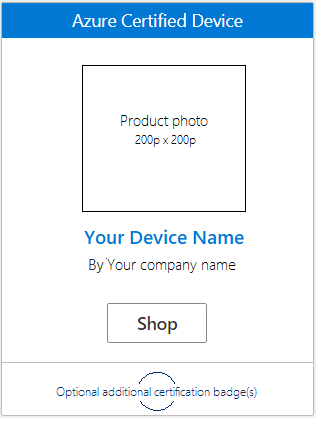
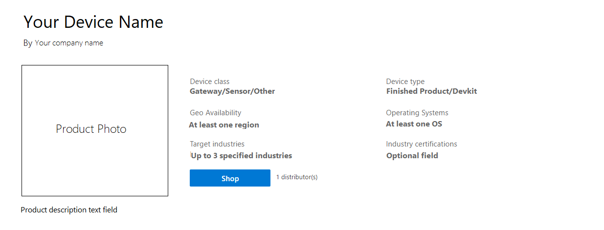
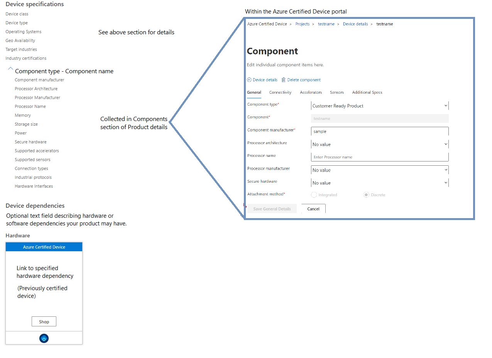
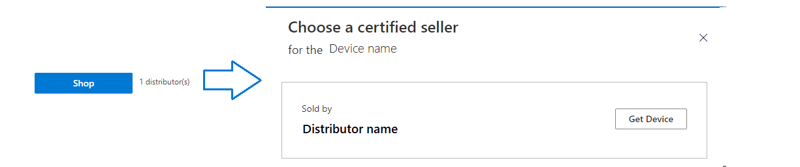

# Marketing properties

In the process of [adding your device details](tutorial-02-adding-device-details.md), you will be required to supply marketing information that will be displayed on the [Azure Certified Device catalog](https://devicecatalog.azure.com). This information is collected within the Azure Certified Device portal during the certification submission process and will be used as filter parameters on the catalog. This article provides a mapping between the fields collected in the portal to how they appear on the catalog. After reading this article, partners should better understand what information to provide during the certification process to best represent their product on the catalog.

## Azure Certified Device catalog product tile

Visitors to the catalog will first interact with your device as a catalog product tile on the search page. This will provide a basic overview of the device and certifications it has been awarded.

| Field | Description                  | Where to add in the portal                |
|---------------|-------------------------|----------------------------------|
| Device Name | Public name of your certified device         | Basics tab of Device details|
| Company name| Public name of your company  | Not editable in the portal. Extracted from MPN account name |
| Product photo  | Image of your device with minimum resolution 200p x 200p  | Marketing details |
| Certification classification  | Mandatory Azure Certified Device certification label and optional certification badges  | Basics tab of Device details. Must pass appropriate testing in Connect & test section. |

## Product description page information

Once a customer has clicked on your device tile from the catalog search page, they will be navigated to the product description page of your device. This is where the bulk of the information provided during the certification process will be found.

The top of the product description page highlights key characteristics, some of which were already used for the product tile.

| Field | Description                  | Where to add in the portal                |
|---------------|-------------------------|----------------------------------|
| Device class | Classification of the form factor and primary purpose of your device ([Learn more](./resources-glossary.md))       | Basics tab of Device details|
| Device type | Classification of device based on implementation readiness ([Learn more](./resources-glossary.md)) | Basics tab of Device details |
| Geo availability | Regions that your device is available for purchase  | Marketing details |
| Operating systems  | Operating system(s) that your device supports  | Product details tab of Device details |
| Target industries  | Top 3 industries that your device is optimized for  | Marketing details |
| Product description  | Free text field for you to write your marketing description of your product. This can capture details not listed in the portal, or add additional context for the benefits of using your device. | Marketing details|

The remainder of the page is focused on displaying the technical specifications of your device in table format that will help your customer better understand your product. For convenience, the information displayed at the top of the page is also listed here, along with some additional device information. The rest of the table is sectioned by the components specified in the portal.

| Field | Description                  | Where to add in the portal                |
|---------------|-------------------------|----------------------------------|
| Environmental certifications | Official certifications received for performance in different environments     | Hardware of Device details  |
| Operating conditions | Ingress Protection value or temperature ranges the device is qualified for     | Software of device details  |
| Azure software set-up | Classification of the set-up process to connect the device to Azure ([Learn more](./how-to-software-levels.md))     | Software of Device details  |
| Component type | Classification of the form factor and primary purpose of your device ([Learn more](./resources-glossary.md))       | Hardware of Device details|
| Component name| Name of the component you are describing | Product details of Device details |
| Additional component information | Additional hardware specifications such as included sensors, connectivity, accelerators, etc.  | Additional component information of Device details ([Learn more](./how-to-using-the-components-feature.md))  |
| Device dependency text | Partner-provided text describing the different dependencies the product requires to connect to Azure ([Learn more](./how-to-indirectly-connected-devices.md))   | Customer-facing comments section of Dependencies tab of Device details |
| Device dependency link  | Link to a certified device that your current product requires  | Dependencies tab of Device details |

## Shop links
Available both on the product tile and product description page is a Shop button. When clicked by the customer, a window opens that allows them to select a distributor (you are allowed to list up to 5 distributors). Once selected, the customer is redirected to the partner-provided URL.

| Field | Description                  | Where to add in the portal                |
|---------------|-------------------------|----------------------------------|
| Distributor name | Name of the distributor who is selling your product | Marketing details|
| Get Device| Link to external website for customer to purchase the device (or request a quote from the distributor). This may be the same as the Manufacturer's page if the distributor is the same as the device manufacturer. If a purchase page is not available, this will redirect to the distributor's page for customer to contact them directly.  | Distributor product page URL in marketing details. If no purchase page is available, link will default to Distributor URL in Marketing detail. |

## External links

Also included within the Product Description page are links that navigate to partner-provided sites or files that help the customer better understand the product. They appear towards the top of the page, beneath the product description text. The links displayed will differ for different device types and certification programs.

| Link | Description                  | Where to add in the portal                |
|---------------|-------------------------|----------------------------------|
| Get Started guide* | PDF file with user instructions to connect and use your device with Azure services | Add 'Get Started' guide section of the portal|
| Manufacturer's page*|Link to manufacturer's page. This page may be the specific product page for your device, or to the company home page if a marketing page is not available. | Manufacturer's marketing page in Marketing details |
| Device model | Public DTDL models for IoT Plug and Play solutions  | Not editable in the portal. Device model must be uploaded to the ([public model repository](https://aka.ms/modelrepo)  |
| Device source code | URL to device source code for Dev Kit device types| Basics tab of Device details  |

 **Required for all published devices*

## Next steps
Now that you have an understanding of how we use the information you provide during certification, you are now ready to certify your device! Begin your certification project, or jump back into the device details stage to add your own marketing information.

- [Start your certification journey](./tutorial-00-selecting-your-certification.md)
- [Adding device details](./tutorial-02-adding-device-details.md)
