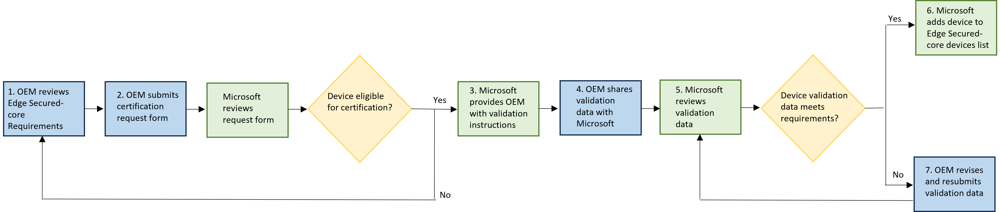

# Get your device certified
This page contains a series of steps to get a new device Edge Secured-core certified.

## Prerequisites
Create a [Microsoft Partner Center account.](https://partner.microsoft.com/dashboard/account/exp/enrollment/welcome?cloudInstance=Global&accountProgram=Reseller)

## Certification steps
1. Review [Edge Secured-core certification requirements](program-requirements-edge-secured-core.md).
2. Submit a [form](https://forms.office.com/r/HSAtk0Ghru) to express interest in getting your device certified.
3. Microsoft reaches out to you on next steps and provides instructions to validate that your device meets the program's requirements.
4. Once your device validation is completed based on the instructions provided, share the results with Microsoft.
5. Microsoft reviews and communicates the status of your submission.
6. If the device is approved for Edge Secured-core certification, notification is sent and the device appears on the [Edge Secured-core device listing](edge-secured-core-devices.md) page.
7. If the device didn't meet requirements for Edge Secured-core certification, notification is sent and you can submit new/additional validation data to Microsoft. 

