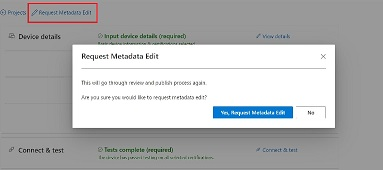
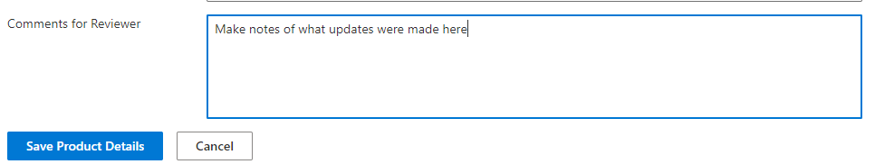

# Edit your published device

After your device has been certified and published to the Azure Certified Device catalog, you may need to update your device details. This may be due to an update to your distributor list, changes to purchase page URLs, or updates to the hardware specifications (such as operating system version or a new component addition). You may also have to update your IoT Plug and Play device model from what you originally uploaded to the model repository.

## Prerequisites

- You should be signed in and have an **approved** project for your device  on the [Azure Certified Device portal](https://certify.azure.com). If you don't have a certified device, you can view this [tutorial](tutorial-01-creating-your-project.md) to get started.

## Editing your published project information

On the project summary, you should notice that your project is in read-only mode since it has already been reviewed and accepted. To make changes, you will have to request an edit to your project and have the update re-approved by the Azure Certification team.

1. Click the `Request Metadata Edit` button on the top of the page  

    

1. Acknowledge the notification on the page that you will be required to submit your product for review after editing.
    > [!NOTE]
    > By confirming this edit, you are **not** removing your device from the Azure Certified Device catalog if it has already been published. Your previous version of the product will remain on the catalog until you have republished your device.
    > You will also not have to repeat the Connect & test section of the portal.

1. Once acknowledging this warning, you can edit your device details. Make sure to leave a note in the `Comments for Reviewer` section of `Device Details` of what has been changed.

    

1. On the project summary page, click `Submit for review` to have your changes reapproved by the Azure Certification team.
1. After your changes have been reviewed and approved, you can then republish your changes to the catalog through the portal (See our [tutorial](./tutorial-04-publishing-your-device.md)).

## Editing your IoT Plug and Play device model

Once you have submitted your device model to the public model repository, it cannot be removed. If you update your device model and would like to re-link your certified device to the new model, you **must re-certify** your device as a new project. If you do this, please leave a note in the 'Comments for Reviewer' section so the certification team can remove your old device entry.

## Next steps

You've now successfully edited your device on the Azure Certified Device catalog. You can check out your changes on the catalog, or certify another device!
- [Azure Certified Device catalog](https://devicecatalog.azure.com/)
- [Get started with certifying a device](./tutorial-01-creating-your-project.md)
