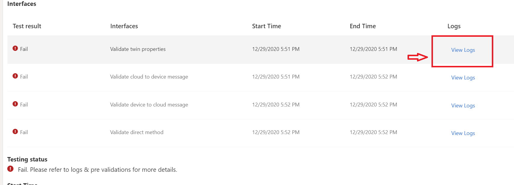
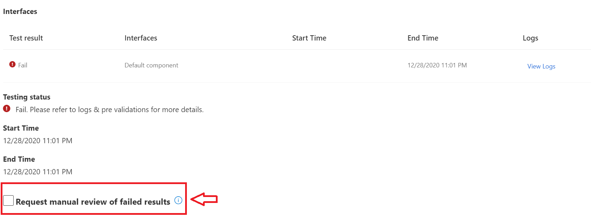

# Troubleshoot your IoT Plug and Play certification project

During the Connect & test phase of your IoT Plug and Play certification project, you may run into some scenarios that prevent you from passing the Azure for IoT Certification Service (AICS) testing.

## Prerequisites

- You should be signed in and have a project for your device created on the [Azure Certified Device portal](https://certify.azure.com). For more information, view the [tutorial](tutorial-01-creating-your-project.md).

## When AICS tests aren't passing

AICS test may not pass because of several causes. Follow these steps to check for common issues and troubleshoot your device.

1. Double-check that your device code is setting the Model ID Payload during DPS provisioning. This is a requirement for AICS to validate your device.
1. You can view the telemetry logs from previous test runs by pressing the `View Logs` button to identify what is causing the test to fail. Both the test messaging and raw data are available for review.  

    

1. In some instances where the logs indicate `Failed to get Digital Twin Model ID of device xx due to DeviceNotConnected`, try rebooting the device and restarting the device provisioning process.
1. If the automated tests continue to fail, then you can `request a manual review` of the results to substitute. This will trigger a request for **manual validation** with the Azure Certified Device team.  

    

## When you see "Passed with warnings"

While running the tests, if you receive a result of `Passed with warnings`, this means that some telemetry was not received during the testing period. This may be due to a dependency of the telemetry on longer time intervals or external triggers that were not available. You can proceed with submitting your device for review, during which the review team will determine if **manual validation** is necessary in the future.

## When you need help with the model repository

For IoT Plug and Play issues related to the model repository, refer to [our Docs guidance about the device model repository](https://docs.microsoft.com/azure/iot-pnp/concepts-model-repository).

## Next steps

Hopefully this guide helps you continue with your IoT Plug and Play certification journey! Once you have passed AICS, you can then proceed with our tutorials to submit and publish your device.

- [Tutorial: Testing your device](tutorial-03-testing-your-device.md)
