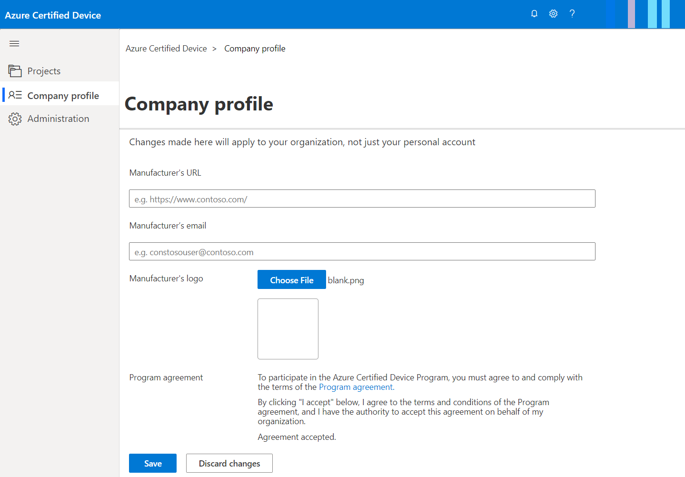
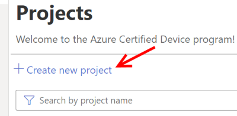
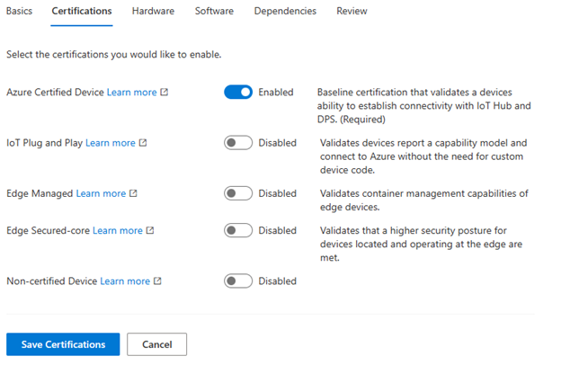
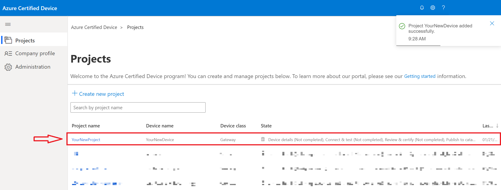
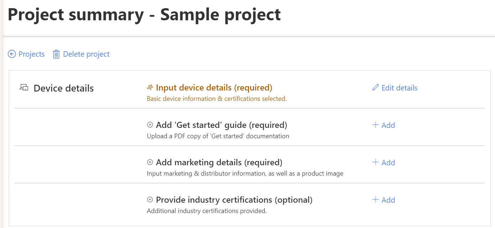

# Tutorial: Create your project

Congratulations on choosing to certify your device through the Azure Certified Device program! You've now selected the appropriate certification program for your device, and are ready to get started on the portal.

In this tutorial, you will learn how to:

> [!div class="checklist"]
> * Sign into the [Azure Certified Device portal](https://certify.azure.com/)
> * Create a new certification project for your device
> * Specify basic device details of your project

## Prerequisites

- Valid work/school [Microsoft Entra account](../active-directory/fundamentals/active-directory-whatis.md).
- Verified Microsoft Partner Network (MPN) account. If you don't have an MPN account, [join the partner network](https://partner.microsoft.com/) before you begin. 

> [!NOTE] 
> If you're having problems setting up or validating your MPN account, see the [Partner Center Support](/partner-center) documentation.

## Signing into the Azure Certified Device portal

To get started, you must sign in to the portal, where you'll be providing your device information, completing certification testing, and managing your device publications to the Azure Certified Device catalog.

1. Go to the [Azure Certified Device portal](https://certify.azure.com).
1. Select `Company profile` on the left-hand side and update your manufacturer information.
   
1. Accept the program agreement to begin your project.

## Creating your project on the portal

Now that you're all set up in the portal, you can begin the certification process. First, you must create a project for your device.

1. On the home screen, select `Create new project`. This will open a window to add basic device information in the next section.

 

## Identifying basic device information

Then, you must supply basic device information. You can to edit this information later.

1. Complete the fields requested under the `Basics` section. Refer to the table below for clarification regarding the **required** fields:

    | Fields                  | Description                                                                                                                         |
    |------------------------|-------------------------------------------------------------------------------------------------------------------------------------|
    | Project name           | Internal name that will not be visible on the Azure Certified Device catalog                                                        |
    | Device name            | Public name for your device                                                                                                |
    | Device type            | Specification of Finished Product or Solution-Ready Developer Kit.     For more information about the terminology, see [Certification glossary](./resources-glossary.md).                                                                     |
    | Device class           | Gateway, Sensor, or other.  For more information about the terminology, see [Certification glossary](./resources-glossary.md).                                                                    |
    | Device source code URL | Required if you are certifying a Solution-Ready Dev Kit, optional otherwise. URL must be to a GitHub location for your device code. |

    > [!Note]
    > If you are marketing a Microsoft service (e.g. Azure Sphere), please ensure that your device name adheres to Microsoft [branding guidelines](https://www.microsoft.com/en-us/legal/intellectualproperty/trademarks).

1. Select the `Next` button to continue to the `Certifications` tab.

    

1. Specify which certification(s) you wish to achieve for your device.
1. Select `Create` and the new project will be saved and visible in the home page of the portal.

    

1. Select on the Project name in the table. This will launch the project summary page where you can add and view other details about your device.

    

## Next steps

You are now ready to add device details and test your device using our certification service. Advance to the next article to learn how to edit your device details.
> [!div class="nextstepaction"]
> [Tutorial: Adding device details](tutorial-02-adding-device-details.md)
