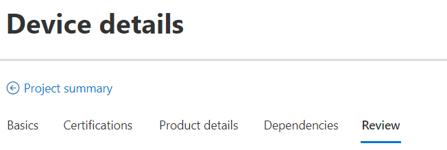
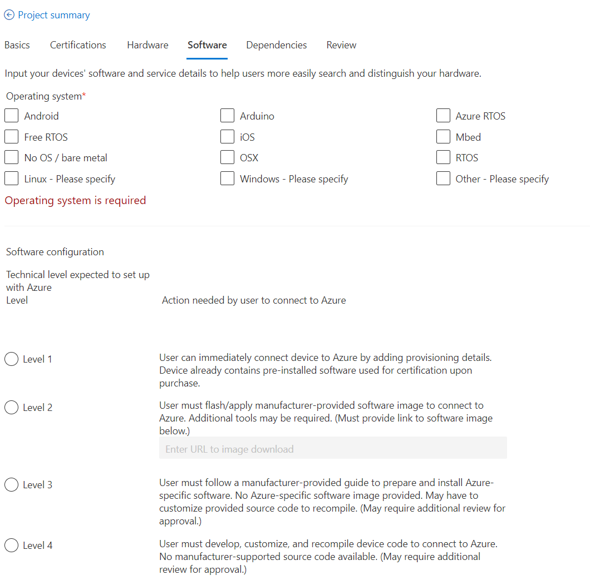
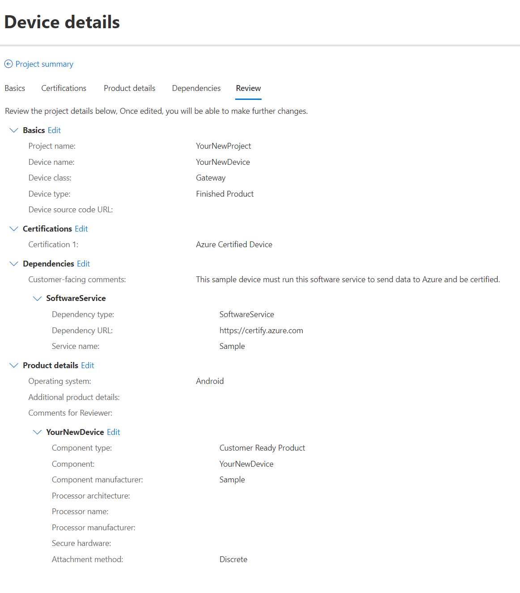
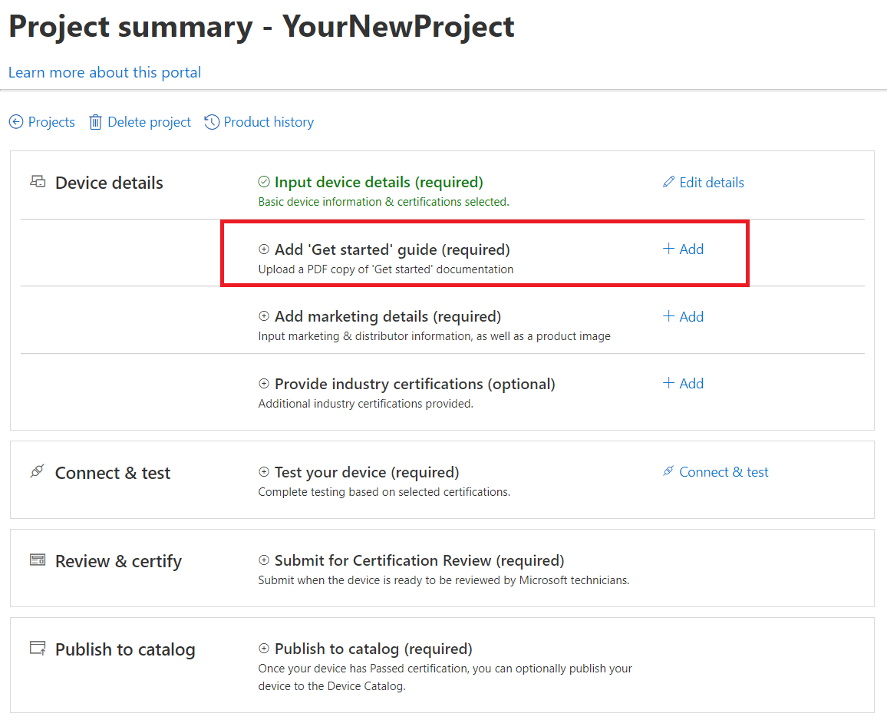
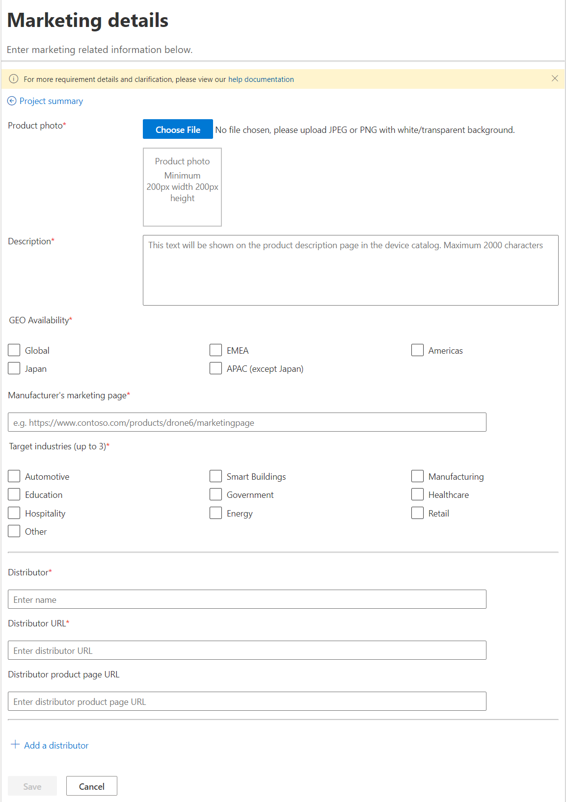

# Tutorial: Add device details

Now you've created your project for your device, and you're all set to begin the certification process! First, let's add your device details. These will include technical specifications that your customers will be able to view on the Azure Certified Device catalog and the marketing details that they will use to purchase once they've made a decision.

In this tutorial, you learn how to:

> [!div class="checklist"]
> * Add device details using the Components and Dependencies features
> * Upload a Get Started guide for your device
> * Specify marketing details for customers to purchase your device
> * Optionally identify any industry certifications

## Prerequisites

* You should be signed in and have a project for your device created on the [Azure Certified Device portal](https://certify.azure.com). For more information, view the [tutorial](tutorial-01-creating-your-project.md).
* You should have a Get Started guide for your device in PDF format. We provide many Get Started templates for you to use, depending on both the certification program and your preferred language. The templates are available at our [Get started templates](https://aka.ms/GSTemplate "Get started templates") GitHub location.

## Adding technical device details

The first section of your project page, called 'Input device details', allows you to provide information on the core hardware capabilities of your device, such as device name, description, processor, operating system, connectivity options, hardware interfaces, industry protocols, physical dimensions, and more. While many of the fields are optional, most of this information will be made available to potential customers on the Azure Certified Device catalog if you choose to publish your device after it has been certified.

1. Click `Add` in the 'Input device details' section on your project summary page to open the device details section. You will see six sections for you to complete.

2. Review the information you previously provided when you created the project under the `Basics` tab.
1. Review the certifications you are applying for with your device under the `Certifications` tab.
1. Open the `Hardware` tab and add **at least** one discrete component that describes your device. You can also view our guidance on [component usage](how-to-using-the-components-feature.md).
1. Click `Save`. You will then be able to edit your component device and add more advanced details.
1. Add any relevant information regarding operating conditions (such as IP rating, operating temperature, or safety certification).

7. List additional device details not captured by the component details under `Additional product details`.
1. If you marked `Other` in any of the component fields or have a special circumstance you would like to flag with the Azure Certification team, leave a clarifying comment in the `Comments for reviewer` section.
1. Open the `Software` tab and select **at least** one operating system.
1. (**Required for Dev Kit devices** and highly recommended for all others) Select a level to indicate the expected set-up process to connect your device to Azure. If you select Level 2, you will be required to provide a link to the available software image.

11. Use the `Dependencies` tab to list any dependencies if your device requires additional hardware or services to send data to Azure. You can also view our additional guidance for [listing dependencies](how-to-indirectly-connected-devices.md).
1. Once you are satisfied with the information you've provided, you can use the `Review` tab for a read-only overview of the full set of device details that been entered.
1. Click `Project summary` at the top of the page to return to your summary page.

## Uploading a Get Started guide

The Get Started guide is a PDF document to simplify the setup and configuration and management of your product. Its purpose is to make it simple for customers to connect and support devices on Azure using your device. As part of the certification process, we require our partners to provide **one** Get Started guide for their most relevant certification program.

1. Double-check that you have provided all requested information in your Get Started guide PDF according to the supplied [templates](https://aka.ms/GSTemplate). The template that you use should be determined by the certification badge you are applying for. (For example, an IoT Plug and Play device will use the IoT Plug and Play template. Devices applying for *only* the Azure Certified Device baseline certification will use the Azure Certified Device template.)
1. Click `Add` in the 'Get Started' guide section of the project summary page.

2. Click 'Choose File' to upload your PDF.
1. Review the document in the preview for formatting.
1. Save your upload by clicking the 'Save' button.
1. Click `Project summary` at the top of the page to return to your summary page.

## Providing marketing details

In this area, you will  provide customer-ready marketing information for your device. These fields will be showcased on the Azure Certified Device catalog if you choose to publish your certified device.

1. Click `Add` in the 'Add marketing details' section to open the marketing details page.

1. Upload a product photo in JPEG or PNG format that will be used in the catalog.
1. Write a short description of your device that will be displayed on the product description page of the catalog.
1. Indicate geographic availability of your device.
1. Provide a link to the manufacturer's marketing page for this device. This should be a link to a site that provides additional information about the device.
    > [!Note]
    > Please ensure all supplied URLs are valid or will be active at the time of publication following approval.*)

1. Indicate up to three target industries that your device is optimized for.
1. Provide information for up to five distributors of your device. This may include the manufacturer's own site.

    > [!Note]
    > If no distributor product page URL is supplied, then the `Shop` button on the catalog will default to the link supplied for `Distributor page`, which may not be specific to the device. Ideally, the distributor URL should lead to a specific page where a customer can purchase a device, but is not mandatory. If the distributor is the same as the manufacturer, this URL may be the same as the manufacturer's marketing page.*)

1. Click `Save` to confirm your information.
1. Click `Project summary` at the top of the page to return to your summary page.

## Declaring additional industry certifications

You can also promote additional industry certifications you may have received for your device. These certifications can help provide further clarity on the intended use of your device and will be searchable on the Azure Certified Device catalog.

1. Click `Add` in the 'Provide industry certifications' section.
1. Click `Add a certification`to select from a list of the common industry certification programs. If your product has achieved a certification not in our list, you can specify a custom string value by selecting `Other (please specify)`.
1. Optionally provide a description or notes to the reviewer. However, these notes will not be publicly available to view on the catalog.
1. Click `Save` to confirm your information.
1. Click `Project summary` at the top of the page to return to your summary page.

## Next steps

Now you have completed the process of describing your device! This will help the Azure Certified Device review team and your customer better understand your product. Once you are satisfied with the information you've provided, you are now ready to move on to the testing phase of the certification process.
> [!div class="nextstepaction"]
> [Tutorial: Testing your device](tutorial-03-testing-your-device.md)
