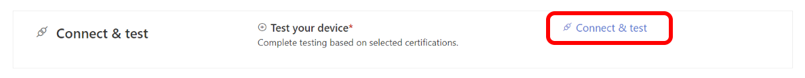
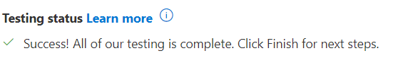
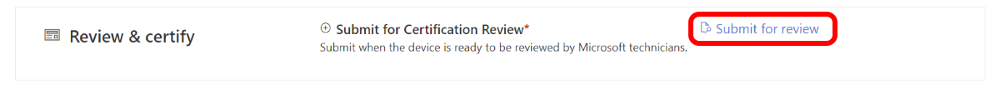
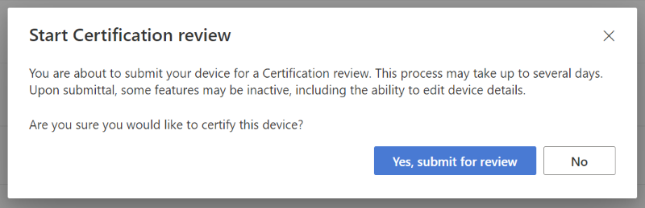
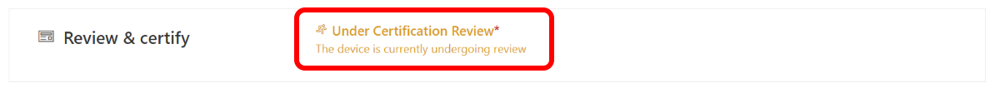

# Tutorial: Test and submit your device

The next major phase of the certification process (though it can be completed before adding your device details) involves testing your device. Through the portal, you'll use the Azure IoT Certification Service (AICS) to demonstrate your device performance according to our certification requirements. Once you've successfully passed the  testing phase, you'll then submit your device for final review and approval by the Azure Certification team!

In this tutorial, you learn how to:

> [!div class="checklist"]
> * Connect your device to IoT Hub using Device Provisioning Service (DPS)
> * Test your device according to your selected certification program(s)
> * Submit your device for review by the Azure Certification team

## Prerequisites

- You should be signed in and have a project for your device created on the [Azure Certified Device portal](https://certify.azure.com). For more information, view the [tutorial](tutorial-01-creating-your-project.md).
- (Optional) We advise that you prepare your device and manually verify their performance according to certification requirements. This is because if you wish to re-test with different device code or certification program, you will have to create a new project.

## Connecting your device using DPS

All certified devices are required to demonstrate the ability to connect to IoT Hub using DPS. The following steps walk you through how to successfully connect your device for testing on the portal.

1. To begin the testing phase, select the `Connect & test` link on the project summary page:  

    

1. Depending on the certification(s) selected, you'll see the required tests on the 'Connect & test' page. Review these to ensure that you're applying for the correct certification program.  

    

1. Connect your device to IoT Hub using the Device Provisioning Service (DPS). DPS supports connectivity options of Symmetric keys, X.509 certification, and a Trusted Platform Module (TPM). This is required for all certifications.

    - *For more information on connecting your device to Azure IoT Hub with DPS, visit [Provisioning devices overview](../iot-dps/about-iot-dps.md "Device Provisioning Service overview").*
    
1. If using symmetric keys, you'll then be asked to configure the DPS with the supplied DPS ID scope, Device ID, authentication key, and DPS endpoint. Otherwise, you will be asked to provide either X.509 certificate or endorsement key.

1. After configuring your device with DPS, confirm the connection by clicking the `Connect` button at the bottom of the page. Upon successful connection, you can proceed to the testing phase by clicking the `Next` button.  

    

## Testing your device

Once you have successfully connected your device to AICS, you are now ready to run the certification tests specific to the certification program you are applying for.

1. **For Azure Certified Device certification**: In the 'Select device capability' tab, you will review and select which tests you wish to run on your device.
1. **For IoT Plug and Play certification**: Carefully review the parameters that will be checked during the test that you declared in your device model.
1. **For Edge Managed certification**: No additional steps are required beyond demonstrating connectivity.
1. Once you have completed the necessary preparations for the specified certification program, select `Next` to proceed to the 'Test' phase.
1. Select `Run tests` on the page to begin running AICS with your device.
1. Once you have received a notification that you have passed the tests, select `Finish` to return to your summary page.

7. If you have additional questions or need troubleshooting assistance with AICS, visit our troubleshooting guide.

> [!NOTE]
> While you will be able to complete the online certification process for IoT Plug and Play and Edge Managed without having to submit your device for manual review, you may be contacted by a Azure Certified Device team member for further device validation beyond what is tested through our automation service.

## Submitting your device for review

Once you have completed all of the mandatory fields in the 'Device details' section and successfully passed the automated testing in the 'Connect & test' process, you can now notify the Azure Certified Device team that you are ready for certification review.

1. select `Submit for review` on the project summary page:  

    

1. Confirm your submission in the pop-up window. Once a device has been submitted, all device details will be read-only until editing is requested. (See [How to edit your device information after publishing](./how-to-edit-published-device.md).)  

    

1. Once the project is submitted, the project summary page will indicate the project is `Under Certification Review` by the Azure Certification team:  

    

1. Within 5-7 business days, expect an email response from the Azure Certification team to the address provided in your company profile regarding the status of your device submission.

    - Approved submission  
        Once your project has been reviewed and approved, you will receive an email. The email will include a set of files including the Azure Certified Device badge, badge usage guidelines, and other information on how to amplify the message that your device is certified. Congratulations!

    - Pending submission  
        In the case your project is not approved, you will be able to make changes to the project details and then resubmit the device for certification once ready. An email will be sent with information on why the project was not approved and steps to resubmit for certification.

## Next steps

Congratulations! Your device has now successfully passed all of the tests and has been approved through the Azure Certified Device program. You can now publish your device to our Azure Certified Device catalog, where customers can shop for your products with confidence in their performance with Azure.
> [!div class="nextstepaction"]
> [Tutorial: Publishing your device](tutorial-04-publishing-your-device.md)

