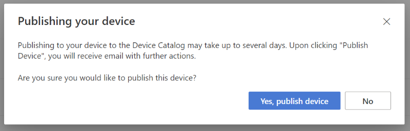

# Tutorial: Publish your device

Congratulations on successfully certifying your device! Your product is joining an ecosystem of exceptional devices that work great with Azure. Now that your device has been certified, you can optionally publish your device details to the [Azure Certified Device catalog](https://devicecatalog.azure.com) for a world of customers to discover and buy.

In this tutorial, you learn how to:

> [!div class="checklist"]
> * Publish your device to the Azure Certified Device catalog

## Prerequisites

- You should be signed in and have an **approved** project for your device  on the [Azure Certified Device portal](https://certify.azure.com). If you don't have a certified device, you can view this [tutorial](tutorial-01-creating-your-project.md) to get started.

## Publishing your device

Publishing your device is a simple process that will help bring customers to your product from the Azure Certified Device catalog.

1. To publish your device, click `Publish to Device Catalog` on the project summary page.

    

1. Confirm the publication in the pop-up window

    

1. You will receive notification to the email address in your company profile once the device has been processed the Azure Certified Device catalog.

## Next steps

Congratulations! Your certified device is now a part of the  Azure Certified Device catalog, where customers can shop for your products with confidence in their performance with Azure! Thank you for being part of our ecosystem of certified IoT products. You will notice that your project page is now read-only. If you wish to make any updates to your device information, see our how-to guide.
> [!div class="nextstepaction"]
> [How to edit your published device](how-to-edit-published-device.md)

