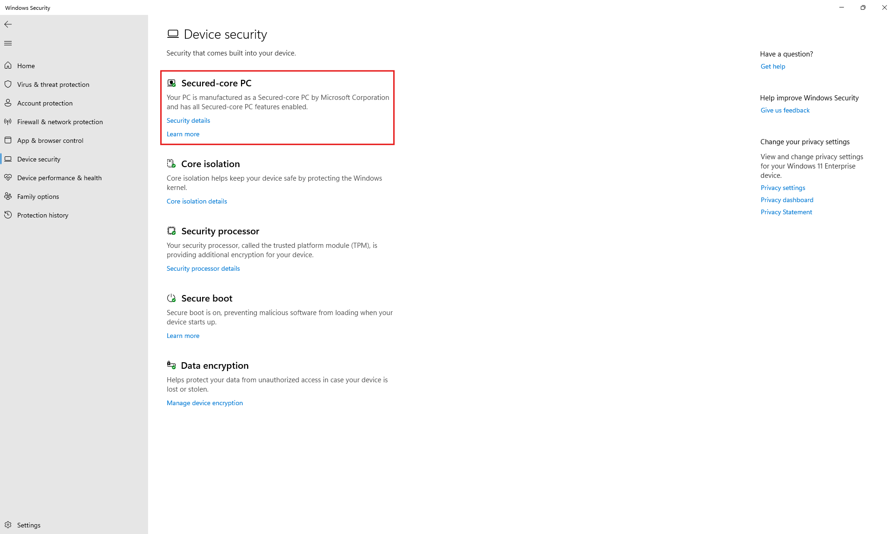
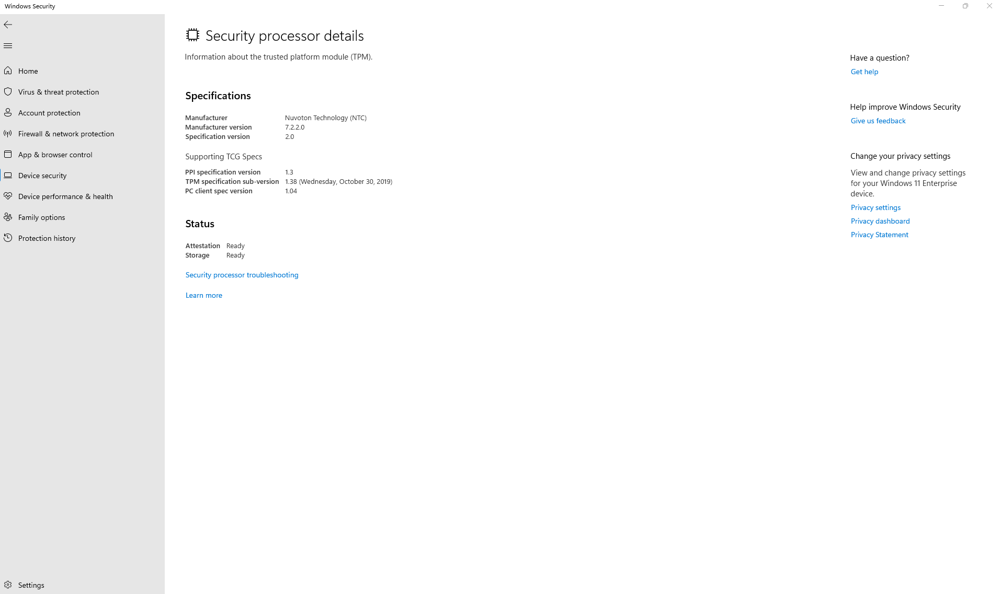

# Validate your Edge Secured-core certified devices
To check if your device is Edge Secured-core enabled: 
1.	Go to Windows Icon > Security Settings > Device Security. The "Secured-core PC" status is available on the top of the screen. If the status is missing, reach out to the device builder for assistance.

2.	Go to "Core isolation" to ensure that "Memory integrity" is on.

3.	Go to "Security processor" to ensure that the Trusted Platform Module "Specification version" is 2.0.

4.	Go to "Data encryption" to ensure that "Device encryption" is on.

