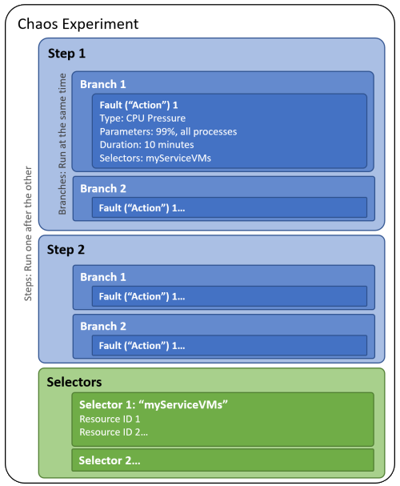

# Chaos experiments

In Azure Chaos Studio, you create and run chaos experiments. A chaos experiment is an Azure resource that describes the faults that should be run and the resources those faults should be run against.

An experiment is divided into two sections:

- **Selectors**: Selectors are groups of target resources that have faults or other actions run against them. A selector allows you to logically group resources for reuse across multiple actions.

   For example, you might have a selector named `AllNonProdEastUSVMs`, in which you've added all the nonproduction virtual machines in East US. You could then apply CPU pressure followed by virtual memory pressure to those virtual machines by referencing the selector.
- **Logic**: The rest of the experiment describes how and when to run faults. An experiment is organized into *steps* that run one after the other. Each step has one or more *branches* that run at the same time. Steps and branches allow you to inject multiple faults across resources in your environment in parallel.

   Each branch has one or more *actions*, which are either the faults you want to run or time delays. *Faults* are actions that cause some disruption. Most faults take one or more *parameters*, such as the duration to run the fault or the amount of stress to apply.

## Cross-subscription and cross-tenant experiments

A chaos experiment is an Azure resource deployed to a subscription, resource group, and region. You can use the Azure portal or the Chaos Studio REST API to create, update, start, cancel, and view the status of an experiment.

Chaos experiments can target resources in a different subscription than the experiment if the subscription is within the same Azure tenant. Chaos experiments can target resources in a different region than the experiment if the region is a supported region for Chaos Studio.

## Next steps
Now that you understand what a chaos experiment is you're ready to:

- [Learn about faults and actions](chaos-studio-faults-actions.md)
- [Create and run your first experiment](chaos-studio-tutorial-service-direct-portal.md)
