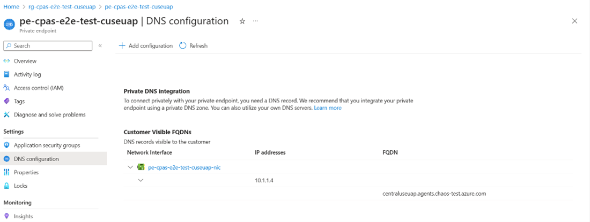
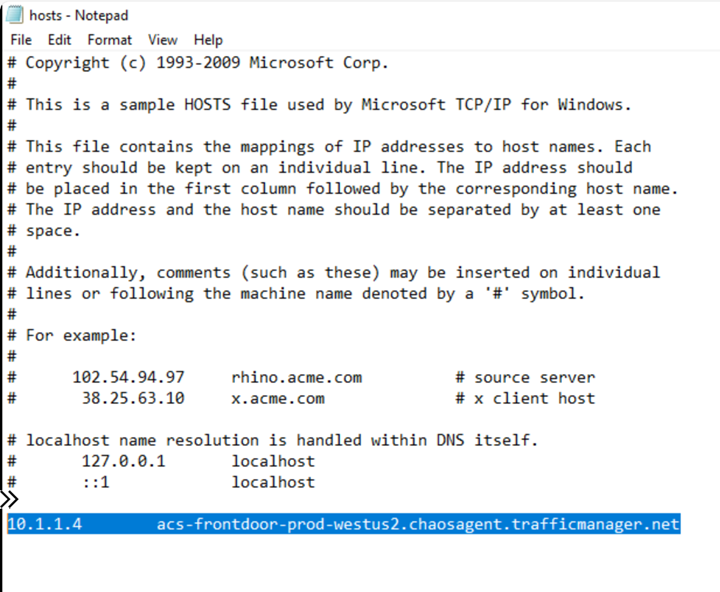
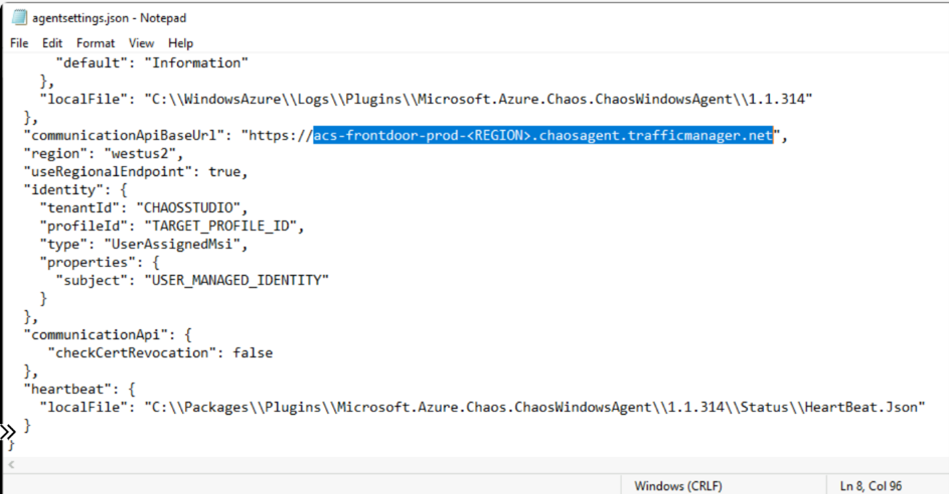
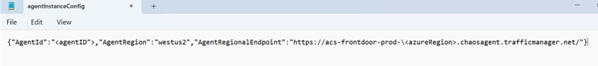
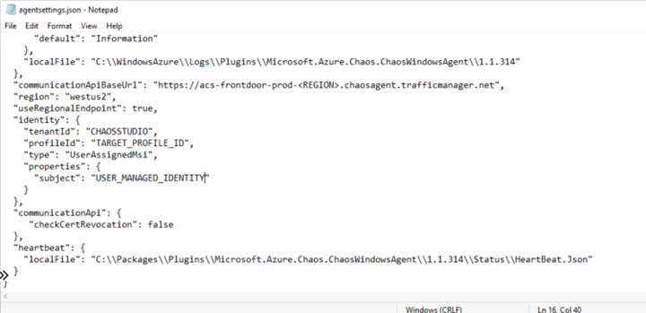

# How-to: Configure Private Link for Agent-Based experiments
This guide explains the steps needed to configure Private Link for a Chaos Studio **Agent-based** Experiment. The current user experience is based on the private endpoints support enabled as part of public preview of the private endpoints feature. Expect this experience to evolve with time as the feature is enhanced to GA quality.

---
## Prerequisites

1. An Azure account with an active subscription. If you don't have an Azure subscription, create a [free account](https://azure.microsoft.com/free/?WT.mc_id=A261C142F) before you begin.
2. First define your agent-based experiment by following the steps found [here](chaos-studio-tutorial-agent-based-portal.md).

> [!NOTE]
> If the target resource was created using the portal, then the chaos agent VM extension will be austomatically installed on the host VM. If the target is enabled using the CLI, then follow the Chaos Studio documentation to install the VM extension first on the virtual machine. Until you complete the private endpoint setup, the VM extension will be reporting an unhealthy state. This is expected.

<br/>

3. Ensure that the `Microsoft.Resources/EUAPParticipation` feature flag is enabled for your subscription. Previous Chaos Studio users may already have the feature flag enabled if you ran your first experiment via the Azure portal in the past. 

<br/>

The feature flag can be enabled using Azure CLI. Here's an example:

```AzCLI
az feature register --namespace Microsoft.Resources --name "EUAPParticipation" --subscription <subscription id>
```

## Limitations

- You'll need to use our **2023-10-27-preview REST API** to create and use private link for agent-based experiments ONLY. There's **no** support for private link for agent-based experiments in our GA-stable REST API until H1 2024. 

- The entire end-to-end for this flow requires some use of the CLI. The current end-to-end experience cannot be done from the Azure portal currently. 

## Step 1: Make sure you allowlist Microsoft.Network/AllowPrivateEndpoints in your subscription

The first step is to ensure that your desired subscription allows the Networking Resource Provider to operate. 

Ensure that the `Microsoft.Network/AllowPrivateEndpoints` feature flag is enabled for your subscription. 

<br/>

The feature flag can be enabled using Azure CLI. Here's an example:

```AzCLI
az feature register --namespace Microsoft.Network --name "AllowPrivateEndpoints" --subscription <subscription id>
```

> [!NOTE]
> If you are going to be using private endpoints using manual requests across multiple subscriptions, you'll need to ensure you register the Microsoft.Network Resource Provider (RP) in your respective tenants/subscriptions. See [Register RP](../azure-resource-manager/management/resource-providers-and-types.md) for more info about this.
>
> 
> This step is not needed if you are using the same subscription across both the Chaos and Networking Resource Providers.
 
## Step 2: Create a Chaos Studio Private Access (CSPA) resource

To use Private endpoints for agent-based chaos experiments, you need to create a new resource type called **Chaos Studio Private Accesses**. CSPA is the resource against which the private endpoints are created.

> [!NOTE]
> Currently this resource can **only be created from the CLI**. See the example code for how to do this:

 ```AzCLI
az rest --verbose --skip-authorization-header --header "Authorization=Bearer $accessToken" --uri-parameters api-version=2023-10-27-preview --method PUT --uri "https://centraluseuap.management.azure.com/subscriptions/<subscriptionID>/resourceGroups/<resourceGroupName>/providers/Microsoft.Chaos/privateAccesses/<CSPAResourceName>?api-version=2023-10-27-preview" --body ' 

{ 

    "location": "<resourceLocation>", 

    "properties": { 

        "id": "<CSPAResourceName>", 

        "name": "<CSPAResourceName>", 

        "location": "<resourceLocation>", 

        "type": "Microsoft.Chaos/privateAccesses", 

        "resourceId": "subscriptions/<subscriptionID>/resourceGroups/<resourceGroupName>/providers/Microsoft.Chaos/privateAccesses/<CSPAResourceName>" 

    } 

}'
 ```

| Name |Required | Type | Description |
|-|-|-|-|
|subscriptionID|True|String|GUID that represents an Azure subscription ID|
|resourceGroupName|True|String|String that represents an Azure resource group|
|CSPAResourceName|True|String|String that represents the name you want to give your Chaos Studio Private Access Resource|
|resourceLocation|True|String|Location you want the resource to be hosted (must be a support region by Chaos Studio)|


## Step 3: Create your Virtual Network, Subnet, and Private Endpoint

[Set up your desired Virtual Network, Subnet, and Endpoint](../private-link/create-private-endpoint-portal.md) for the experiment if you haven't already.

Make sure you attach it to the same VM's VNET. Screenshots provide examples of creating the VNET, Subnet and Private Endpoint. It's important to note that you need to set the "Resource Type" to "Microsoft.Chaos/privateAccesses" as seen in the screenshot. 

[](images/resource-private-endpoint.png#lightbox)

[](images/resource-vnet-cspa.png#lightbox)


## Step 4: Map the agent host VM to the CSPA resource

Find the Target "Resource ID" by making a GetTarget call:

```AzCLI
GET https://management.azure.com/subscriptions/{subscriptionId}/resourceGroups/{resourceGroupName}/providers/{parentProviderNamespace}/{parentResourceType}/{parentResourceName}/providers/Microsoft.Chaos/targets/{targetName}?api-version=2023-10-27-preview
```

<br/>

The GET command returns a large response. Note this response. We use this response and modify it before running a "PUT Target" command to map the two resources. 

<br/>

Invoke a "PUT Target" command using this response. You need to append **TWO ADDITIONAL FIELDS** to the body of the PUT command before running it.

These extra fields are shown below:

```
"privateAccessId": "subscriptions/<subID>/...
"allowPublicAccess": false

},
```

Here's an example block for what the "PUT Target" command should look like and the fields that you would need to fill out:

> [!NOTE]
> The body should be copied from the previous GET command. You'll need to manually append the "privateAccessID" and "allowPublicAccess" fields. 

```AzCLI

az rest --verbose --skip-authorization-header --header "Authorization=Bearer $accessToken" --uri-parameters api-version=2023-10-27-preview --method PUT --uri "https://management.azure.com/subscriptions/<subscriptionID>/resourceGroups/<resourceGroup>/providers/Microsoft.Compute/virtualMachines/<VMSSname>/providers/Microsoft.Chaos/targets/Microsoft-Agent?api-version=2023-10-27-preview " --body ' {
    "id": "/subscriptions/<subscriptionID>/resourceGroups/<resourceGroupName>/providers/microsoft.compute/virtualmachines/<VMSSName>/providers/Microsoft.Chaos/targets/Microsoft-Agent",
    "type": "Microsoft.Chaos/targets",
    "name": "Microsoft-Agent",
    "location": "<resourceLocation>",
    "properties": {
        "agentProfileId": "<from target resource>",
        "identities": [
            {
                "type": "AzureManagedIdentity",
                "clientId": "<clientID>",
                "tenantId": "<tenantID>"
            }
        ],
        "agentTenantId": "CHAOSSTUDIO",
        "privateAccessId": "subscriptions/<subscriptionID>/resourceGroups/<resourceGroupName>/providers/Microsoft.Chaos/privateAccesses/<CSPAresourceName>",
        "allowPublicAccess": false
    }} '

```

> [!NOTE]
> The PrivateAccessID should exactly match the "resourceID" used to create the CSPA resource in Step 2.

## Step 5: Update host VM to map the communications endpoint to the private endpoint

During the Preview of this feature, customers need to update the Agent VM extensions settings to point to the communication endpoint that supports traffic over a private network. Customers need to update the host entry on the actual VM to map the communication endpoint to the private IP generated during the private endpoint creation. You can get the IP address from the "DNS Configuration" tab in the Private Endpoint resource seen in the following screenshot:

[](images/dns-config.png#lightbox)

After noting the IP address, you need to open the "hosts" file on your host VM and update it with the following entry:

```
<IP address>    acs-frontdoor-prod-<azureRegion>.chaosagent.trafficmanager.net
```

> [!NOTE]
> **Path of hosts file on Windows:** C:\Windows\System32\drivers\etc
>
> 
> **Path of hosts file on Linux:** /etc/hosts

Example of what the "hosts" file should look like. The IP address and Azure region change for your scenario:

[](images/cspa-hosts.png#lightbox)

Save and close the file.

## Step 6: Update the communication endpoint in agentSettings and agentInstanceConfig JSON files

In this step, you need to continue to edit files on the host VM machine. You need to update the "agentSettings.json" and "agentInstanceConfig.json" files to include the communication endpoint based on the region in which the VM targets were created in the previous steps. 

### Updating the agentSettings.json

> [!NOTE]
> **Path of agentSettings.json file on Windows:** C:\Packages\Plugins\Microsoft.Azure.Chaos.ChaosWindowsAgent-\<Version\>\win-x64\agentSettings.json
>
> 
> **Path of agentSettings.json file on Linux:** /var/lib/waagent/Microsoft.Azure.Chaos.ChaosLinuxAgent-\<Version\>\linux-x64

<br/>

**Communication endpoint format:** https://acs-frontdoor-prod-\<azureRegion\>.chaosagent.trafficmanager.net

<br/>

Example of updated agentSettings.json: 

[](images/agent-settings-json.png#lightbox)


### Updating the agentInstanceConfig.json

> [!NOTE]
> **Path of agentInstanceConfig.json file on Windows:** C:\Windows\System32\config\systemprofile\.azure-chaos-	agent\data
>
> 
> **Path of agentInstanceConfig.json file on Linux:** /.azure-chaos-agent/data/agentInstanceConfig.json

<br/>

**Communication endpoint format:** https://acs-frontdoor-prod-\<azureRegion\>.chaosagent.trafficmanager.net

<br/>

Example of updated agentInstanceConfig.json: 

[](images/agent-instance-config-json.png#lightbox)

## Step 6.5: Disable CRL verification in agentSettings.JSON

**IF** you blocked outbound access to Microsoft Certificate Revocation List (CRL) verification endpoints, then you need to update agentSettings.JSON to disable CRL verification check in the agent.

```
"communicationApi": {
     "checkCertRevocation": false
  }
```

The final agentSettings.JSON should appear as shown:

[](images/agent-settings-crl.png#lightbox)

If outbound access to Microsoft CRL verification endpoints is not blocked, then you can ignore this step. 

## Step 7: Restart the Azure Chaos Agent service in the VM

After making all the required changes to the host, restart the Azure Chaos Agent Service in the VM

### Windows

[](images/restart-windows-vm.png#lightbox)

### Linux

For Linux, run the following command from the CLI:

```
Systemctl restart azure-chaos-agent
```

[](images/restart-linux-vm.png#lightbox)

## Step 8: Run your Agent-based experiment using private endpoints

After the restart, the Chaos agent should be able to communicate with the Agent Communication data plane service and the agent registration to the data plane should be successful. After successful registration, the agent will be able to heartbeat its status and you can go ahead and run the chaos agent-based experiments using private endpoints!

