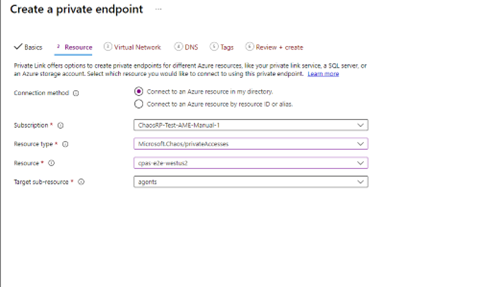
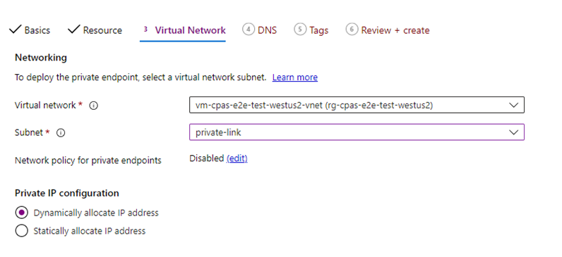
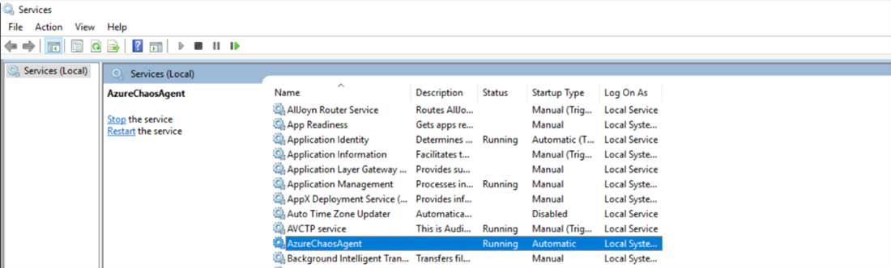
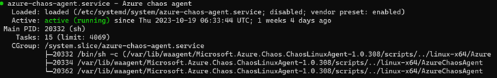

# Configure Private Link for agent-based experiments (preview)

This article explains the steps needed to configure Azure Private Link for an Azure Chaos Studio agent-based experiment (preview). The current user experience is based on the private endpoints support that's enabled as part of the public preview of the private endpoints feature. Expect this experience to evolve with time as the feature is enhanced to general availability (GA) quality. It's currently in preview.

---
## Prerequisites

- An Azure account with an active subscription. If you don't have an Azure subscription, create a [free account](https://azure.microsoft.com/free/?WT.mc_id=A261C142F) before you begin.
- Define your agent-based experiment by following the steps in [Create a chaos experiment that uses an agent-based fault with the Azure portal](chaos-studio-tutorial-agent-based-portal.md).

> [!NOTE]
> If the target resource was created by using the Azure portal, the Chaos Agent virtual machine (VM) extension is automatically installed on the host VM. If the target is enabled by using the Azure CLI, follow the Chaos Studio documentation to install the VM extension first on the VM. Until you finish the private endpoint setup, the VM extension reports an unhealthy state. This behavior is expected.

<br/>

## Limitations

- You need to use our *2023-10-27-preview REST API* to create and use Private Link for agent-based experiments only. There's *no* support for Private Link for agent-based experiments in our GA-stable REST API until H1 2024.
- The entire end-to-end experience for this flow requires some use of the CLI. The current end-to-end experience can't be done from the Azure portal.
- The **Chaos Studio Private Accesses (CSPA)** resource type has a strict 1:1 mapping of Chaos Target:CSPA Resource (abstraction for private endpoint). We allow only *five CSPA resources to be created per subscription* to maintain the expected experience for all our customers.  

## Create a Chaos Studio Private Access resource

To use private endpoints for agent-based chaos experiments, you need to create a new resource type called Chaos Studio Private Accesses. CSPA is the resource against which the private endpoints are created.

Currently, this resource can *only be created from the CLI*. See the following example code for how to create this resource type:

 ```AzCLI
az rest --verbose --skip-authorization-header --header "Authorization=Bearer $accessToken" --uri-parameters api-version=2023-10-27-preview --method PUT --uri "https://centraluseuap.management.azure.com/subscriptions/<subscriptionID>/resourceGroups/<resourceGroupName>/providers/Microsoft.Chaos/privateAccesses/<CSPAResourceName>?api-version=2023-10-27-preview" --body ' 

{ 

    "location": "<resourceLocation>", 

    "properties": { 

        "id": "<CSPAResourceName>", 

        "name": "<CSPAResourceName>", 

        "location": "<resourceLocation>", 

        "type": "Microsoft.Chaos/privateAccesses", 

        "resourceId": "subscriptions/<subscriptionID>/resourceGroups/<resourceGroupName>/providers/Microsoft.Chaos/privateAccesses/<CSPAResourceName>" 

    } 

}'
 ```

| Name |Required | Type | Description |
|-|-|-|-|
|subscriptionID|True|String|GUID that represents an Azure subscription ID.|
|resourceGroupName|True|String|String that represents an Azure resource group.|
|CSPAResourceName|True|String|String that represents the name you want to give your Chaos Studio Private Access resource.|
|resourceLocation|True|String|Location where you want the resource to be hosted (must be a support region by Chaos Studio).|

## Create your virtual network, subnet, and private endpoint

[Set up your desired virtual network, subnet, and endpoint](../private-link/create-private-endpoint-portal.md) for the experiment if you haven't already.

Make sure you attach it to the same VM's virtual network. Screenshots provide examples of creating the virtual network, subnet, and private endpoint. You need to set **Resource type** to **Microsoft.Chaos/privateAccesses** as seen in the screenshot.

[](images/resource-private-endpoint.png#lightbox)

[](images/resource-vnet-cspa.png#lightbox)

## Map the agent host VM to the CSPA resource

Find the target `Resource ID` by making a `GetTarget` call:

```AzCLI
GET https://management.azure.com/subscriptions/{subscriptionId}/resourceGroups/{resourceGroupName}/providers/{parentProviderNamespace}/{parentResourceType}/{parentResourceName}/providers/Microsoft.Chaos/targets/{targetName}?api-version=2023-10-27-preview
```

<br/>

The `GET` command returns a large response. Note this response. We use this response and modify it before running a `PUT Target` command to map the two resources.

<br/>

Invoke a `PUT Target` command by using this response. You need to append *two more fields* to the body of the `PUT` command before you run it.

These extra fields are shown here:

```
"privateAccessId": "subscriptions/<subID>/...
"allowPublicAccess": false

},
```

Here's an example block for what the `PUT Target` command should look like and the fields that you would need to fill out:

> [!NOTE]
> Copy the body from the previous `GET` command. You need to manually append the `privateAccessID` and `allowPublicAccess` fields.

```AzCLI

az rest --verbose --skip-authorization-header --header "Authorization=Bearer $accessToken" --uri-parameters api-version=2023-10-27-preview --method PUT --uri "https://management.azure.com/subscriptions/<subscriptionID>/resourceGroups/<resourceGroup>/providers/Microsoft.Compute/virtualMachines/<VMSSname>/providers/Microsoft.Chaos/targets/Microsoft-Agent?api-version=2023-10-27-preview " --body ' {
    "id": "/subscriptions/<subscriptionID>/resourceGroups/<resourceGroupName>/providers/microsoft.compute/virtualmachines/<VMSSName>/providers/Microsoft.Chaos/targets/Microsoft-Agent",
    "type": "Microsoft.Chaos/targets",
    "name": "Microsoft-Agent",
    "location": "<resourceLocation>",
    "properties": {
        "agentProfileId": "<from target resource>",
        "identities": [
            {
                "type": "AzureManagedIdentity",
                "clientId": "<clientID>",
                "tenantId": "<tenantID>"
            }
        ],
        "agentTenantId": "CHAOSSTUDIO",
        "privateAccessId": "subscriptions/<subscriptionID>/resourceGroups/<resourceGroupName>/providers/Microsoft.Chaos/privateAccesses/<CSPAresourceName>",
        "allowPublicAccess": false
    }} '

```

> [!NOTE]
> The `PrivateAccessID` value should exactly match the `resourceID` value that you used to create the CSPA resource in the earlier section **Create a Chaos Studio Private Access resource**.

## Restart the Azure Chaos Agent service in the VM

After you make all the required changes to the host, restart the Azure Chaos Agent service in the VM.

### Windows

[](images/restart-windows-vm.png#lightbox)

### Linux

For Linux, run the following command from the CLI:

```
Systemctl restart azure-chaos-agent
```

[](images/restart-linux-vm.png#lightbox)

## Run your agent-based experiment by using private endpoints

After the restart, Azure Chaos Agent should be able to communicate with the Agent Communication data plane service, and the agent registration to the data plane should be successful. After successful registration, the agent can indicate its status with a heartbeat. Then you can proceed to run the Azure Chaos Agent-based experiments by using private endpoints.
