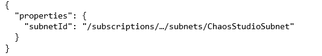

# Virtual network injection in Azure Chaos Studio Preview

Azure [Virtual Network](../virtual-network/virtual-networks-overview.md) is the fundamental building block for your private network in Azure. A virtual network enables many types of Azure resources to securely communicate with each other, the internet, and on-premises networks. A virtual network is similar to a traditional network that you operate in your own datacenter. It brings other benefits of Azure's infrastructure, such as scale, availability, and isolation.

Virtual network injection allows an Azure Chaos Studio Preview resource provider to inject containerized workloads into your virtual network so that resources without public endpoints can be accessed via a private IP address on the virtual network. After you've configured virtual network injection for a resource in a virtual network and enabled the resource as a target, you can use it in multiple experiments. An experiment can target a mix of private and nonprivate resources if the private resources are configured according to the instructions in this article.

## Resource type support
Currently, you can only enable certain resource types for Chaos Studio virtual network injection:

* **Azure Kubernetes Service (AKS)** targets can be enabled with virtual network injection through the Azure portal and the Azure CLI. All AKS Chaos Mesh faults can be used.
* **Azure Key Vault** targets can be enabled with virtual network injection through the Azure CLI. The faults that can be used with virtual network injection are Disable Certificate, Increment Certificate Version, and Update Certificate Policy.

## Enable virtual network injection
To use Chaos Studio with virtual network injection, you must meet the following requirements.
1. The `Microsoft.ContainerInstance` and `Microsoft.Relay` resource providers must be registered with your subscription.
1. The virtual network where Chaos Studio resources will be injected must have two subnets: a container subnet and a relay subnet. A container subnet is used for the Chaos Studio containers that will be injected into your private network. A relay subnet is used to forward communication from Chaos Studio to the containers inside the private network.
    1. Both subnets need at least `/28` in the address space. An example is an address prefix of `10.0.0.0/28` or `10.0.0.0/24`.
    1. The container subnet must be delegated to `Microsoft.ContainerInstance/containerGroups`.
    1. The subnets can be arbitrarily named, but we recommend `ChaosStudioContainerSubnet` and `ChaosStudioRelaySubnet`.
1. When you enable the desired resource as a target so that you can use it in Chaos Studio experiments, the following properties must be set:
    1. Set `properties.subnets.containerSubnetId` to the ID for the container subnet.
    1. Set `properties.subnets.relaySubnetId` to the ID for the relay subnet.

If you're using the Azure portal to enable a private resource as a Chaos Studio target, Chaos Studio currently only recognizes subnets named `ChaosStudioContainerSubnet` and `ChaosStudioRelaySubnet`. If these subnets don't exist, the portal workflow can create them automatically.

If you're using the CLI, the container and relay subnets can have any name (subject to the resource naming guidelines). Specify the appropriate IDs when you enable the resource as a target.

## Example: Use Chaos Studio with a private AKS cluster

This example shows how to configure a private AKS cluster to use with Chaos Studio. It assumes you already have a private AKS cluster within your Azure subscription. To create one, see [Create a private Azure Kubernetes Service cluster](../aks/private-clusters.md).

### [Azure portal](#tab/azure-portal)

1. In the Azure portal, go to **Subscriptions** > **Resource providers** in your subscription.
1. Register the `Microsoft.ContainerInstance` and `Microsoft.Relay` resource providers, if they aren't already registered, by selecting the provider and then selecting **Register**. Reregister the `Microsoft.Chaos` resource provider.

   :::image type="content" source="images/vnet-register-resource-provider.png" alt-text="Screenshot that shows how to register a resource provider." lightbox="images/vnet-register-resource-provider.png":::

1. Go to Chaos Studio and select **Targets**. Find your desired AKS cluster and select **Enable targets** > **Enable service-direct targets**.

   :::image type="content" source="images/vnet-enable-targets.png" alt-text="Screenshot that shows how to enable targets in Chaos Studio." lightbox="images/vnet-enable-targets.png":::

1. Select the cluster's virtual network. If the virtual network already includes subnets named `ChaosStudioContainerSubnet` and `ChaosStudioRelaySubnet`, select them. If they don't already exist, they're automatically created for you.

   :::image type="content" source="images/vnet-select-subnets.png" alt-text="Screenshot that shows how to select the virtual network and subnets." lightbox="images/vnet-select-subnets.png":::

1. Select **Review + Enable** > **Enable**.

   :::image type="content" source="images/vnet-review.png" alt-text="Screenshot that shows how to review the target enablement." lightbox="images/vnet-review.png":::

Now you can use your private AKS cluster with Chaos Studio. To learn how to install Chaos Mesh and run the experiment, see [Create a chaos experiment that uses a Chaos Mesh fault with the Azure portal](chaos-studio-tutorial-aks-portal.md).

### [Azure CLI](#tab/azure-cli)

1. Register the `Microsoft.ContainerInstance` and `Microsoft.Relay` resource providers with your subscription by running the following commands. If they're both already registered, you can skip this step. For more information, see the [Register resource provider](../azure-resource-manager/management/resource-providers-and-types.md) instructions.

    ```azurecli
    az provider register --namespace 'Microsoft.ContainerInstance' --wait
    ```

    ```azurecli
    az provider register --namespace 'Microsoft.Relay' --wait
    ```

    Verify the registration by running the following commands:

    ```azurecli
    az provider show --namespace 'Microsoft.ContainerInstance' | grep registrationState
    ```

    ```azurecli
    az provider show --namespace 'Microsoft.Relay' | grep registrationState
    ```

    In the output, you should see something similar to:

    ```azurecli
    "registrationState": "Registered",
    ```

1. Reregister the `Microsoft.Chaos` resource provider with your subscription.

    ```azurecli
    az provider register --namespace 'Microsoft.Chaos' --wait
    ```

    Verify the registration by running the following command:

    ```azurecli
    az provider show --namespace 'Microsoft.Chaos' | grep registrationState
    ```

    In the output, you should see something similar to:

    ```azurecli
    "registrationState": "Registered",
    ```

1. Create two subnets in the virtual network you want to inject Chaos Studio resources into (in this case, the private AKS cluster's virtual network):

    - Container subnet (example name: `ChaosStudioContainerSubnet`)
        - Delegate the subnet to the `Microsoft.ContainerInstance/containerGroups` service.
        - This subnet must have at least `/28` in the address space.
    - Relay subnet (example name: `ChaosStudioRelaySubnet`)
        - This subnet must have at least `/28` in the address space.
        
    ```azurecli
    az network vnet subnet create -g MyResourceGroup --vnet-name MyVnetName --name ChaosStudioContainerSubnet --address-prefixes "10.0.0.0/28" --delegations "Microsoft.ContainerInstance/containerGroups"
    ```
    ```azurecli
    az network vnet subnet create -g MyResourceGroup --vnet-name MyVnetName --name ChaosStudioRelaySubnet --address-prefixes "10.0.0.0/28"
    ```

1. When you enable targets for the AKS cluster so that you can use it in chaos experiments, set the `properties.subnets.containerSubnetId` and `properties.subnets.relaySubnetId` properties by using the new subnets you created in step 3.

    Replace `$SUBSCRIPTION_ID` with your Azure subscription ID. Replace `$RESOURCE_GROUP` and `$AKS_CLUSTER` with the resource group name and your AKS cluster resource name. Also, replace `$AKS_INFRA_RESOURCE_GROUP` and `$AKS_VNET` with your AKS infrastructure resource group name and virtual network name. Replace `$URL` with the corresponding `https://management.azure.com/` URL used for onboarding the target.

    ```azurecli
    CONTAINER_SUBNET_ID=/subscriptions/$SUBSCRIPTION_ID/resourceGroups/$AKS_INFRA_RESOURCE_GROUP/providers/Microsoft.Network/virtualNetworks/$AKS_VNET/subnets/ChaosStudioContainerSubnet
    RELAY_SUBNET_ID=/subscriptions/$SUBSCRIPTION_ID/resourceGroups/$AKS_INFRA_RESOURCE_GROUP/providers/Microsoft.Network/virtualNetworks/$AKS_VNET/subnets/ChaosStudioRelaySubnet
    BODY="{ \"properties\": { \"subnets\": { \"containerSubnetId\": \"$CONTAINER_SUBNET_ID\", \"relaySubnetId\": \"$RELAY_SUBNET_ID\" } } }"
    az rest --method put --url $URL --body "$BODY"
    ```
    <!--
    After you create a Target resource with virtual network injection enabled, the resource's properties will include:
    
    ```json
    {
      "properties": {
        "subnets": {
          "containerSubnetId": "/subscriptions/.../subnets/ChaosStudioContainerSubnet",
          "relaySubnetId": "/subscriptions/.../subnets/ChaosStudioRelaySubnet"
        }
      }
    }
    ```
    -->

Now you can use your private AKS cluster with Chaos Studio. To learn how to install Chaos Mesh and run the experiment, see [Create a chaos experiment that uses a Chaos Mesh fault with the Azure CLI](chaos-studio-tutorial-aks-cli.md).

---

## Limitations
* Virtual network injection is currently only possible in subscriptions/regions where Azure Container Instances and Azure Relay are available.
* When you create a Target resource that you enable with virtual network injection, you need `Microsoft.Network/virtualNetworks/subnets/write` access to the virtual network. For example, if the AKS cluster is deployed to virtual network_A, then you must have permissions to create subnets in virtual network_A to enable virtual network injection for the AKS cluster.

<!--

-->

## Next steps
Now that you understand how virtual network injection can be achieved for Chaos Studio, you're ready to:
- [Create and run your first experiment](chaos-studio-tutorial-service-direct-portal.md)
- [Create and run your first Azure Kubernetes Service experiment](chaos-studio-tutorial-aks-portal.md)
