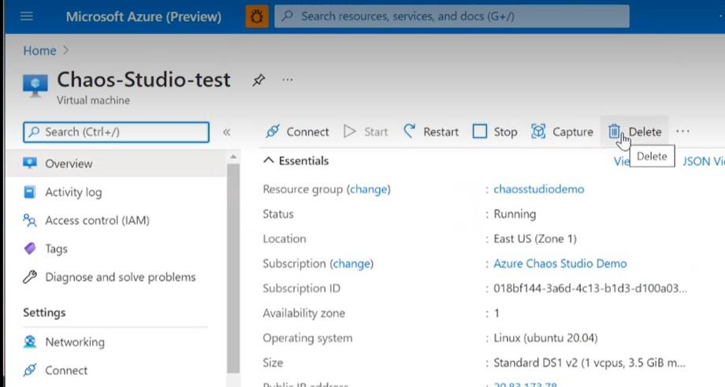

# Quickstart: Create and run a chaos experiment that uses a VM Shutdown fault 
Get started with Chaos Studio by using VM shutdown service-direct experiment to make your service more resilient to that failure in real-world. 

## Prerequisites
- Open the [Azure portal](https://portal.azure.com).
- A virtual machine. If you do not have a virtual machine, you can [follow these steps to create one](../virtual-machines/linux/quick-create-portal.md).

## Enable Chaos Studio on the Virtual Machine you created
1. Open the [Azure portal](https://portal.azure.com).
2. Search for **Chaos Studio (preview)** in the search bar.
3. Click on **Targets** and navigate to your VM created.

4. Check the box next to your VM created and click **Enable targets** then **Enable service-direct targets** from the dropdown menu.

5. A notification will appear indicating that the resource(s) selected were successfully enabled.

## Create an experiment

1. Click **Add an experiment**.

    

2. Fill in the Subscription, Resource Group, and Location where you want to deploy the chaos experiment. Give your experiment a Name. Click **Next : Experiment designer >**

3. You are now in the Chaos Studio experiment designer. Give a friendly name to your Step and Branch, then click Add fault.

4. Select VM Shutdown from the dropdown, then fill in the Duration with the number of minutes you want the failure to last. Click **Next: Target resources >**

5. Click **Next: Target resources >**.

6. Click **Add**.

7. Verify that your experiment looks correct, then click **Review + create**, then **Create**.

## Run your experiment
1. You are now ready to run the  experiment. 
2. In the Experiments view, click on your experiment, and click **Start**, then click **OK**.
3. When the Status changes to Running, click Details for the latest run under History to see details for the running experiment

## Clean up resources
1. Search the VM that you created on the Azure portal serach bar.

2. Click on **delete** to avoid being charged for the resource.

## Next steps
Now that you have run a VM shutdown service-direct experiment, you are ready to:
- [Create an experiment that uses agent-based faults](chaos-studio-tutorial-agent-based.md)

